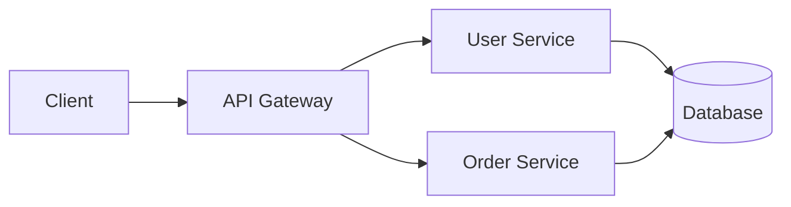
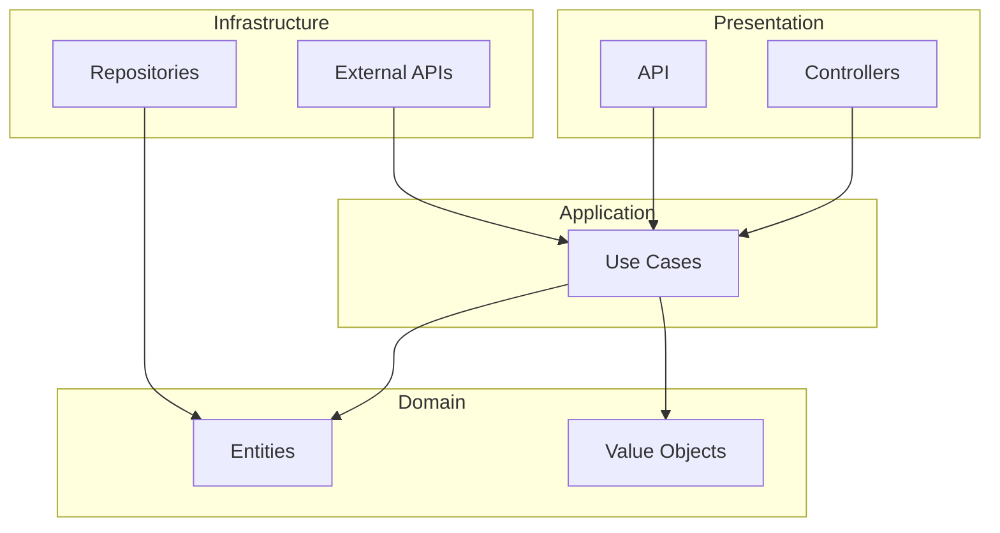

# Dokumentation

## Überblick

Eine gute Dokumentation ist **essenziell** für die Wartbarkeit des Projekts. Sie muss aktuell, prägnant und nützlich sein.

**Prinzipien:**
- Documentation as Code (versioniert mit dem Code)
- Single Source of Truth (keine Duplikation)
- Aktualisierung mit jedem PR
- Automatisiert wo möglich

---

## Inhaltsverzeichnis

1. [Dokumentationstypen](#dokumentationstypen)
2. [README.md](#readmemd)
3. [Code-Dokumentation](#code-dokumentation)
4. [ADR - Architecture Decision Records](#adr---architecture-decision-records)
5. [API-Dokumentation](#api-dokumentation)
6. [Changelog](#changelog)
7. [Best Practices](#best-practices)
8. [Checkliste](#checkliste)

---

## Dokumentationstypen

| Typ | Zielgruppe | Inhalt | Format |
|-----|-----------|--------|--------|
| README | Neue Entwickler | Schnellstart | Markdown |
| Code-Kommentare | Entwickler | Warum, nicht Was | Inline |
| API-Docs | Konsumenten | Endpoints, Schemas | OpenAPI |
| ADR | Team | Architektur-Entscheidungen | Markdown |
| Changelog | Alle | Änderungshistorie | Markdown |
| Benutzer-Docs | Benutzer | Anleitungen, Tutorials | Markdown/HTML |

---

## README.md

### Empfohlene Struktur

```markdown
# Projektname

Kurze Beschreibung (1-2 Sätze).

## Voraussetzungen

- Tool 1 (Version)
- Tool 2 (Version)

## Installation

\`\`\`bash
# Installationsbefehle
\`\`\`

## Schnellstart

\`\`\`bash
# Befehle zum Starten des Projekts
\`\`\`

## Konfiguration

Erforderliche Umgebungsvariablen:

| Variable | Beschreibung | Standard |
|----------|-------------|----------|
| DATABASE_URL | Datenbank-URL | - |
| API_KEY | Externer API-Schlüssel | - |

## Tests

\`\`\`bash
# Wie Tests ausgeführt werden
make test
\`\`\`

## Deployment

Deployment-Anweisungen.

## Architektur

Kurze Beschreibung der Architektur.
Link zur detaillierten Dokumentation.

## Beitragen

Anweisungen zum Beitragen.
Link zu CONTRIBUTING.md.

## Lizenz

MIT License
```

### Beispiele

#### GUT

```markdown
# E-Commerce API

REST-API für die Verwaltung von E-Commerce-Bestellungen.

## Installation

\`\`\`bash
git clone https://github.com/company/ecommerce-api
cd ecommerce-api
make install
\`\`\`

## Start

\`\`\`bash
make dev
# API verfügbar unter http://localhost:8080
\`\`\`
```

#### SCHLECHT

```markdown
# Projekt

Das ist ein Projekt.

Führen Sie `npm install` dann `npm start` aus.
```

---

## Code-Dokumentation

### Goldene Regel

> **Der Code muss selbstdokumentierend sein.**
> Kommentare erklären das WARUM, nicht das WAS.

### Wann kommentieren

```
KOMMENTIEREN:
- Nicht offensichtliche Entscheidungen
- Temporäre Workarounds
- Externe Referenzen (Tickets, Spezifikationen)
- Komplexe Algorithmen

NICHT KOMMENTIEREN:
- Was der Code tut (lesbar)
- Offensichtlicher Code
- Toter Code
```

### Beispiele

#### GUT - Erklärt das Warum

```
// Workaround: Externe API unterstützt kein UTF-8
// TODO: Entfernen, wenn API v2 verfügbar (#1234)
function sanitizeInput(text):
  return text.ascii_only()

// Rate Limit von 100 Req/Min vom Provider vorgegeben
// Siehe: https://provider.com/docs/rate-limits
RATE_LIMIT = 100
```

#### SCHLECHT - Erklärt das Was (unnötig)

```
// Zähler inkrementieren
counter = counter + 1

// Benutzer zurückgeben
return user

// Über Items iterieren
for item in items:
```

### Funktionsdokumentation

Dokumentieren:
- **Public API** - Immer
- **Komplexe Funktionen** - Falls nicht offensichtlich
- **Private Funktionen** - Selten

```
/**
 * Berechnet den Gesamtpreis mit anwendbaren Rabatten.
 *
 * @param items - Liste der Artikel
 * @param discountCode - Optionaler Promo-Code
 * @returns Gesamtpreis nach Rabatten
 * @throws InvalidDiscountCode falls Code ungültig
 *
 * @example
 * calculateTotal([item1, item2], "SAVE10")
 * // => Money(90.00)
 */
function calculateTotal(items, discountCode = null):
  ...
```

---

## ADR - Architecture Decision Records

### Format

```markdown
# ADR-001: Wahl der Datenbank

## Status

Akzeptiert (2025-01-15)

## Kontext

Wir müssen eine Datenbank wählen, um Benutzer-
und Bestellungsdaten zu speichern.

Einschränkungen:
- Volumen: ~1M Benutzer, ~10M Bestellungen
- Abfragen: 80% Lesezugriffe, 20% Schreibzugriffe
- Budget: Begrenzt

## Entscheidung

Wir verwenden PostgreSQL.

## Betrachtete Alternativen

### MySQL
- Vertrautheit im Team
- Weniger performant bei komplexen Abfragen

### MongoDB
- Schema-Flexibilität
- Nicht geeignet für starke Relationen

### PostgreSQL (gewählt)
- Leistung bei komplexen Abfragen
- JSONB für Flexibilität
- Erweiterungen (PostGIS bei Bedarf)

## Konsequenzen

### Positiv
- Vorhersehbare Leistung
- Ausgereiftes Ökosystem
- Standard Backup/Restore

### Negativ
- Migration von MySQL erforderlich
- Teamschulung zu PG-Besonderheiten
```

### Wann ein ADR erstellen

- Wahl einer wichtigen Technologie
- Architekturänderung
- Einführung eines Patterns
- Unumkehrbare oder kostspielig zu ändernde Entscheidung

### Dateistruktur

```
docs/
└── adr/
    ├── 0001-wahl-datenbank.md
    ├── 0002-microservices-architektur.md
    ├── 0003-cache-strategie.md
    └── index.md
```

---

## API-Dokumentation

### OpenAPI (Swagger)

```yaml
openapi: 3.0.0
info:
  title: User API
  version: 1.0.0
  description: API for user management

paths:
  /users:
    get:
      summary: List all users
      parameters:
        - name: page
          in: query
          schema:
            type: integer
            default: 1
      responses:
        200:
          description: Success
          content:
            application/json:
              schema:
                $ref: '#/components/schemas/UserList'

    post:
      summary: Create user
      requestBody:
        required: true
        content:
          application/json:
            schema:
              $ref: '#/components/schemas/CreateUser'
      responses:
        201:
          description: Created

components:
  schemas:
    User:
      type: object
      properties:
        id:
          type: string
          format: uuid
        email:
          type: string
          format: email
        name:
          type: string
```

### Best Practices API-Docs

1. **Konkrete Beispiele** für jeden Endpoint
2. **Fehlercodes** dokumentiert
3. **Authentifizierung** erklärt
4. **Rate Limits** erwähnt
5. **Versionierung** klar

---

## Changelog

### Keep-a-Changelog-Format

```markdown
# Changelog

All notable changes to this project will be documented in this file.

The format is based on [Keep a Changelog](https://keepachangelog.com/).

## [Unreleased]

### Added
- New payment gateway integration

### Changed
- Improved error messages

## [1.2.0] - 2025-01-15

### Added
- User profile pictures
- Export to PDF

### Changed
- Updated dependencies

### Fixed
- Login timeout issue (#123)

### Security
- Fixed XSS vulnerability in comments

## [1.1.0] - 2025-01-01

### Added
- Initial release
```

### Kategorien

| Kategorie | Inhalt |
|-----------|--------|
| **Added** | Neue Funktionalitäten |
| **Changed** | Verhaltensänderungen |
| **Deprecated** | Bald entfernte Funktionalitäten |
| **Removed** | Entfernte Funktionalitäten |
| **Fixed** | Bugfixes |
| **Security** | Sicherheitskorrekturen |

---

## Best Practices

### 1. Documentation as Code

```
Versioniert mit Git
In PRs überprüft
Dokumentations-Tests (Links, Syntax)
CI/CD generiert die Doku
```

### 2. Single Source of Truth

```
SCHLECHT
- README sagt "npm verwenden"
- Wiki sagt "yarn verwenden"
- Slack sagt "pnpm verwenden"

GUT
- README sagt "npm verwenden"
- Wiki verweist auf README
- Slack verweist auf README
```

### 3. Kontinuierliche Aktualisierung

```
Regel: Jeder PR, der das Verhalten ändert,
       muss die Dokumentation aktualisieren.

PR-Checkliste:
- [ ] README aktualisiert
- [ ] API-Docs aktualisiert
- [ ] CHANGELOG aktualisiert
- [ ] ADR erstellt bei Architekturentscheidung
```

### 4. Automatisierung

```yaml
# Automatische Generierung
- API-Docs aus Code (Annotations)
- Changelog aus Commits (Conventional)
- Diagramme aus Code (Mermaid)
```

---

## Diagramme

### Mermaid (integriert in GitHub/GitLab)

````markdown

````

### Architekturentscheidung

````markdown

````

---

## Checkliste

### Für jeden PR

- [ ] README aktualisiert bei Setup-Änderung
- [ ] Kommentare für nicht offensichtlichen Code hinzugefügt
- [ ] CHANGELOG aktualisiert
- [ ] API-Docs generiert/aktualisiert
- [ ] ADR erstellt bei Architekturentscheidung

### Vierteljährliche Überprüfung

- [ ] README noch korrekt
- [ ] Links funktionsfähig
- [ ] Beispiele aktuell
- [ ] Abhängigkeiten dokumentiert

### Neues Projekt

- [ ] README mit Installation
- [ ] CONTRIBUTING.md
- [ ] CHANGELOG.md initialisiert
- [ ] docs/adr/-Struktur erstellt
- [ ] PR-Vorlage mit Doku-Checkliste

---

## Empfohlene Tools

| Tool | Verwendung |
|------|-----------|
| **MkDocs** | Dokumentations-Website |
| **Swagger UI** | API-Dokumentation |
| **Mermaid** | Diagramme |
| **ADR Tools** | ADR-Verwaltung |
| **Vale** | Prosa-Linting |

---

## Ressourcen

- **Keep a Changelog:** [keepachangelog.com](https://keepachangelog.com/)
- **ADR:** [adr.github.io](https://adr.github.io/)
- **OpenAPI:** [swagger.io/specification](https://swagger.io/specification/)
- **Diataxis:** [diataxis.fr](https://diataxis.fr/) (Dokumentations-Framework)

---

**Datum der letzten Aktualisierung:** 2025-01
**Version:** 1.0.0
**Autor:** The Bearded CTO
