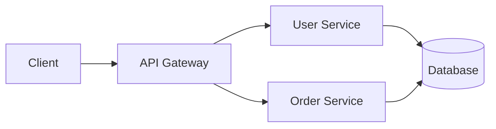
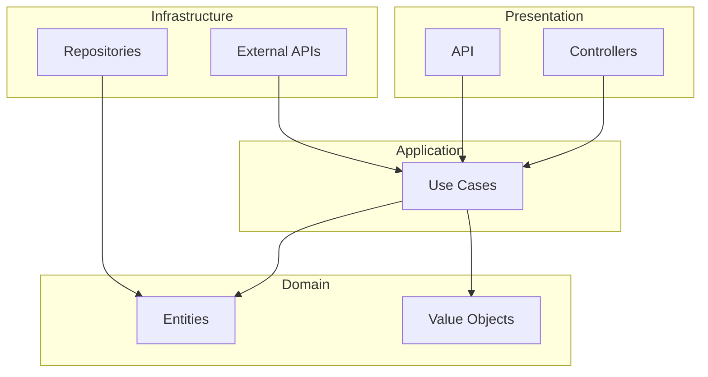

# Documentation

## Overview

Good documentation is **essential** for project maintainability. It must be up to date, concise, and useful.

**Principles:**
- Documentation as Code (versioned with the code)
- Single Source of Truth (no duplication)
- Updated with each PR
- Automated when possible

---

## Table of Contents

1. [Types of Documentation](#types-of-documentation)
2. [README.md](#readmemd)
3. [Code Documentation](#code-documentation)
4. [ADR - Architecture Decision Records](#adr---architecture-decision-records)
5. [API Documentation](#api-documentation)
6. [Changelog](#changelog)
7. [Best Practices](#best-practices)
8. [Checklist](#checklist)

---

## Types of Documentation

| Type | Audience | Content | Format |
|------|----------|---------|--------|
| README | New devs | Quick start | Markdown |
| Code comments | Developers | Why, not what | Inline |
| API docs | Consumers | Endpoints, schemas | OpenAPI |
| ADR | Team | Arch. decisions | Markdown |
| Changelog | Everyone | Change history | Markdown |
| User docs | Users | Guides, tutorials | Markdown/HTML |

---

## README.md

### Recommended Structure

```markdown
# Project Name

Short description (1-2 sentences).

## Prerequisites

- Tool 1 (version)
- Tool 2 (version)

## Installation

```bash
# Installation commands
```

## Quick Start

```bash
# Commands to launch the project
```

## Configuration

Required environment variables:

| Variable | Description | Default |
|----------|-------------|---------|
| DATABASE_URL | Database URL | - |
| API_KEY | External API key | - |

## Tests

```bash
# How to run tests
make test
```

## Deployment

Deployment instructions.

## Architecture

Brief architecture description.
Link to detailed documentation.

## Contributing

Instructions for contributing.
Link to CONTRIBUTING.md.

## License

MIT License
```

### Examples

#### GOOD

```markdown
# E-Commerce API

REST API for e-commerce order management.

## Installation

```bash
git clone https://github.com/company/ecommerce-api
cd ecommerce-api
make install
```

## Getting Started

```bash
make dev
# API available at http://localhost:8080
```
```

#### BAD

```markdown
# Project

This is a project.

Run `npm install` then `npm start`.
```

---

## Code Documentation

### Golden Rule

> **Code should be self-documenting.**
> Comments explain the WHY, not the WHAT.

### When to Comment

```
COMMENT:
- Non-obvious decisions
- Temporary workarounds
- External references (tickets, specs)
- Complex algorithms

DO NOT COMMENT:
- What the code does (readable)
- Obvious code
- Dead code
```

### Examples

#### GOOD - Explains the why

```
// Workaround: External API does not support UTF-8
// TODO: Remove when API v2 is available (#1234)
function sanitizeInput(text):
  return text.ascii_only()

// Rate limit of 100 req/min imposed by the provider
// See: https://provider.com/docs/rate-limits
RATE_LIMIT = 100
```

#### BAD - Explains the what (useless)

```
// Increment the counter
counter = counter + 1

// Return the user
return user

// Loop over items
for item in items:
```

### Function Documentation

Document:
- **Public API** - Always
- **Complex functions** - If not obvious
- **Private functions** - Rarely

```
/**
 * Calculates the total price with applicable discounts.
 *
 * @param items - List of items
 * @param discountCode - Optional promo code
 * @returns Total price after discounts
 * @throws InvalidDiscountCode if code is invalid
 *
 * @example
 * calculateTotal([item1, item2], "SAVE10")
 * // => Money(90.00)
 */
function calculateTotal(items, discountCode = null):
  ...
```

---

## ADR - Architecture Decision Records

### Format

```markdown
# ADR-001: Database Choice

## Status

Accepted (2025-01-15)

## Context

We need to choose a database to store
user and order data.

Constraints:
- Volume: ~1M users, ~10M orders
- Queries: 80% reads, 20% writes
- Budget: Limited

## Decision

We use PostgreSQL.

## Alternatives Considered

### MySQL
- Familiar to the team
- Less performant for complex queries

### MongoDB
- Schema flexibility
- Not suited for strong relationships

### PostgreSQL (chosen)
- Complex query performance
- JSONB for flexibility
- Extensions (PostGIS if needed)

## Consequences

### Positive
- Predictable performance
- Mature ecosystem
- Standard backup/restore

### Negative
- Migration from MySQL required
- Team training on PG specifics
```

### When to Create an ADR

- Major technology choice
- Architecture change
- Pattern adoption
- Irreversible or costly-to-change decision

### File Structure

```
docs/
└── adr/
    ├── 0001-database-choice.md
    ├── 0002-microservices-architecture.md
    ├── 0003-caching-strategy.md
    └── index.md
```

---

## API Documentation

### OpenAPI (Swagger)

```yaml
openapi: 3.0.0
info:
  title: User API
  version: 1.0.0
  description: API for user management

paths:
  /users:
    get:
      summary: List all users
      parameters:
        - name: page
          in: query
          schema:
            type: integer
            default: 1
      responses:
        200:
          description: Success
          content:
            application/json:
              schema:
                $ref: '#/components/schemas/UserList'

    post:
      summary: Create user
      requestBody:
        required: true
        content:
          application/json:
            schema:
              $ref: '#/components/schemas/CreateUser'
      responses:
        201:
          description: Created

components:
  schemas:
    User:
      type: object
      properties:
        id:
          type: string
          format: uuid
        email:
          type: string
          format: email
        name:
          type: string
```

### API Docs Best Practices

1. **Concrete examples** for each endpoint
2. **Error codes** documented
3. **Authentication** explained
4. **Rate limits** mentioned
5. **Versioning** clear

---

## Changelog

### Keep a Changelog Format

```markdown
# Changelog

All notable changes to this project will be documented in this file.

The format is based on [Keep a Changelog](https://keepachangelog.com/).

## [Unreleased]

### Added
- New payment gateway integration

### Changed
- Improved error messages

## [1.2.0] - 2025-01-15

### Added
- User profile pictures
- Export to PDF

### Changed
- Updated dependencies

### Fixed
- Login timeout issue (#123)

### Security
- Fixed XSS vulnerability in comments

## [1.1.0] - 2025-01-01

### Added
- Initial release
```

### Categories

| Category | Content |
|----------|---------|
| **Added** | New features |
| **Changed** | Behavior changes |
| **Deprecated** | Features to be removed soon |
| **Removed** | Removed features |
| **Fixed** | Bug fixes |
| **Security** | Security fixes |

---

## Best Practices

### 1. Documentation as Code

```
Versioned with Git
Reviewed in PRs
Documentation tests (links, syntax)
CI/CD generates the docs
```

### 2. Single Source of Truth

```
BAD
- README says "use npm"
- Wiki says "use yarn"
- Slack says "use pnpm"

GOOD
- README says "use npm"
- Wiki links to README
- Slack links to README
```

### 3. Continuous Updates

```
Rule: Each PR that changes behavior
      must update the documentation.

PR Checklist:
- [ ] README updated
- [ ] API docs updated
- [ ] CHANGELOG updated
- [ ] ADR created if architectural decision
```

### 4. Automation

```yaml
# Automatic generation
- API docs from code (annotations)
- Changelog from commits (conventional)
- Diagrams from code (Mermaid)
```

---

## Diagrams

### Mermaid (integrated GitHub/GitLab)

```markdown

```

### Architecture Decision

```markdown

```

---

## Checklist

### For each PR

- [ ] README updated if setup changed
- [ ] Comments added for non-obvious code
- [ ] CHANGELOG updated
- [ ] API docs generated/updated
- [ ] ADR created if architectural decision

### Quarterly Review

- [ ] README still accurate
- [ ] Links functional
- [ ] Examples up to date
- [ ] Dependencies documented

### New Project

- [ ] README with installation
- [ ] CONTRIBUTING.md
- [ ] CHANGELOG.md initialized
- [ ] docs/adr/ structure created
- [ ] PR template with doc checklist

---

## Recommended Tools

| Tool | Usage |
|------|-------|
| **MkDocs** | Documentation site |
| **Swagger UI** | API documentation |
| **Mermaid** | Diagrams |
| **ADR Tools** | ADR management |
| **Vale** | Prose linting |

---

## Resources

- **Keep a Changelog:** [keepachangelog.com](https://keepachangelog.com/)
- **ADR:** [adr.github.io](https://adr.github.io/)
- **OpenAPI:** [swagger.io/specification](https://swagger.io/specification/)
- **Diataxis:** [diataxis.fr](https://diataxis.fr/) (documentation framework)

---

**Last updated:** 2025-01
**Version:** 1.0.0
**Author:** The Bearded CTO
