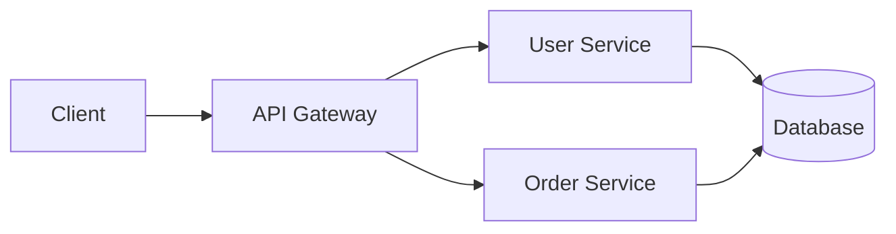
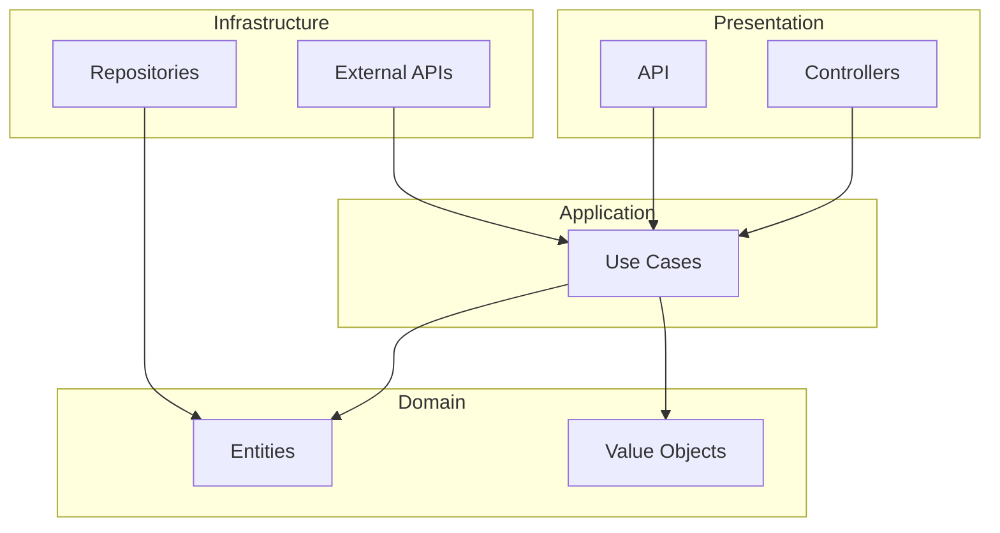

# Documentacion

## Vision general

Una buena documentacion es **esencial** para la mantenibilidad del proyecto. Debe estar actualizada, ser concisa y util.

**Principios:**
- ✅ Documentation as Code (versionada con el codigo)
- ✅ Single Source of Truth (sin duplicacion)
- ✅ Actualizacion con cada PR
- ✅ Automatizada cuando sea posible

---

## Tabla de contenidos

1. [Tipos de documentacion](#tipos-de-documentacion)
2. [README.md](#readmemd)
3. [Documentacion del codigo](#documentacion-del-codigo)
4. [ADR - Architecture Decision Records](#adr---architecture-decision-records)
5. [API Documentation](#api-documentation)
6. [Changelog](#changelog)
7. [Buenas practicas](#buenas-practicas)
8. [Checklist](#checklist)

---

## Tipos de documentacion

| Tipo | Audiencia | Contenido | Formato |
|------|-----------|-----------|---------|
| README | Nuevos devs | Inicio rapido | Markdown |
| Code comments | Desarrolladores | Por que, no que | Inline |
| API docs | Consumidores | Endpoints, schemas | OpenAPI |
| ADR | Equipo | Decisiones arq. | Markdown |
| Changelog | Todos | Historial de cambios | Markdown |
| User docs | Usuarios | Guias, tutoriales | Markdown/HTML |

---

## README.md

### Estructura recomendada

```markdown
# Nombre del Proyecto

Descripcion corta (1-2 frases).

## Requisitos previos

- Herramienta 1 (version)
- Herramienta 2 (version)

## Instalacion

```bash
# Comandos de instalacion
```

## Inicio rapido

```bash
# Comandos para lanzar el proyecto
```

## Configuracion

Variables de entorno requeridas:

| Variable | Descripcion | Por defecto |
|----------|-------------|-------------|
| DATABASE_URL | URL base de datos | - |
| API_KEY | Clave API externa | - |

## Tests

```bash
# Como ejecutar los tests
make test
```

## Despliegue

Instrucciones de despliegue.

## Arquitectura

Breve descripcion de la arquitectura.
Enlace a documentacion detallada.

## Contribucion

Instrucciones para contribuir.
Enlace a CONTRIBUTING.md.

## Licencia

MIT License
```

### Ejemplos

#### ✅ BUENO

```markdown
# E-Commerce API

API REST para la gestion de pedidos e-commerce.

## Instalacion

```bash
git clone https://github.com/company/ecommerce-api
cd ecommerce-api
make install
```

## Inicio

```bash
make dev
# API disponible en http://localhost:8080
```
```

#### ❌ MALO

```markdown
# Project

This is a project.

Run `npm install` then `npm start`.
```

---

## Documentacion del codigo

### Regla de oro

> **El codigo debe ser auto-documentado.**
> Los comentarios explican el POR QUE, no el QUE.

### Cuando comentar

```
✅ COMENTAR:
- Decisiones no evidentes
- Workarounds temporales
- Referencias externas (tickets, specs)
- Algoritmos complejos

❌ NO COMENTAR:
- Lo que hace el codigo (legible)
- Codigo evidente
- Codigo muerto
```

### Ejemplos

#### ✅ BUENO - Explica el por que

```
// Workaround: API externa no soporta UTF-8
// TODO: Eliminar cuando API v2 este disponible (#1234)
function sanitizeInput(text):
  return text.ascii_only()

// Rate limit de 100 req/min impuesto por el proveedor
// Ver: https://provider.com/docs/rate-limits
RATE_LIMIT = 100
```

#### ❌ MALO - Explica el que (innecesario)

```
// Incrementa el contador
counter = counter + 1

// Retorna el usuario
return user

// Itera sobre los items
for item in items:
```

### Documentacion de funciones

Documentar:
- **Public API** - Siempre
- **Funciones complejas** - Si no es evidente
- **Funciones privadas** - Raramente

```
/**
 * Calcula el precio total con descuentos aplicables.
 *
 * @param items - Lista de articulos
 * @param discountCode - Codigo promo opcional
 * @returns Precio total despues de descuentos
 * @throws InvalidDiscountCode si el codigo es invalido
 *
 * @example
 * calculateTotal([item1, item2], "SAVE10")
 * // => Money(90.00)
 */
function calculateTotal(items, discountCode = null):
  ...
```

---

## ADR - Architecture Decision Records

### Formato

```markdown
# ADR-001: Eleccion de la base de datos

## Estado

Aceptado (2025-01-15)

## Contexto

Necesitamos elegir una base de datos para almacenar
los datos de usuarios y pedidos.

Restricciones:
- Volumen: ~1M usuarios, ~10M pedidos
- Consultas: 80% lecturas, 20% escrituras
- Presupuesto: Limitado

## Decision

Utilizamos PostgreSQL.

## Alternativas consideradas

### MySQL
- ✅ Familiaridad del equipo
- ❌ Menos rendimiento para consultas complejas

### MongoDB
- ✅ Flexibilidad de esquema
- ❌ No adaptado para relaciones fuertes

### PostgreSQL (elegido)
- ✅ Rendimiento en consultas complejas
- ✅ JSONB para flexibilidad
- ✅ Extensiones (PostGIS si es necesario)

## Consecuencias

### Positivas
- Rendimiento predecible
- Ecosistema maduro
- Backup/restore estandar

### Negativas
- Migracion desde MySQL necesaria
- Formacion del equipo en especificidades PG
```

### Cuando crear un ADR

- Eleccion de tecnologia importante
- Cambio de arquitectura
- Adopcion de un patron
- Decision irreversible o costosa de cambiar

### Estructura de archivos

```
docs/
└── adr/
    ├── 0001-eleccion-base-datos.md
    ├── 0002-arquitectura-microservicios.md
    ├── 0003-estrategia-cache.md
    └── index.md
```

---

## API Documentation

### OpenAPI (Swagger)

```yaml
openapi: 3.1.1
info:
  title: User API
  version: 1.0.0
  description: API for user management

paths:
  /users:
    get:
      summary: List all users
      parameters:
        - name: page
          in: query
          schema:
            type: integer
            default: 1
      responses:
        200:
          description: Success
          content:
            application/json:
              schema:
                $ref: '#/components/schemas/UserList'

    post:
      summary: Create user
      requestBody:
        required: true
        content:
          application/json:
            schema:
              $ref: '#/components/schemas/CreateUser'
      responses:
        201:
          description: Created

components:
  schemas:
    User:
      type: object
      properties:
        id:
          type: string
          format: uuid
        email:
          type: string
          format: email
        name:
          type: string
```

### Buenas practicas API Docs

1. **Ejemplos concretos** para cada endpoint
2. **Codigos de error** documentados
3. **Autenticacion** explicada
4. **Rate limits** mencionados
5. **Versionado** claro

---

## Changelog

### Formato Keep a Changelog

```markdown
# Changelog

All notable changes to this project will be documented in this file.

The format is based on [Keep a Changelog](https://keepachangelog.com/).

## [Unreleased]

### Added
- New payment gateway integration

### Changed
- Improved error messages

## [1.2.0] - 2025-01-15

### Added
- User profile pictures
- Export to PDF

### Changed
- Updated dependencies

### Fixed
- Login timeout issue (#123)

### Security
- Fixed XSS vulnerability in comments

## [1.1.0] - 2025-01-01

### Added
- Initial release
```

### Categorias

| Categoria | Contenido |
|-----------|-----------|
| **Added** | Nuevas funcionalidades |
| **Changed** | Modificaciones de comportamiento |
| **Deprecated** | Funcionalidades que seran eliminadas pronto |
| **Removed** | Funcionalidades eliminadas |
| **Fixed** | Correcciones de bugs |
| **Security** | Correcciones de seguridad |

---

## Buenas practicas

### 1. Documentation as Code

```
✅ Versionada con Git
✅ Revisada en las PRs
✅ Tests de documentacion (enlaces, sintaxis)
✅ CI/CD genera la doc
```

### 2. Single Source of Truth

```
❌ MALO
- README dice "usar npm"
- Wiki dice "usar yarn"
- Slack dice "usar pnpm"

✅ BUENO
- README dice "usar npm"
- Wiki redirige al README
- Slack redirige al README
```

### 3. Actualizacion continua

```
Regla: Cada PR que cambia el comportamiento
       debe actualizar la documentacion.

Checklist PR:
- [ ] README actualizado
- [ ] API docs actualizadas
- [ ] CHANGELOG actualizado
- [ ] ADR creado si decision arquitectonica
```

### 4. Automatizacion

```yaml
# Generacion automatica
- API docs desde codigo (anotaciones)
- Changelog desde commits (conventional)
- Diagramas desde codigo (Mermaid)
```

---

## Diagramas

### Mermaid (integrado GitHub/GitLab)

```markdown

```

### Architecture Decision

```markdown

```

---

## Checklist

### Para cada PR

- [ ] README actualizado si hay cambio de setup
- [ ] Comentarios agregados para codigo no evidente
- [ ] CHANGELOG actualizado
- [ ] API docs generadas/actualizadas
- [ ] ADR creado si hay decision arquitectonica

### Revision trimestral

- [ ] README sigue siendo exacto
- [ ] Enlaces funcionales
- [ ] Ejemplos al dia
- [ ] Dependencias documentadas

### Nuevo proyecto

- [ ] README con instalacion
- [ ] CONTRIBUTING.md
- [ ] CHANGELOG.md inicializado
- [ ] Estructura docs/adr/ creada
- [ ] Template PR con checklist doc

---

## Herramientas recomendadas

| Herramienta | Uso |
|-------------|-----|
| **MkDocs** | Sitio de documentacion |
| **Swagger UI** | Documentacion API |
| **Mermaid** | Diagramas |
| **ADR Tools** | Gestion ADRs |
| **Vale** | Linting de prosa |

---

## Recursos

- **Keep a Changelog:** [keepachangelog.com](https://keepachangelog.com/)
- **ADR:** [adr.github.io](https://adr.github.io/)
- **OpenAPI:** [swagger.io/specification](https://swagger.io/specification/)
- **Diataxis:** [diataxis.fr](https://diataxis.fr/) (framework de documentacion)

---

**Fecha de ultima actualizacion:** 2025-01
**Version:** 1.0.0
**Autor:** The Bearded CTO
