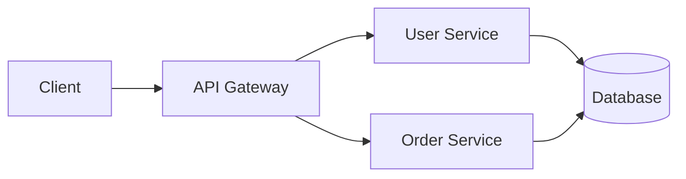
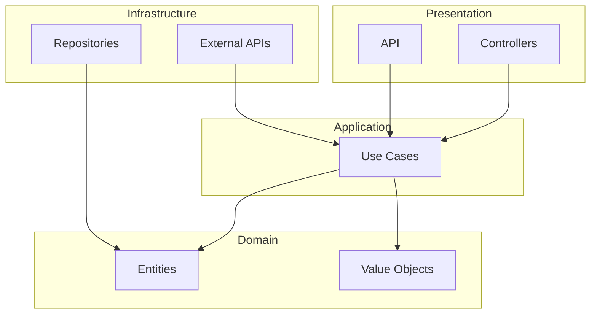

# Documentation

## Vue d'ensemble

Une bonne documentation est **essentielle** pour la maintenabilité du projet. Elle doit être à jour, concise et utile.

**Principes:**
- ✅ Documentation as Code (versionnée avec le code)
- ✅ Single Source of Truth (pas de duplication)
- ✅ Mise à jour avec chaque PR
- ✅ Automatisée quand possible

---

## Table des matières

1. [Types de documentation](#types-de-documentation)
2. [README.md](#readmemd)
3. [Documentation du code](#documentation-du-code)
4. [ADR - Architecture Decision Records](#adr---architecture-decision-records)
5. [API Documentation](#api-documentation)
6. [Changelog](#changelog)
7. [Bonnes pratiques](#bonnes-pratiques)
8. [Checklist](#checklist)

---

## Types de documentation

| Type | Audience | Contenu | Format |
|------|----------|---------|--------|
| README | Nouveaux devs | Démarrage rapide | Markdown |
| Code comments | Développeurs | Pourquoi, pas quoi | Inline |
| API docs | Consommateurs | Endpoints, schemas | OpenAPI |
| ADR | Équipe | Décisions arch. | Markdown |
| Changelog | Tous | Historique changes | Markdown |
| User docs | Utilisateurs | Guides, tutoriels | Markdown/HTML |

---

## README.md

### Structure recommandée

```markdown
# Nom du Projet

Description courte (1-2 phrases).

## Prérequis

- Tool 1 (version)
- Tool 2 (version)

## Installation

```bash
# Commandes d'installation
```

## Démarrage rapide

```bash
# Commandes pour lancer le projet
```

## Configuration

Variables d'environnement requises:

| Variable | Description | Défaut |
|----------|-------------|--------|
| DATABASE_URL | URL base de données | - |
| API_KEY | Clé API externe | - |

## Tests

```bash
# Comment lancer les tests
make test
```

## Déploiement

Instructions de déploiement.

## Architecture

Brève description de l'architecture.
Lien vers documentation détaillée.

## Contribution

Instructions pour contribuer.
Lien vers CONTRIBUTING.md.

## License

MIT License
```

### Exemples

#### ✅ BON

```markdown
# E-Commerce API

API REST pour la gestion de commandes e-commerce.

## Installation

```bash
git clone https://github.com/company/ecommerce-api
cd ecommerce-api
make install
```

## Démarrage

```bash
make dev
# API disponible sur http://localhost:8080
```
```

#### ❌ MAUVAIS

```markdown
# Project

This is a project.

Run `npm install` then `npm start`.
```

---

## Documentation du code

### Règle d'or

> **Le code doit être auto-documenté.**
> Les commentaires expliquent le POURQUOI, pas le QUOI.

### Quand commenter

```
✅ COMMENTER:
- Décisions non évidentes
- Workarounds temporaires
- Références externes (tickets, specs)
- Algorithmes complexes

❌ NE PAS COMMENTER:
- Ce que fait le code (lisible)
- Code évident
- Code mort
```

### Exemples

#### ✅ BON - Explique le pourquoi

```
// Workaround: API externe ne supporte pas UTF-8
// TODO: Supprimer quand API v2 sera disponible (#1234)
function sanitizeInput(text):
  return text.ascii_only()

// Rate limit de 100 req/min imposé par le provider
// Voir: https://provider.com/docs/rate-limits
RATE_LIMIT = 100
```

#### ❌ MAUVAIS - Explique le quoi (inutile)

```
// Incrémente le compteur
counter = counter + 1

// Retourne l'utilisateur
return user

// Boucle sur les items
for item in items:
```

### Documentation des fonctions

Documenter:
- **Public API** - Toujours
- **Fonctions complexes** - Si non évident
- **Fonctions privées** - Rarement

```
/**
 * Calcule le prix total avec remises applicables.
 *
 * @param items - Liste des articles
 * @param discountCode - Code promo optionnel
 * @returns Prix total après remises
 * @throws InvalidDiscountCode si code invalide
 *
 * @example
 * calculateTotal([item1, item2], "SAVE10")
 * // => Money(90.00)
 */
function calculateTotal(items, discountCode = null):
  ...
```

---

## ADR - Architecture Decision Records

### Format

```markdown
# ADR-001: Choix de la base de données

## Statut

Accepté (2025-01-15)

## Contexte

Nous devons choisir une base de données pour stocker
les données utilisateurs et commandes.

Contraintes:
- Volume: ~1M utilisateurs, ~10M commandes
- Requêtes: 80% lectures, 20% écritures
- Budget: Limité

## Décision

Nous utilisons PostgreSQL.

## Alternatives considérées

### MySQL
- ✅ Familiarité équipe
- ❌ Moins performant pour requêtes complexes

### MongoDB
- ✅ Flexibilité schéma
- ❌ Pas adapté aux relations fortes

### PostgreSQL (choisi)
- ✅ Performance requêtes complexes
- ✅ JSONB pour flexibilité
- ✅ Extensions (PostGIS si besoin)

## Conséquences

### Positives
- Performances prévisibles
- Écosystème mature
- Backup/restore standard

### Négatives
- Migration depuis MySQL nécessaire
- Formation équipe sur spécificités PG
```

### Quand créer un ADR

- Choix de technologie majeure
- Changement d'architecture
- Adoption d'un pattern
- Décision irréversible ou coûteuse à changer

### Structure des fichiers

```
docs/
└── adr/
    ├── 0001-choix-base-donnees.md
    ├── 0002-architecture-microservices.md
    ├── 0003-strategie-cache.md
    └── index.md
```

---

## API Documentation

### OpenAPI (Swagger)

```yaml
openapi: 3.0.0
info:
  title: User API
  version: 1.0.0
  description: API for user management

paths:
  /users:
    get:
      summary: List all users
      parameters:
        - name: page
          in: query
          schema:
            type: integer
            default: 1
      responses:
        200:
          description: Success
          content:
            application/json:
              schema:
                $ref: '#/components/schemas/UserList'

    post:
      summary: Create user
      requestBody:
        required: true
        content:
          application/json:
            schema:
              $ref: '#/components/schemas/CreateUser'
      responses:
        201:
          description: Created

components:
  schemas:
    User:
      type: object
      properties:
        id:
          type: string
          format: uuid
        email:
          type: string
          format: email
        name:
          type: string
```

### Bonnes pratiques API Docs

1. **Exemples concrets** pour chaque endpoint
2. **Codes d'erreur** documentés
3. **Authentification** expliquée
4. **Rate limits** mentionnés
5. **Versioning** clair

---

## Changelog

### Format Keep a Changelog

```markdown
# Changelog

All notable changes to this project will be documented in this file.

The format is based on [Keep a Changelog](https://keepachangelog.com/).

## [Unreleased]

### Added
- New payment gateway integration

### Changed
- Improved error messages

## [1.2.0] - 2025-01-15

### Added
- User profile pictures
- Export to PDF

### Changed
- Updated dependencies

### Fixed
- Login timeout issue (#123)

### Security
- Fixed XSS vulnerability in comments

## [1.1.0] - 2025-01-01

### Added
- Initial release
```

### Catégories

| Catégorie | Contenu |
|-----------|---------|
| **Added** | Nouvelles fonctionnalités |
| **Changed** | Modifications de comportement |
| **Deprecated** | Fonctionnalités bientôt supprimées |
| **Removed** | Fonctionnalités supprimées |
| **Fixed** | Corrections de bugs |
| **Security** | Corrections de sécurité |

---

## Bonnes pratiques

### 1. Documentation as Code

```
✅ Versionnée avec Git
✅ Revue dans les PRs
✅ Tests de documentation (liens, syntaxe)
✅ CI/CD génère la doc
```

### 2. Single Source of Truth

```
❌ MAUVAIS
- README dit "utiliser npm"
- Wiki dit "utiliser yarn"
- Slack dit "utiliser pnpm"

✅ BON
- README dit "utiliser npm"
- Wiki renvoie vers README
- Slack renvoie vers README
```

### 3. Mise à jour continue

```
Règle: Chaque PR qui change le comportement
       doit mettre à jour la documentation.

Checklist PR:
- [ ] README mis à jour
- [ ] API docs mis à jour
- [ ] CHANGELOG mis à jour
- [ ] ADR créé si décision architecturale
```

### 4. Automatisation

```yaml
# Génération automatique
- API docs depuis code (annotations)
- Changelog depuis commits (conventional)
- Diagrammes depuis code (Mermaid)
```

---

## Diagrammes

### Mermaid (intégré GitHub/GitLab)

```markdown

```

### Architecture Decision

```markdown

```

---

## Checklist

### Pour chaque PR

- [ ] README mis à jour si changement de setup
- [ ] Commentaires ajoutés pour code non évident
- [ ] CHANGELOG mis à jour
- [ ] API docs générées/mises à jour
- [ ] ADR créé si décision architecturale

### Revue trimestrielle

- [ ] README toujours exact
- [ ] Liens fonctionnels
- [ ] Exemples à jour
- [ ] Dépendances documentées

### Nouveau projet

- [ ] README avec installation
- [ ] CONTRIBUTING.md
- [ ] CHANGELOG.md initialisé
- [ ] Structure docs/adr/ créée
- [ ] Template PR avec checklist doc

---

## Outils recommandés

| Outil | Usage |
|-------|-------|
| **MkDocs** | Documentation site |
| **Swagger UI** | API documentation |
| **Mermaid** | Diagrammes |
| **ADR Tools** | Gestion ADRs |
| **Vale** | Linting prose |

---

## Ressources

- **Keep a Changelog:** [keepachangelog.com](https://keepachangelog.com/)
- **ADR:** [adr.github.io](https://adr.github.io/)
- **OpenAPI:** [swagger.io/specification](https://swagger.io/specification/)
- **Diátaxis:** [diataxis.fr](https://diataxis.fr/) (framework documentation)

---

**Date de dernière mise à jour:** 2025-01
**Version:** 1.0.0
**Auteur:** The Bearded CTO
