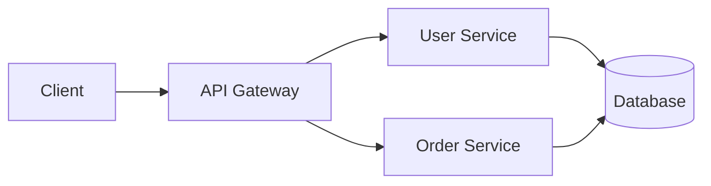
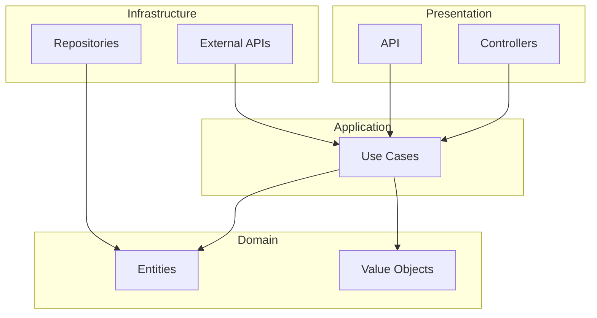

# Documentacao

## Visao Geral

Uma boa documentacao e **essencial** para a manutenibilidade do projeto. Ela deve estar atualizada, concisa e util.

**Principios:**
- Documentation as Code (versionada com o codigo)
- Single Source of Truth (sem duplicacao)
- Atualizada a cada PR
- Automatizada quando possivel

---

## Sumario

1. [Tipos de documentacao](#tipos-de-documentacao)
2. [README.md](#readmemd)
3. [Documentacao do codigo](#documentacao-do-codigo)
4. [ADR - Architecture Decision Records](#adr---architecture-decision-records)
5. [API Documentation](#api-documentation)
6. [Changelog](#changelog)
7. [Boas praticas](#boas-praticas)
8. [Checklist](#checklist)

---

## Tipos de documentacao

| Tipo | Audiencia | Conteudo | Formato |
|------|-----------|----------|---------|
| README | Novos devs | Inicio rapido | Markdown |
| Code comments | Desenvolvedores | Por que, nao o que | Inline |
| API docs | Consumidores | Endpoints, schemas | OpenAPI |
| ADR | Equipe | Decisoes arquiteturais | Markdown |
| Changelog | Todos | Historico de mudancas | Markdown |
| User docs | Usuarios | Guias, tutoriais | Markdown/HTML |

---

## README.md

### Estrutura recomendada

```markdown
# Nome do Projeto

Descricao curta (1-2 frases).

## Pre-requisitos

- Tool 1 (versao)
- Tool 2 (versao)

## Instalacao

```bash
# Comandos de instalacao
```

## Inicio rapido

```bash
# Comandos para iniciar o projeto
```

## Configuracao

Variaveis de ambiente necessarias:

| Variavel | Descricao | Padrao |
|----------|-----------|--------|
| DATABASE_URL | URL do banco de dados | - |
| API_KEY | Chave de API externa | - |

## Testes

```bash
# Como executar os testes
make test
```

## Deploy

Instrucoes de deploy.

## Arquitetura

Breve descricao da arquitetura.
Link para documentacao detalhada.

## Contribuicao

Instrucoes para contribuir.
Link para CONTRIBUTING.md.

## Licenca

MIT License
```

### Exemplos

#### BOM

```markdown
# E-Commerce API

API REST para gestao de pedidos e-commerce.

## Instalacao

```bash
git clone https://github.com/company/ecommerce-api
cd ecommerce-api
make install
```

## Inicio

```bash
make dev
# API disponivel em http://localhost:8080
```
```

#### RUIM

```markdown
# Project

This is a project.

Run `npm install` then `npm start`.
```

---

## Documentacao do codigo

### Regra de ouro

> **O codigo deve ser auto-documentado.**
> Os comentarios explicam o POR QUE, nao o QUE.

### Quando comentar

```
COMENTAR:
- Decisoes nao obvias
- Workarounds temporarios
- Referencias externas (tickets, specs)
- Algoritmos complexos

NAO COMENTAR:
- O que o codigo faz (legivel)
- Codigo obvio
- Codigo morto
```

### Exemplos

#### BOM - Explica o por que

```
// Workaround: API externa nao suporta UTF-8
// TODO: Remover quando API v2 estiver disponivel (#1234)
function sanitizeInput(text):
  return text.ascii_only()

// Rate limit de 100 req/min imposto pelo provedor
// Ver: https://provider.com/docs/rate-limits
RATE_LIMIT = 100
```

#### RUIM - Explica o que (inutil)

```
// Incrementa o contador
counter = counter + 1

// Retorna o usuario
return user

// Percorre os itens
for item in items:
```

### Documentacao das funcoes

Documentar:
- **Public API** - Sempre
- **Funcoes complexas** - Se nao for obvio
- **Funcoes privadas** - Raramente

```
/**
 * Calcula o preco total com descontos aplicaveis.
 *
 * @param items - Lista dos artigos
 * @param discountCode - Codigo promocional opcional
 * @returns Preco total apos descontos
 * @throws InvalidDiscountCode se codigo invalido
 *
 * @example
 * calculateTotal([item1, item2], "SAVE10")
 * // => Money(90.00)
 */
function calculateTotal(items, discountCode = null):
  ...
```

---

## ADR - Architecture Decision Records

### Formato

```markdown
# ADR-001: Escolha do banco de dados

## Status

Aceito (2025-01-15)

## Contexto

Precisamos escolher um banco de dados para armazenar
os dados de usuarios e pedidos.

Restricoes:
- Volume: ~1M usuarios, ~10M pedidos
- Consultas: 80% leituras, 20% escritas
- Orcamento: Limitado

## Decisao

Utilizamos PostgreSQL.

## Alternativas consideradas

### MySQL
- Familiaridade da equipe
- Menos performante para consultas complexas

### MongoDB
- Flexibilidade de schema
- Nao adaptado para relacoes fortes

### PostgreSQL (escolhido)
- Performance em consultas complexas
- JSONB para flexibilidade
- Extensoes (PostGIS se necessario)

## Consequencias

### Positivas
- Performance previsivel
- Ecossistema maduro
- Backup/restore padrao

### Negativas
- Migracao a partir do MySQL necessaria
- Treinamento da equipe nas especificidades do PG
```

### Quando criar um ADR

- Escolha de tecnologia importante
- Mudanca de arquitetura
- Adocao de um pattern
- Decisao irreversivel ou custosa para mudar

### Estrutura dos arquivos

```
docs/
└── adr/
    ├── 0001-escolha-banco-dados.md
    ├── 0002-arquitetura-microservices.md
    ├── 0003-estrategia-cache.md
    └── index.md
```

---

## API Documentation

### OpenAPI (Swagger)

```yaml
openapi: 3.0.0
info:
  title: User API
  version: 1.0.0
  description: API for user management

paths:
  /users:
    get:
      summary: List all users
      parameters:
        - name: page
          in: query
          schema:
            type: integer
            default: 1
      responses:
        200:
          description: Success
          content:
            application/json:
              schema:
                $ref: '#/components/schemas/UserList'

    post:
      summary: Create user
      requestBody:
        required: true
        content:
          application/json:
            schema:
              $ref: '#/components/schemas/CreateUser'
      responses:
        201:
          description: Created

components:
  schemas:
    User:
      type: object
      properties:
        id:
          type: string
          format: uuid
        email:
          type: string
          format: email
        name:
          type: string
```

### Boas praticas para documentacao de API

1. **Exemplos concretos** para cada endpoint
2. **Codigos de erro** documentados
3. **Autenticacao** explicada
4. **Rate limits** mencionados
5. **Versionamento** claro

---

## Changelog

### Formato Keep a Changelog

```markdown
# Changelog

All notable changes to this project will be documented in this file.

The format is based on [Keep a Changelog](https://keepachangelog.com/).

## [Unreleased]

### Added
- New payment gateway integration

### Changed
- Improved error messages

## [1.2.0] - 2025-01-15

### Added
- User profile pictures
- Export to PDF

### Changed
- Updated dependencies

### Fixed
- Login timeout issue (#123)

### Security
- Fixed XSS vulnerability in comments

## [1.1.0] - 2025-01-01

### Added
- Initial release
```

### Categorias

| Categoria | Conteudo |
|-----------|---------|
| **Added** | Novas funcionalidades |
| **Changed** | Modificacoes de comportamento |
| **Deprecated** | Funcionalidades que serao removidas em breve |
| **Removed** | Funcionalidades removidas |
| **Fixed** | Correcoes de bugs |
| **Security** | Correcoes de seguranca |

---

## Boas praticas

### 1. Documentation as Code

```
Versionada com Git
Revisada nas PRs
Testes de documentacao (links, sintaxe)
CI/CD gera a documentacao
```

### 2. Single Source of Truth

```
RUIM
- README diz "usar npm"
- Wiki diz "usar yarn"
- Slack diz "usar pnpm"

BOM
- README diz "usar npm"
- Wiki aponta para o README
- Slack aponta para o README
```

### 3. Atualizacao continua

```
Regra: Cada PR que muda o comportamento
       deve atualizar a documentacao.

Checklist PR:
- [ ] README atualizado
- [ ] API docs atualizados
- [ ] CHANGELOG atualizado
- [ ] ADR criado se decisao arquitetural
```

### 4. Automacao

```yaml
# Geracao automatica
- API docs a partir do codigo (anotacoes)
- Changelog a partir dos commits (conventional)
- Diagramas a partir do codigo (Mermaid)
```

---

## Diagramas

### Mermaid (integrado GitHub/GitLab)

```markdown

```

### Decisao de Arquitetura

```markdown

```

---

## Checklist

### Para cada PR

- [ ] README atualizado se mudanca de setup
- [ ] Comentarios adicionados para codigo nao obvio
- [ ] CHANGELOG atualizado
- [ ] API docs gerados/atualizados
- [ ] ADR criado se decisao arquitetural

### Revisao trimestral

- [ ] README ainda correto
- [ ] Links funcionais
- [ ] Exemplos atualizados
- [ ] Dependencias documentadas

### Novo projeto

- [ ] README com instalacao
- [ ] CONTRIBUTING.md
- [ ] CHANGELOG.md inicializado
- [ ] Estrutura docs/adr/ criada
- [ ] Template PR com checklist de documentacao

---

## Ferramentas recomendadas

| Ferramenta | Uso |
|------------|-----|
| **MkDocs** | Site de documentacao |
| **Swagger UI** | Documentacao de API |
| **Mermaid** | Diagramas |
| **ADR Tools** | Gestao de ADRs |
| **Vale** | Linting de prosa |

---

## Recursos

- **Keep a Changelog:** [keepachangelog.com](https://keepachangelog.com/)
- **ADR:** [adr.github.io](https://adr.github.io/)
- **OpenAPI:** [swagger.io/specification](https://swagger.io/specification/)
- **Diataxis:** [diataxis.fr](https://diataxis.fr/) (framework de documentacao)

---

**Data da ultima atualizacao:** 2025-01
**Versao:** 1.0.0
**Autor:** The Bearded CTO
