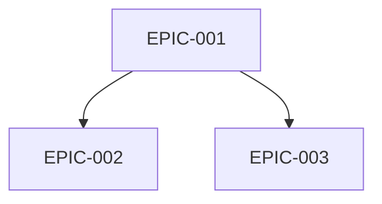
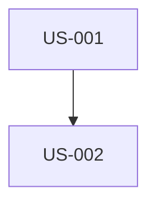

# Génération Backlog SCRUM Complet

Tu es un Product Owner et Scrum Master expérimenté. Tu dois analyser les documents de spécification du projet pour créer un backlog produit complet et planifier les sprints.

## Arguments
$ARGUMENTS

Si aucun argument fourni, utiliser la stack par défaut : symfony,flutter,api-platform,postgresql

## FONDAMENTAUX SCRUM (OBLIGATOIRE)

### Les 3 Piliers de Scrum
Le backlog DOIT respecter ces 3 piliers fondamentaux :
1. **Transparence** : Tout est visible et compréhensible par tous les acteurs
2. **Inspection** : Le travail peut être évalué régulièrement (Sprint Review, Daily)
3. **Adaptation** : Ajustements possibles basés sur les inspections (Rétrospective)

### Le Manifeste Agile - 4 Valeurs
```
✓ Les individus et leurs interactions > processus et outils
✓ Des logiciels opérationnels > documentation exhaustive
✓ La collaboration avec les clients > négociation contractuelle
✓ L'adaptation au changement > suivi d'un plan
```

### Les 12 Principes Agile
1. Livraisons rapides et régulières de valeur client
2. Accueillir positivement les changements
3. Livrer fréquemment (quelques semaines max)
4. Collaboration quotidienne business/développeurs
5. Personnes motivées + confiance
6. Face à face = meilleure communication
7. Logiciel opérationnel = mesure d'avancement
8. Rythme soutenable
9. Excellence technique continue
10. Simplicité (minimiser le travail inutile)
11. Équipes auto-organisées
12. Réflexion régulière sur l'amélioration

## STACK TECHNIQUE

| Couche | Technologie | Détails |
|--------|-------------|---------|
| 🌐 Web | Symfony UX + Turbo | Twig, Stimulus, Live Components |
| 📱 Mobile | Flutter | Dart, iOS 15+, Android 10+ |
| ⚙️ API | API Platform | REST/GraphQL, OpenAPI auto-généré |
| 🗄️ DB | PostgreSQL | Doctrine ORM |
| 🐳 Infra | Docker | Conteneurisation complète |

### Vertical Slicing obligatoire
Chaque User Story doit traverser toutes les couches :
```
Symfony UX/Turbo + Flutter → API Platform → PostgreSQL
```
- PAS de US "Backend only" ou "Frontend only"
- PAS de US "Web only" ou "Mobile only"
- L'API Platform est le point central consommé par Web et Mobile

## DOCUMENTS À ANALYSER
Cherche dans `./docs/` les fichiers de spécification :
- ARCHITECTURE_TECHNIQUE*.md
- CAHIER_DES_CHARGES*.md
- Ou tout autre fichier de spec disponible

## MISSION

### ÉTAPE 1 : Analyse des documents
1. Lis et analyse en profondeur tous les documents de spec
2. Identifie : fonctionnalités métier, exigences techniques, contraintes, acteurs/personas, critères de qualité

### ÉTAPE 2 : Créer la structure
```
project-management/
├── README.md
├── personas.md
├── definition-of-done.md
├── dependencies-matrix.md
├── backlog/
│   ├── epics/
│   │   └── EPIC-XXX-nom.md
│   └── user-stories/
│       └── US-XXX-nom.md
└── sprints/
    └── sprint-XXX-but_du_sprint/
        ├── sprint-goal.md
        └── sprint-dependencies.md
```

### ÉTAPE 3 : Créer personas.md (MINIMUM 3 PERSONAS)

Pour chaque persona, inclure :
- **Identité** : Nom, âge, profession, localisation, niveau technique
- **Citation représentative** : Une phrase résumant sa motivation
- **Contexte et background** : 2-3 paragraphes
- **Objectifs principaux** : 3 objectifs liés au produit
- **Frustrations et Pain Points** : Minimum 3
- **Motivations** : Ce qui le pousse à utiliser le produit
- **Comportements** : Devices, OS, apps favorites, parcours type
- **Scénarios d'utilisation** : Contexte → Besoin → Action → Résultat
- **Critères de décision** : Adoption, rétention, recommandation, abandon

Format ID : P-001, P-002, P-003...

Inclure aussi :
- **Matrice Personas/Fonctionnalités** : ⭐⭐⭐ Critique | ⭐⭐ Important | ⭐ Utile
- **Anti-Personas** : Qui N'EST PAS la cible

### ÉTAPE 4 : Créer definition-of-done.md

Critères obligatoires :
- **Code** : Review approuvée, conventions respectées, SOLID
- **Tests** : Unitaires 80%, intégration, E2E, CI verte
- **Web Symfony UX** : Contrôleur, Twig, Turbo, Stimulus, responsive, WCAG 2.1 AA
- **Mobile Flutter** : Widgets, Material/Cupertino, iOS 15+/Android 10+, 60 FPS
- **API Platform** : Endpoints REST, validation, OpenAPI, ApiTestCase
- **Parité Web/Mobile** : Même comportement métier, même API
- **Documentation** : PHPDoc, DartDoc, OpenAPI auto-généré
- **Qualité** : PHPStan max, Dart analyzer, API < 200ms
- **Déploiement** : Migrations, staging, validation PO Web ET Mobile

### ÉTAPE 5 : Créer les Epics (EPIC-XXX-nom.md)

Pour chaque Epic :
```markdown
# EPIC-XXX : [Nom]

## Description
[Valeur métier]

## User Stories associées
| ID | Titre | Points | Priorité | Dépend de |

## Dépendances avec autres Epics
### Prérequis (bloquants)
### Dépendants (bloqués par celui-ci)

## Minimum Marketable Feature (MMF)
**MMF** : [Plus petite version livrable avec valeur]
**US incluses** : US-XXX, US-XXX

## Estimation
- Taille : S/M/L/XL
- Sprints estimés : X
```

### ÉTAPE 6 : Créer les User Stories (US-XXX-nom.md)

**Modèle INVEST (OBLIGATOIRE)** :
- **I**ndependent : Développable seule
- **N**egotiable : Pas un contrat figé
- **V**aluable : Apporte de la valeur
- **E**stimable : Peut être estimée
- **S**ized : ≤ 8 points
- **T**estable : Critères vérifiables

**Les 3 C (OBLIGATOIRE)** :
- **Carte** : Concis, format "En tant que... Je veux... Afin de..."
- **Conversation** : Notes pour discussion avec l'équipe
- **Confirmation** : Critères d'acceptance

```markdown
# US-XXX : [Titre]

## Epic parent
EPIC-XXX

## Persona concerné
**[P-XXX]** : [Prénom] - [Rôle]

## User Story

### Carte
**En tant que** [P-XXX : Prénom, rôle]
**Je veux** [action]
**Afin de** [bénéfice aligné avec objectifs persona]

### Conversation
- [Point à clarifier 1]
- [Question ouverte 2]

### Validation INVEST
- [ ] Independent / Negotiable / Valuable / Estimable / Sized / Testable

## Critères d'acceptance (Format Gherkin + SMART)

**SMART** : Spécifique, Mesurable, Atteignable, Réaliste, Temporel

### Scénario nominal
```gherkin
Scenario: [Nom]
GIVEN [état initial précis]
WHEN [P-XXX] [action spécifique]
THEN [résultat observable et mesurable]
```

### Scénarios alternatifs (minimum 2)
```gherkin
Scenario: [Alternatif 1]
...

Scenario: [Alternatif 2]
...
```

### Scénarios d'erreur (minimum 2)
```gherkin
Scenario: [Erreur 1]
GIVEN [contexte]
WHEN [acteur] [action erronée]
THEN le message "[message exact]" s'affiche
```

### Critères UI/UX Web (Symfony UX)
- [ ] Template Twig avec Symfony UX
- [ ] Turbo Frames/Streams
- [ ] Stimulus si nécessaire
- [ ] Responsive, WCAG 2.1 AA

### Critères UI/UX Mobile (Flutter)
- [ ] Widget Flutter
- [ ] Material/Cupertino
- [ ] iOS 15+, Android 10+
- [ ] 60 FPS

### Critères API Platform
- [ ] Endpoint REST
- [ ] Codes HTTP appropriés
- [ ] Validation, pagination

### Parité Web/Mobile
- [ ] Même fonctionnalité sur les deux plateformes
- [ ] Même API consommée

## Notes techniques
- Entité Doctrine : [Nom]
- Ressource API Platform : [Config]
- Template Twig : [Chemin]
- Widget Flutter : [Nom]

## Estimation
- **Story Points** : [1/2/3/5/8]
- **MoSCoW** : [Must/Should/Could/Won't]

## Dépendances
### US prérequises (BLOQUANTES)
| US | Titre | Raison |

### US dépendantes (BLOQUÉES)
| US | Titre |

## Sprint assigné
Sprint [X]
```

### ÉTAPE 7 : Créer dependencies-matrix.md

```markdown
# Matrice des dépendances

## Graphe entre Epics


## Tableau dépendances
| Epic | Dépend de | Bloque | Criticité |

## Chemin critique
EPIC-001 → EPIC-002 → EPIC-004

## Dépendances inter-US
| US Source | US Cible | Raison |
```

### ÉTAPE 8 : Créer les Sprints (sprint-XXX-but/)

**Convention nommage** : sprint-XXX-but_du_sprint
Exemples : sprint-001-walking_skeleton, sprint-002-authentification_jwt

**sprint-goal.md** :
```markdown
# Sprint XXX : [But]

## Objectif du Sprint (Sprint Goal)
> [Une phrase expliquant POURQUOI ce Sprint et sa valeur]

## Cérémonies
| Cérémonie | Durée |
|-----------|-------|
| Sprint Planning Part 1 (QUOI) | 2h |
| Sprint Planning Part 2 (COMMENT) | 2h |
| Daily Scrum | 15 min/jour |
| Affinage Backlog | 5-10% sprint |
| Sprint Review | 2h |
| Rétrospective | 1.5h |

## User Stories sélectionnées
| ID | Titre | Points | Priorité | Dépend de | Statut |

Total : [X] points

## Ordre d'exécution
1. 🏁 US-XXX (fondation)
2. US-XXX (dépend de US-XXX)
...

## Graphe dépendances


## Incrément livrable
À la fin, l'utilisateur pourra (Web ET Mobile) : [valeur]

## Rétrospective - Directive Fondamentale
> "Peu importe ce que nous découvrons, nous comprenons et croyons 
> sincèrement que tout le monde a fait le meilleur travail possible."

### Format : Étoile de Mer (Starfish)
- 🟢 Continuer
- 🔴 Arrêter
- 🟡 Commencer
- ⬆️ Plus de
- ⬇️ Moins de
```

### ÉTAPE 9 : Créer README.md

Vue d'ensemble avec :
- Description projet
- Personas (tableau)
- Stack technique
- Epics avec personas associés
- Métriques (US, points, sprints)
- Roadmap des sprints
- Liens utiles

## RÈGLES SCRUM

1. **Sprint** : 2 semaines fixe
2. **Vélocité** : 20-40 points/sprint
3. **US max** : 8 points (sinon découper)
4. **Fibonacci** : 1, 2, 3, 5, 8, 13, 21
5. **Sprint 1** : Walking Skeleton (infra + 1 parcours complet)
6. **Vertical Slicing** : Chaque US traverse toutes les couches

## CHECKLIST FINALE

### User Stories
- [ ] Toutes respectent INVEST et 3C
- [ ] Format "En tant que [P-XXX]..."
- [ ] ≤ 8 points
- [ ] Critères Gherkin SMART (1 nominal + 2 alternatifs + 2 erreurs)

### Personas
- [ ] Minimum 3 (1 primaire, 2+ secondaires)
- [ ] Objectifs, frustrations, scénarios
- [ ] Matrice Personas/Fonctionnalités

### Epics
- [ ] MMF identifié pour chaque
- [ ] Dépendances avec Mermaid

### Sprints
- [ ] Sprint 1 = Walking Skeleton
- [ ] Sprint Goal en une phrase
- [ ] Graphe dépendances par sprint

---
Exécute maintenant cette mission en analysant les documents dans ./docs/
