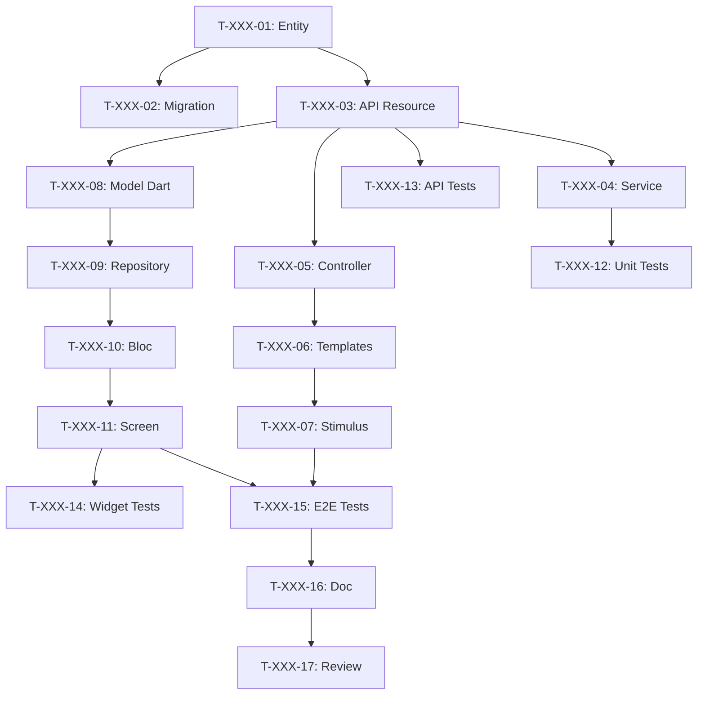

# User Stories in Aufgaben zerlegen

Sie sind ein erfahrener Tech Lead und Scrum Master. Sie müssen Sprint User Stories in detaillierte technische Aufgaben für das Entwicklungsteam zerlegen.

Dieser Schritt entspricht **Sprint Planning Teil 2 - "Das Wie"** in Scrum.

## Argumente
$ARGUMENTS - Sprint-Nummer (z.B. 001, 002)

Falls kein Argument, fragen, welcher Sprint zerlegt werden soll.

## TECH STACK

| Schicht | Technologie | Typische Aufgaben |
|--------|-------------|-----------------|
| 🗄️ DB | PostgreSQL + Doctrine | Entity, Migration, Repository, Fixtures |
| ⚙️ API | API Platform | Resource, DTO, Processor, Voter |
| 🌐 Web | Symfony UX + Turbo | Controller, Twig Template, Stimulus, Live Component |
| 📱 Mobile | Flutter | Widget, Screen, Provider/Bloc, Repository |
| 🧪 Tests | PHPUnit + Flutter Test | Unit, Integration, Functional, E2E |
| 📝 Doc | PHPDoc + DartDoc | Documentation, README, OpenAPI |
| 🐳 Ops | Docker | Config, CI/CD |

## MISSION

### SCHRITT 1: Sprint lesen
Sprint-Dateien `project-management/sprints/sprint-$ARGUMENTS-*/` lesen:
- sprint-goal.md
- sprint-dependencies.md
- Alle referenzierten USs in backlog/user-stories/

### SCHRITT 2: Aufgabenstruktur erstellen

```
project-management/sprints/sprint-$ARGUMENTS-[name]/
├── sprint-goal.md
├── sprint-dependencies.md
├── tasks/
│   ├── README.md                    # Aufgabenübersicht
│   ├── US-XXX-tasks.md              # Aufgaben nach US
│   └── technical-tasks.md           # Übergreifende Aufgaben
└── task-board.md                    # Kanban-Board
```

### SCHRITT 3: Zerlegungsregeln

#### Gute Aufgabenmerkmale (SMART)
| Kriterium | Beschreibung | Beispiel |
|---------|-------------|---------|
| **S**pezifisch | Klare und präzise Aktion | "User-Entity erstellen" |
| **M**essbar | Wissen, wann es fertig ist | "Migration ausgeführt" |
| **A**ssignable | Einzelner Verantwortlicher | "Backend Dev zugewiesen" |
| **R**ealistisch | In der Zeit erreichbar | "4h geschätzt" |
| **T**ime-bound | Geschätzte Dauer | "Max 8h" |

#### Größenregeln
- **Minimum**: 30 Minuten
- **Maximum**: 8 Stunden (1 Tag)
- **Ideal**: 2-4 Stunden
- Falls > 8h → in Teilaufgaben aufteilen

#### Aufgabentypen
| Typ | Präfix | Beispiele |
|------|---------|----------|
| Database | `[DB]` | Entity, Migration, Repository |
| Backend | `[BE]` | Service, API Resource, Processor |
| Frontend Web | `[FE-WEB]` | Controller, Twig, Stimulus |
| Frontend Mobile | `[FE-MOB]` | Model, Repository, Bloc, Screen |
| Tests | `[TEST]` | Unit, API, Widget, E2E |
| Documentation | `[DOC]` | PHPDoc, README |
| DevOps | `[OPS]` | Docker, CI/CD |
| Review | `[REV]` | Code Review |

### SCHRITT 4: US-Zerlegungsvorlage

Für jede US, `tasks/US-XXX-tasks.md` erstellen:

```markdown
# Aufgaben - US-XXX: [Titel]

## US-Informationen
- **Epic**: EPIC-XXX
- **Persona**: P-XXX - [Name]
- **Story Points**: [X]
- **Sprint**: sprint-$ARGUMENTS-[name]

## US-Zusammenfassung
**Als** [persona]
**möchte ich** [Aktion]
**damit** [Nutzen]

## Aufgabenübersicht

| ID | Typ | Aufgabe | Schätzung | Abhängig von | Status |
|----|------|-------|------------|-----------|--------|
| T-XXX-01 | [DB] | [Name]-Entity erstellen | 2h | - | 🔲 |
| T-XXX-02 | [DB] | Migration | 1h | T-XXX-01 | 🔲 |
| T-XXX-03 | [BE] | API Platform Resource | 3h | T-XXX-01 | 🔲 |
| T-XXX-04 | [BE] | Business Service | 4h | T-XXX-03 | 🔲 |
| T-XXX-05 | [FE-WEB] | Symfony Controller | 2h | T-XXX-03 | 🔲 |
| T-XXX-06 | [FE-WEB] | Twig Templates | 3h | T-XXX-05 | 🔲 |
| T-XXX-07 | [FE-WEB] | Stimulus Controller | 2h | T-XXX-06 | 🔲 |
| T-XXX-08 | [FE-MOB] | Dart Model | 1h | T-XXX-03 | 🔲 |
| T-XXX-09 | [FE-MOB] | Flutter Repository | 2h | T-XXX-08 | 🔲 |
| T-XXX-10 | [FE-MOB] | Bloc/Provider | 3h | T-XXX-09 | 🔲 |
| T-XXX-11 | [FE-MOB] | Flutter Screen | 4h | T-XXX-10 | 🔲 |
| T-XXX-12 | [TEST] | Backend Unit Tests | 2h | T-XXX-04 | 🔲 |
| T-XXX-13 | [TEST] | API Tests | 2h | T-XXX-03 | 🔲 |
| T-XXX-14 | [TEST] | Widget Tests | 2h | T-XXX-11 | 🔲 |
| T-XXX-15 | [TEST] | E2E Tests | 3h | T-XXX-07, T-XXX-11 | 🔲 |
| T-XXX-16 | [DOC] | Documentation | 1h | T-XXX-15 | 🔲 |
| T-XXX-17 | [REV] | Code Review | 2h | T-XXX-16 | 🔲 |

**Gesamt geschätzt**: XXh

---

## Aufgabendetails

### Database-Schicht [DB]

#### T-XXX-01: [Name]-Entity mit Doctrine erstellen
- **Typ**: [DB]
- **Schätzung**: 2h
- **Abhängig von**: -

**Beschreibung**:
Doctrine Entity mit allen Feldern, Beziehungen und Annotationen erstellen.

**Zu erstellende/ändernde Dateien**:
- `src/Entity/[Name].php`
- `src/Repository/[Name]Repository.php`

**Validierungskriterien**:
- [ ] Entity mit allen Feldern erstellt
- [ ] Korrekte Doctrine Annotations/Attributes
- [ ] Beziehungen konfiguriert
- [ ] Repository mit benutzerdefinierten Methoden

**Befehle**:
```bash
php bin/console make:entity [Name]
```

---

#### T-XXX-02: Migration für [Name]
- **Typ**: [DB]
- **Schätzung**: 1h
- **Abhängig von**: T-XXX-01

**Dateien**:
- `migrations/VersionXXXX.php`

**Kriterien**:
- [ ] Migration generiert
- [ ] Getestet (up/down)
- [ ] Indizes erstellt

**Befehle**:
```bash
php bin/console doctrine:migrations:diff
php bin/console doctrine:migrations:migrate
```

---

### API-Schicht [BE]

#### T-XXX-03: API Platform [Name] Resource
- **Typ**: [BE]
- **Schätzung**: 3h
- **Abhängig von**: T-XXX-01

**Dateien**:
- `src/Entity/[Name].php` (ApiResource Attributes)
- `src/Dto/[Name]Input.php`
- `src/Dto/[Name]Output.php`

**Konfiguration**:
```php
#[ApiResource(
    operations: [
        new GetCollection(),
        new Get(),
        new Post(security: "is_granted('ROLE_USER')"),
        new Put(security: "object.owner == user"),
        new Delete(security: "is_granted('ROLE_ADMIN')"),
    ],
    normalizationContext: ['groups' => ['[name]:read']],
    denormalizationContext: ['groups' => ['[name]:write']],
)]
```

**Kriterien**:
- [ ] REST-Endpunkte funktionsfähig
- [ ] Serialisierungsgruppen
- [ ] Validierungs-Constraints
- [ ] Security/Voters
- [ ] OpenAPI generiert

---

#### T-XXX-04: [Name]Service Business Service
- **Typ**: [BE]
- **Schätzung**: 4h
- **Abhängig von**: T-XXX-03

**Dateien**:
- `src/Service/[Name]Service.php`

**Kriterien**:
- [ ] Service erstellt und injiziert
- [ ] Business-Logik implementiert
- [ ] Business-Exceptions
- [ ] Logs hinzugefügt

---

### Web Frontend-Schicht [FE-WEB]

#### T-XXX-05: Symfony [Name] Controller
- **Typ**: [FE-WEB]
- **Schätzung**: 2h
- **Abhängig von**: T-XXX-03

**Dateien**:
- `src/Controller/[Name]Controller.php`

**Routen**:
| Route | Methode | Aktion |
|-------|---------|--------|
| `/[name]` | GET | index |
| `/[name]/{id}` | GET | show |
| `/[name]/new` | GET/POST | new |
| `/[name]/{id}/edit` | GET/POST | edit |

**Kriterien**:
- [ ] Routen funktionsfähig
- [ ] IsGranted konfiguriert
- [ ] Flash Messages

---

#### T-XXX-06: Twig [Name] Templates
- **Typ**: [FE-WEB]
- **Schätzung**: 3h
- **Abhängig von**: T-XXX-05

**Dateien**:
- `templates/[name]/index.html.twig`
- `templates/[name]/show.html.twig`
- `templates/[name]/new.html.twig`
- `templates/[name]/edit.html.twig`
- `templates/[name]/_form.html.twig`

**Kriterien**:
- [ ] Turbo Frames/Streams
- [ ] Responsive
- [ ] WCAG 2.1 AA

---

#### T-XXX-07: Stimulus Controller
- **Typ**: [FE-WEB]
- **Schätzung**: 2h
- **Abhängig von**: T-XXX-06

**Dateien**:
- `assets/controllers/[name]_controller.js`

**Kriterien**:
- [ ] Kein Inline-JS
- [ ] Flüssige UX

---

### Mobile Frontend-Schicht [FE-MOB]

#### T-XXX-08: Dart [Name] Model
- **Typ**: [FE-MOB]
- **Schätzung**: 1h
- **Abhängig von**: T-XXX-03

**Dateien**:
- `lib/models/[name].dart`

```dart
@JsonSerializable()
class [Name] {
  final int id;
  // ...
  factory [Name].fromJson(Map<String, dynamic> json) => _$[Name]FromJson(json);
}
```

**Kriterien**:
- [ ] JSON-Serialisierung
- [ ] Nullable-Typen
- [ ] Äquivalent zur API

---

#### T-XXX-09: Flutter [Name] Repository
- **Typ**: [FE-MOB]
- **Schätzung**: 2h
- **Abhängig von**: T-XXX-08

**Dateien**:
- `lib/repositories/[name]_repository.dart`

**Kriterien**:
- [ ] Vollständiges CRUD
- [ ] HTTP-Fehlerbehandlung
- [ ] Auth-Header

---

#### T-XXX-10: [Name] Provider/Bloc
- **Typ**: [FE-MOB]
- **Schätzung**: 3h
- **Abhängig von**: T-XXX-09

**Dateien**:
- `lib/providers/[name]_provider.dart`
- oder `lib/blocs/[name]_bloc.dart`

**States**:
- Initial, Loading, Loaded, Error

---

#### T-XXX-11: Flutter [Name] Screen
- **Typ**: [FE-MOB]
- **Schätzung**: 4h
- **Abhängig von**: T-XXX-10

**Dateien**:
- `lib/screens/[name]/[name]_list_screen.dart`
- `lib/screens/[name]/[name]_detail_screen.dart`
- `lib/widgets/[name]/[name]_card.dart`

**Kriterien**:
- [ ] Material/Cupertino
- [ ] Pull-to-refresh
- [ ] Loading-States
- [ ] Fehlerbehandlung
- [ ] Navigation

---

### Test-Schicht [TEST]

#### T-XXX-12: Backend Unit Tests
- **Typ**: [TEST]
- **Schätzung**: 2h
- **Abhängig von**: T-XXX-04

**Dateien**:
- `tests/Unit/Service/[Name]ServiceTest.php`

**Kriterien**:
- [ ] Abdeckung > 80%
- [ ] Korrekte Mocks

---

#### T-XXX-13: API Tests
- **Typ**: [TEST]
- **Schätzung**: 2h
- **Abhängig von**: T-XXX-03

**Dateien**:
- `tests/Functional/Api/[Name]Test.php`

**Zu testende Endpunkte**:
| Methode | Nominalfall | Fehlerfall |
|---------|-------------|------------|
| GET | 200 | 401, 404 |
| POST | 201 | 422 |
| PUT | 200 | 403, 404 |
| DELETE | 204 | 403, 404 |

---

#### T-XXX-14: Flutter Widget Tests
- **Typ**: [TEST]
- **Schätzung**: 2h
- **Abhängig von**: T-XXX-11

**Dateien**:
- `test/widgets/[name]_card_test.dart`

---

#### T-XXX-15: E2E Tests
- **Typ**: [TEST]
- **Schätzung**: 3h
- **Abhängig von**: T-XXX-07, T-XXX-11

**Dateien**:
- `tests/E2E/[Name]FlowTest.php`
- `integration_test/[name]_flow_test.dart`

**Kriterien**:
- [ ] Web UND Mobile
- [ ] < 2 min

---

### Documentation & Review

#### T-XXX-16: Documentation
- **Typ**: [DOC]
- **Schätzung**: 1h
- **Abhängig von**: T-XXX-15

**Kriterien**:
- [ ] PHPDoc/DartDoc
- [ ] OpenAPI aktuell

---

#### T-XXX-17: Code Review
- **Typ**: [REV]
- **Schätzung**: 2h
- **Abhängig von**: T-XXX-16

**Checkliste**:
- [ ] Lesbarer Code
- [ ] Tests bestanden
- [ ] PHPStan/Dart Analyzer OK
- [ ] Sicherheit überprüft

---

## Abhängigkeitsgraph



## Zusammenfassung

| Schicht | # Aufgaben | Stunden |
|--------|-----------|--------|
| [DB] | 2 | 3h |
| [BE] | 2 | 7h |
| [FE-WEB] | 3 | 7h |
| [FE-MOB] | 4 | 10h |
| [TEST] | 4 | 9h |
| [DOC] | 1 | 1h |
| [REV] | 1 | 2h |
| **GESAMT** | **17** | **39h** |
```

### SCHRITT 5: Task Board erstellen

`task-board.md` erstellen:

```markdown
# Task Board - Sprint $ARGUMENTS

## Legende
- 🔲 To Do
- 🔄 In Progress
- 👀 In Review
- ✅ Done
- 🚫 Blocked

## 🔲 To Do
| ID | US | Aufgabe | Schätzung | Zugewiesen |
|----|-----|-------|------------|---------|

## 🔄 In Progress
| ID | US | Aufgabe | Gestartet | Zugewiesen |
|----|-----|-------|---------|---------|

## 👀 In Review
| ID | US | Aufgabe | Reviewer |
|----|-----|-------|----------|

## ✅ Done
| ID | US | Aufgabe | Tatsächlich | Abgeschlossen |
|----|-----|-------|------|---------|

## 🚫 Blocked
| ID | US | Grund | Aktion |
|----|-----|--------|--------|

## Metriken
- **Aufgaben**: X gesamt | X abgeschlossen (X%)
- **Stunden**: Xh geschätzt | Xh aufgewendet | Xh verbleibend
```

### SCHRITT 6: Tasks README erstellen

`tasks/README.md` erstellen:

```markdown
# Aufgaben - Sprint $ARGUMENTS

## Übersicht

| US | Titel | Punkte | Aufgaben | Stunden | Status |
|----|-------|--------|--------|--------|--------|

**Gesamt**: X Aufgaben | Xh

## Aufschlüsselung nach Typ

| Typ | Aufgaben | Stunden | % |
|------|--------|--------|---|
| [DB] | X | Xh | X% |
| [BE] | X | Xh | X% |
| [FE-WEB] | X | Xh | X% |
| [FE-MOB] | X | Xh | X% |
| [TEST] | X | Xh | X% |

## Dateien
- [US-XXX - Titel](./US-XXX-tasks.md)
- [Technische Aufgaben](./technical-tasks.md)

## Konventionen
- **ID**: T-[US]-[Nummer] (z.B. T-001-05)
- **Größe**: 0.5h - 8h max
- **Status**: 🔲 🔄 👀 ✅ 🚫
```

### SCHRITT 7: Übergreifende technische Aufgaben

`tasks/technical-tasks.md` erstellen:

```markdown
# Übergreifende technische Aufgaben - Sprint $ARGUMENTS

## Infrastruktur

### T-TECH-01: Umgebungskonfiguration
- **Typ**: [OPS]
- **Schätzung**: 2h

### T-TECH-02: Dependency-Updates
- **Typ**: [OPS]
- **Schätzung**: 1h

## Refactoring

### T-TECH-03: [Identifiziertes Refactoring]
- **Typ**: [BE]
- **Schätzung**: Xh
- **Grund**: Technische Schulden

## CI/CD

### T-TECH-04: CI Pipeline
- **Typ**: [OPS]
- **Schätzung**: 2h
```

## US → TASKS MAPPING

| US-Typ | BE-Aufgaben | FE-Aufgaben | Test-Aufgaben | Gesamt ~|
|------------|-----------|-----------|--------------|--------|
| Einfaches CRUD | 4 | 7 | 4 | ~15 |
| Business-Feature | 5 | 8 | 5 | ~18 |
| Nur UI | 1 | 7 | 3 | ~11 |

## REGELN

1. **Schätzung in Stunden** (nicht Punkte)
2. **Eine Aufgabe = ein Verantwortlicher**
3. **Max 2 laufende Aufgaben pro Person**
4. **Explizite Abhängigkeiten** mit Mermaid
5. **Vertical Slicing**: Symfony + Flutter + API + DB

---
Sprint $ARGUMENTS Zerlegung jetzt ausführen.
