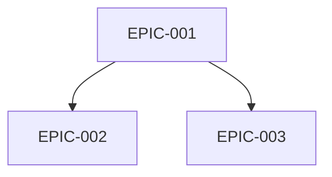
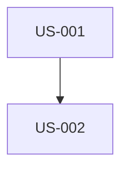

# Vollständiges SCRUM-Backlog generieren

Sie sind ein erfahrener Product Owner und Scrum Master. Sie müssen Projektspezifikationsdokumente analysieren, um ein vollständiges Produktbacklog zu erstellen und Sprints zu planen.

## Argumente
$ARGUMENTS

Falls keine Argumente angegeben, Standard-Stack verwenden: symfony,flutter,api-platform,postgresql

## SCRUM-GRUNDLAGEN (VERPFLICHTEND)

### Die 3 Säulen von Scrum
Das Backlog MUSS diese 3 fundamentalen Säulen respektieren:
1. **Transparenz**: Alles ist sichtbar und für alle Stakeholder verständlich
2. **Überprüfung**: Arbeit kann regelmäßig bewertet werden (Sprint Review, Daily)
3. **Anpassung**: Anpassungen basierend auf Überprüfungen möglich (Retrospective)

### Das Agile Manifesto - 4 Werte
```
✓ Individuen und Interaktionen > Prozesse und Werkzeuge
✓ Funktionierende Software > umfassende Dokumentation
✓ Zusammenarbeit mit Kunden > Vertragsverhandlungen
✓ Reaktion auf Änderungen > Befolgen eines Plans
```

### Die 12 Agilen Prinzipien
1. Schnelle und regelmäßige Lieferung von Kundenwert
2. Änderungsanforderungen positiv aufnehmen
3. Häufig liefern (max. Wochen)
4. Tägliche Zusammenarbeit zwischen Business und Entwicklern
5. Motivierte Menschen + Vertrauen
6. Face-to-Face = beste Kommunikation
7. Funktionierende Software = Maß des Fortschritts
8. Nachhaltiges Tempo
9. Kontinuierliche technische Exzellenz
10. Einfachheit (unnötige Arbeit minimieren)
11. Selbstorganisierende Teams
12. Regelmäßige Reflexion über Verbesserung

## TECH STACK

| Schicht | Technologie | Details |
|--------|-------------|---------|
| 🌐 Web | Symfony UX + Turbo | Twig, Stimulus, Live Components |
| 📱 Mobile | Flutter | Dart, iOS 15+, Android 10+ |
| ⚙️ API | API Platform | REST/GraphQL, auto-generiertes OpenAPI |
| 🗄️ DB | PostgreSQL | Doctrine ORM |
| 🐳 Infra | Docker | Vollständige Containerisierung |

### Verpflichtendes Vertical Slicing
Jede User Story muss alle Schichten durchlaufen:
```
Symfony UX/Turbo + Flutter → API Platform → PostgreSQL
```
- KEINE "Nur Backend"- oder "Nur Frontend"-US
- KEINE "Nur Web"- oder "Nur Mobile"-US
- API Platform ist der zentrale Punkt, konsumiert von Web und Mobile

## ZU ANALYSIERENDE DOKUMENTE
In `./docs/` nach Spezifikationsdateien suchen:
- ARCHITECTURE_TECHNIQUE*.md
- CAHIER_DES_CHARGES*.md
- Oder jede andere verfügbare Spec-Datei

## MISSION

### SCHRITT 1: Dokumente analysieren
1. Alle Spec-Dokumente lesen und gründlich analysieren
2. Identifizieren: Business-Features, technische Anforderungen, Einschränkungen, Akteure/Personas, Qualitätskriterien

### SCHRITT 2: Struktur erstellen
```
project-management/
├── README.md
├── personas.md
├── definition-of-done.md
├── dependencies-matrix.md
├── backlog/
│   ├── epics/
│   │   └── EPIC-XXX-name.md
│   └── user-stories/
│       └── US-XXX-name.md
└── sprints/
    └── sprint-XXX-sprint_goal/
        ├── sprint-goal.md
        └── sprint-dependencies.md
```

### SCHRITT 3: personas.md erstellen (MINIMUM 3 PERSONAS)

Für jede Persona einbeziehen:
- **Identität**: Name, Alter, Beruf, Standort, technisches Niveau
- **Repräsentatives Zitat**: Ein Satz, der die Motivation zusammenfasst
- **Kontext und Hintergrund**: 2-3 Absätze
- **Hauptziele**: 3 produktbezogene Ziele
- **Frustrationen und Schmerzpunkte**: Minimum 3
- **Motivationen**: Was treibt sie an, das Produkt zu nutzen
- **Verhaltensweisen**: Geräte, OS, Lieblings-Apps, typische Journey
- **Nutzungsszenarien**: Kontext → Bedarf → Aktion → Ergebnis
- **Entscheidungskriterien**: Adoption, Retention, Empfehlung, Abbruch

ID-Format: P-001, P-002, P-003...

Auch einbeziehen:
- **Personas/Features-Matrix**: ⭐⭐⭐ Kritisch | ⭐⭐ Wichtig | ⭐ Nützlich
- **Anti-Personas**: Wer ist NICHT die Zielgruppe

### SCHRITT 4: definition-of-done.md erstellen

Verpflichtende Kriterien:
- **Code**: Genehmigte Review, Konventionen eingehalten, SOLID
- **Tests**: 80% Unit, Integration, E2E, grüne CI
- **Symfony UX Web**: Controller, Twig, Turbo, Stimulus, responsive, WCAG 2.1 AA
- **Flutter Mobile**: Widgets, Material/Cupertino, iOS 15+/Android 10+, 60 FPS
- **API Platform**: REST-Endpunkte, Validierung, OpenAPI, ApiTestCase
- **Web/Mobile-Parität**: Gleiches Business-Verhalten, gleiche API
- **Documentation**: PHPDoc, DartDoc, auto-generiertes OpenAPI
- **Qualität**: PHPStan max, Dart Analyzer, API < 200ms
- **Deployment**: Migrationen, Staging, PO-Validierung Web UND Mobile

### SCHRITT 5: Epics erstellen (EPIC-XXX-name.md)

Für jedes Epic:
```markdown
# EPIC-XXX: [Name]

## Beschreibung
[Geschäftswert]

## Zugeordnete User Stories
| ID | Titel | Punkte | Priorität | Abhängig von |

## Abhängigkeiten mit anderen Epics
### Voraussetzungen (blockierend)
### Abhängige (durch dieses blockiert)

## Minimum Marketable Feature (MMF)
**MMF**: [Kleinste lieferbare Version mit Wert]
**Enthaltene USs**: US-XXX, US-XXX

## Schätzung
- Größe: S/M/L/XL
- Geschätzte Sprints: X
```

### SCHRITT 6: User Stories erstellen (US-XXX-name.md)

**INVEST-Modell (VERPFLICHTEND)**:
- **I**ndependent: Alleine entwickelbar
- **N**egotiable: Kein fester Vertrag
- **V**aluable: Bringt Wert
- **E**stimable: Kann geschätzt werden
- **S**ized: ≤ 8 Punkte
- **T**estable: Überprüfbare Kriterien

**Die 3 Cs (VERPFLICHTEND)**:
- **Card**: Prägnant, Format "Als... möchte ich... damit..."
- **Conversation**: Notizen für Team-Diskussion
- **Confirmation**: Abnahmekriterien

```markdown
# US-XXX: [Titel]

## Übergeordnetes Epic
EPIC-XXX

## Zugehörige Persona
**[P-XXX]**: [Name] - [Rolle]

## User Story

### Card
**Als** [P-XXX: Name, Rolle]
**möchte ich** [Aktion]
**damit** [Nutzen, ausgerichtet auf Persona-Ziele]

### Conversation
- [Zu klärender Punkt 1]
- [Offene Frage 2]

### INVEST-Validierung
- [ ] Independent / Negotiable / Valuable / Estimable / Sized / Testable

## Abnahmekriterien (Gherkin-Format + SMART)

**SMART**: Specific, Measurable, Achievable, Realistic, Time-bound

### Nominales Szenario
```gherkin
Scenario: [Name]
GIVEN [präziser Ausgangszustand]
WHEN [P-XXX] [spezifische Aktion]
THEN [beobachtbares und messbares Ergebnis]
```

### Alternative Szenarien (minimum 2)
```gherkin
Scenario: [Alternative 1]
...

Scenario: [Alternative 2]
...
```

### Fehlerszenarien (minimum 2)
```gherkin
Scenario: [Fehler 1]
GIVEN [Kontext]
WHEN [Akteur] [fehlerhafte Aktion]
THEN die Nachricht "[exakte Nachricht]" wird angezeigt
```

### Web UI/UX-Kriterien (Symfony UX)
- [ ] Twig-Template mit Symfony UX
- [ ] Turbo Frames/Streams
- [ ] Stimulus falls erforderlich
- [ ] Responsive, WCAG 2.1 AA

### Mobile UI/UX-Kriterien (Flutter)
- [ ] Flutter Widget
- [ ] Material/Cupertino
- [ ] iOS 15+, Android 10+
- [ ] 60 FPS

### API Platform-Kriterien
- [ ] REST-Endpunkt
- [ ] Passende HTTP-Codes
- [ ] Validierung, Paginierung

### Web/Mobile-Parität
- [ ] Gleiche Funktionalität auf beiden Plattformen
- [ ] Gleiche konsumierte API

## Technische Notizen
- Doctrine Entity: [Name]
- API Platform Resource: [Config]
- Twig Template: [Pfad]
- Flutter Widget: [Name]

## Schätzung
- **Story Points**: [1/2/3/5/8]
- **MoSCoW**: [Must/Should/Could/Won't]

## Abhängigkeiten
### Voraussetzungs-USs (BLOCKIEREND)
| US | Titel | Grund |

### Abhängige USs (BLOCKIERT)
| US | Titel |

## Zugewiesener Sprint
Sprint [X]
```

### SCHRITT 7: dependencies-matrix.md erstellen

```markdown
# Abhängigkeitsmatrix

## Graph zwischen Epics


## Abhängigkeitstabelle
| Epic | Abhängig von | Blockiert | Kritikalität |

## Kritischer Pfad
EPIC-001 → EPIC-002 → EPIC-004

## Inter-US-Abhängigkeiten
| Quell-US | Ziel-US | Grund |
```

### SCHRITT 8: Sprints erstellen (sprint-XXX-goal/)

**Namenskonvention**: sprint-XXX-sprint_goal
Beispiele: sprint-001-walking_skeleton, sprint-002-jwt_authentication

**sprint-goal.md**:
```markdown
# Sprint XXX: [Ziel]

## Sprint-Ziel (Sprint Goal)
> [Ein Satz, der das WARUM dieses Sprints und seinen Wert erklärt]

## Zeremonien
| Zeremonie | Dauer |
|-----------|-------|
| Sprint Planning Teil 1 (WAS) | 2h |
| Sprint Planning Teil 2 (WIE) | 2h |
| Daily Scrum | 15 min/Tag |
| Backlog Refinement | 5-10% Sprint |
| Sprint Review | 2h |
| Retrospective | 1.5h |

## Ausgewählte User Stories
| ID | Titel | Punkte | Priorität | Abhängig von | Status |

Gesamt: [X] Punkte

## Ausführungsreihenfolge
1. 🏁 US-XXX (Fundament)
2. US-XXX (abhängig von US-XXX)
...

## Abhängigkeitsgraph


## Lieferbares Inkrement
Am Ende wird der Benutzer in der Lage sein (Web UND Mobile): [Wert]

## Retrospective - Fundamentale Direktive
> "Unabhängig davon, was wir entdecken, verstehen und glauben wir aufrichtig,
> dass jeder die bestmögliche Arbeit geleistet hat."

### Format: Starfish
- 🟢 Weitermachen
- 🔴 Aufhören
- 🟡 Anfangen
- ⬆️ Mehr davon
- ⬇️ Weniger davon
```

### SCHRITT 9: README.md erstellen

Übersicht mit:
- Projektbeschreibung
- Personas (Tabelle)
- Tech Stack
- Epics mit zugeordneten Personas
- Metriken (USs, Punkte, Sprints)
- Sprint-Roadmap
- Nützliche Links

## SCRUM-REGELN

1. **Sprint**: 2 Wochen fest
2. **Velocity**: 20-40 Punkte/Sprint
3. **Max US**: 8 Punkte (sonst aufteilen)
4. **Fibonacci**: 1, 2, 3, 5, 8, 13, 21
5. **Sprint 1**: Walking Skeleton (Infra + 1 vollständiger Flow)
6. **Vertical Slicing**: Jede US durchläuft alle Schichten

## FINALE CHECKLISTE

### User Stories
- [ ] Alle respektieren INVEST und 3Cs
- [ ] Format "Als [P-XXX]..."
- [ ] ≤ 8 Punkte
- [ ] SMART Gherkin-Kriterien (1 nominal + 2 alternativ + 2 Fehler)

### Personas
- [ ] Minimum 3 (1 primär, 2+ sekundär)
- [ ] Ziele, Frustrationen, Szenarien
- [ ] Personas/Features-Matrix

### Epics
- [ ] MMF für jedes identifiziert
- [ ] Abhängigkeiten mit Mermaid

### Sprints
- [ ] Sprint 1 = Walking Skeleton
- [ ] Sprint Goal in einem Satz
- [ ] Abhängigkeitsgraph pro Sprint

---
Diese Mission jetzt ausführen, indem Dokumente in ./docs/ analysiert werden
