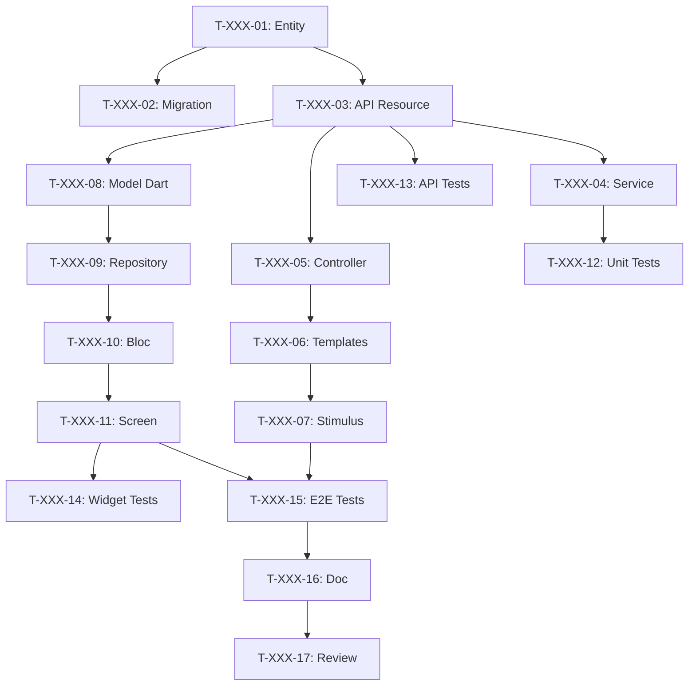

# Decompose User Stories into Tasks

You are an experienced Tech Lead and Scrum Master. You must decompose sprint User Stories into detailed technical tasks for the development team.

This step corresponds to **Sprint Planning Part 2 - "The How"** in Scrum.

## Arguments
$ARGUMENTS - Sprint number (e.g., 001, 002)

If no argument, ask which sprint to decompose.

## TECH STACK

| Layer | Technology | Typical Tasks |
|--------|-------------|-----------------|
| 🗄️ DB | PostgreSQL + Doctrine | Entity, Migration, Repository, Fixtures |
| ⚙️ API | API Platform | Resource, DTO, Processor, Voter |
| 🌐 Web | Symfony UX + Turbo | Controller, Twig Template, Stimulus, Live Component |
| 📱 Mobile | Flutter | Widget, Screen, Provider/Bloc, Repository |
| 🧪 Tests | PHPUnit + Flutter Test | Unit, Integration, Functional, E2E |
| 📝 Doc | PHPDoc + DartDoc | Documentation, README, OpenAPI |
| 🐳 Ops | Docker | Config, CI/CD |

## MISSION

### STEP 1: Read Sprint
Read sprint files `project-management/sprints/sprint-$ARGUMENTS-*/`:
- sprint-goal.md
- sprint-dependencies.md
- All referenced USs in backlog/user-stories/

### STEP 2: Create task structure

```
project-management/sprints/sprint-$ARGUMENTS-[name]/
├── sprint-goal.md
├── sprint-dependencies.md
├── tasks/
│   ├── README.md                    # Task overview
│   ├── US-XXX-tasks.md              # Tasks by US
│   └── technical-tasks.md           # Cross-cutting tasks
└── task-board.md                    # Kanban board
```

### STEP 3: Decomposition rules

#### Good task characteristics (SMART)
| Criteria | Description | Example |
|---------|-------------|---------|
| **S**pecific | Clear and precise action | "Create User entity" |
| **M**easurable | Know when it's done | "Migration executed" |
| **A**ssignable | Single owner | "Assigned to Backend Dev" |
| **R**ealistic | Achievable in time | "4h estimated" |
| **T**ime-bound | Estimated duration | "Max 8h" |

#### Size rules
- **Minimum**: 30 minutes
- **Maximum**: 8 hours (1 day)
- **Ideal**: 2-4 hours
- If > 8h → split into subtasks

#### Task types
| Type | Prefix | Examples |
|------|---------|----------|
| Database | `[DB]` | Entity, Migration, Repository |
| Backend | `[BE]` | Service, API Resource, Processor |
| Frontend Web | `[FE-WEB]` | Controller, Twig, Stimulus |
| Frontend Mobile | `[FE-MOB]` | Model, Repository, Bloc, Screen |
| Tests | `[TEST]` | Unit, API, Widget, E2E |
| Documentation | `[DOC]` | PHPDoc, README |
| DevOps | `[OPS]` | Docker, CI/CD |
| Review | `[REV]` | Code review |

### STEP 4: US decomposition template

For each US, create `tasks/US-XXX-tasks.md`:

```markdown
# Tasks - US-XXX: [Title]

## US Information
- **Epic**: EPIC-XXX
- **Persona**: P-XXX - [Name]
- **Story Points**: [X]
- **Sprint**: sprint-$ARGUMENTS-[name]

## US Summary
**As** [persona]
**I want** [action]
**So that** [benefit]

## Task Overview

| ID | Type | Task | Estimation | Depends on | Status |
|----|------|-------|------------|-----------|--------|
| T-XXX-01 | [DB] | Create [Name] entity | 2h | - | 🔲 |
| T-XXX-02 | [DB] | Migration | 1h | T-XXX-01 | 🔲 |
| T-XXX-03 | [BE] | API Platform resource | 3h | T-XXX-01 | 🔲 |
| T-XXX-04 | [BE] | Business service | 4h | T-XXX-03 | 🔲 |
| T-XXX-05 | [FE-WEB] | Symfony controller | 2h | T-XXX-03 | 🔲 |
| T-XXX-06 | [FE-WEB] | Twig templates | 3h | T-XXX-05 | 🔲 |
| T-XXX-07 | [FE-WEB] | Stimulus controller | 2h | T-XXX-06 | 🔲 |
| T-XXX-08 | [FE-MOB] | Dart model | 1h | T-XXX-03 | 🔲 |
| T-XXX-09 | [FE-MOB] | Flutter repository | 2h | T-XXX-08 | 🔲 |
| T-XXX-10 | [FE-MOB] | Bloc/Provider | 3h | T-XXX-09 | 🔲 |
| T-XXX-11 | [FE-MOB] | Flutter screen | 4h | T-XXX-10 | 🔲 |
| T-XXX-12 | [TEST] | Backend unit tests | 2h | T-XXX-04 | 🔲 |
| T-XXX-13 | [TEST] | API tests | 2h | T-XXX-03 | 🔲 |
| T-XXX-14 | [TEST] | Widget tests | 2h | T-XXX-11 | 🔲 |
| T-XXX-15 | [TEST] | E2E tests | 3h | T-XXX-07, T-XXX-11 | 🔲 |
| T-XXX-16 | [DOC] | Documentation | 1h | T-XXX-15 | 🔲 |
| T-XXX-17 | [REV] | Code Review | 2h | T-XXX-16 | 🔲 |

**Total estimated**: XXh

---

## Task Details

### Database Layer [DB]

#### T-XXX-01: Create [Name] entity with Doctrine
- **Type**: [DB]
- **Estimation**: 2h
- **Depends on**: -

**Description**:
Create Doctrine entity with all fields, relations and annotations.

**Files to create/modify**:
- `src/Entity/[Name].php`
- `src/Repository/[Name]Repository.php`

**Validation criteria**:
- [ ] Entity created with all fields
- [ ] Correct Doctrine annotations/attributes
- [ ] Relations configured
- [ ] Repository with custom methods

**Commands**:
```bash
php bin/console make:entity [Name]
```

---

#### T-XXX-02: Migration for [Name]
- **Type**: [DB]
- **Estimation**: 1h
- **Depends on**: T-XXX-01

**Files**:
- `migrations/VersionXXXX.php`

**Criteria**:
- [ ] Migration generated
- [ ] Tested (up/down)
- [ ] Indexes created

**Commands**:
```bash
php bin/console doctrine:migrations:diff
php bin/console doctrine:migrations:migrate
```

---

### API Layer [BE]

#### T-XXX-03: API Platform [Name] resource
- **Type**: [BE]
- **Estimation**: 3h
- **Depends on**: T-XXX-01

**Files**:
- `src/Entity/[Name].php` (ApiResource attributes)
- `src/Dto/[Name]Input.php`
- `src/Dto/[Name]Output.php`

**Configuration**:
```php
#[ApiResource(
    operations: [
        new GetCollection(),
        new Get(),
        new Post(security: "is_granted('ROLE_USER')"),
        new Put(security: "object.owner == user"),
        new Delete(security: "is_granted('ROLE_ADMIN')"),
    ],
    normalizationContext: ['groups' => ['[name]:read']],
    denormalizationContext: ['groups' => ['[name]:write']],
)]
```

**Criteria**:
- [ ] REST endpoints functional
- [ ] Serialization groups
- [ ] Validation constraints
- [ ] Security/Voters
- [ ] OpenAPI generated

---

#### T-XXX-04: [Name]Service business service
- **Type**: [BE]
- **Estimation**: 4h
- **Depends on**: T-XXX-03

**Files**:
- `src/Service/[Name]Service.php`

**Criteria**:
- [ ] Service created and injected
- [ ] Business logic implemented
- [ ] Business exceptions
- [ ] Logs added

---

### Web Frontend Layer [FE-WEB]

#### T-XXX-05: Symfony [Name] controller
- **Type**: [FE-WEB]
- **Estimation**: 2h
- **Depends on**: T-XXX-03

**Files**:
- `src/Controller/[Name]Controller.php`

**Routes**:
| Route | Method | Action |
|-------|---------|--------|
| `/[name]` | GET | index |
| `/[name]/{id}` | GET | show |
| `/[name]/new` | GET/POST | new |
| `/[name]/{id}/edit` | GET/POST | edit |

**Criteria**:
- [ ] Routes functional
- [ ] IsGranted configured
- [ ] Flash messages

---

#### T-XXX-06: Twig [Name] templates
- **Type**: [FE-WEB]
- **Estimation**: 3h
- **Depends on**: T-XXX-05

**Files**:
- `templates/[name]/index.html.twig`
- `templates/[name]/show.html.twig`
- `templates/[name]/new.html.twig`
- `templates/[name]/edit.html.twig`
- `templates/[name]/_form.html.twig`

**Criteria**:
- [ ] Turbo Frames/Streams
- [ ] Responsive
- [ ] WCAG 2.1 AA

---

#### T-XXX-07: Stimulus controller
- **Type**: [FE-WEB]
- **Estimation**: 2h
- **Depends on**: T-XXX-06

**Files**:
- `assets/controllers/[name]_controller.js`

**Criteria**:
- [ ] No inline JS
- [ ] Smooth UX

---

### Mobile Frontend Layer [FE-MOB]

#### T-XXX-08: Dart [Name] model
- **Type**: [FE-MOB]
- **Estimation**: 1h
- **Depends on**: T-XXX-03

**Files**:
- `lib/models/[name].dart`

```dart
@JsonSerializable()
class [Name] {
  final int id;
  // ...
  factory [Name].fromJson(Map<String, dynamic> json) => _$[Name]FromJson(json);
}
```

**Criteria**:
- [ ] JSON serialization
- [ ] Nullable types
- [ ] Equivalent to API

---

#### T-XXX-09: Flutter [Name] repository
- **Type**: [FE-MOB]
- **Estimation**: 2h
- **Depends on**: T-XXX-08

**Files**:
- `lib/repositories/[name]_repository.dart`

**Criteria**:
- [ ] Complete CRUD
- [ ] HTTP error handling
- [ ] Auth headers

---

#### T-XXX-10: [Name] Provider/Bloc
- **Type**: [FE-MOB]
- **Estimation**: 3h
- **Depends on**: T-XXX-09

**Files**:
- `lib/providers/[name]_provider.dart`
- or `lib/blocs/[name]_bloc.dart`

**States**:
- Initial, Loading, Loaded, Error

---

#### T-XXX-11: Flutter [Name] screen
- **Type**: [FE-MOB]
- **Estimation**: 4h
- **Depends on**: T-XXX-10

**Files**:
- `lib/screens/[name]/[name]_list_screen.dart`
- `lib/screens/[name]/[name]_detail_screen.dart`
- `lib/widgets/[name]/[name]_card.dart`

**Criteria**:
- [ ] Material/Cupertino
- [ ] Pull-to-refresh
- [ ] Loading states
- [ ] Error handling
- [ ] Navigation

---

### Tests Layer [TEST]

#### T-XXX-12: Backend unit tests
- **Type**: [TEST]
- **Estimation**: 2h
- **Depends on**: T-XXX-04

**Files**:
- `tests/Unit/Service/[Name]ServiceTest.php`

**Criteria**:
- [ ] Coverage > 80%
- [ ] Correct mocks

---

#### T-XXX-13: API tests
- **Type**: [TEST]
- **Estimation**: 2h
- **Depends on**: T-XXX-03

**Files**:
- `tests/Functional/Api/[Name]Test.php`

**Endpoints to test**:
| Method | Nominal case | Error case |
|---------|-------------|------------|
| GET | 200 | 401, 404 |
| POST | 201 | 422 |
| PUT | 200 | 403, 404 |
| DELETE | 204 | 403, 404 |

---

#### T-XXX-14: Flutter widget tests
- **Type**: [TEST]
- **Estimation**: 2h
- **Depends on**: T-XXX-11

**Files**:
- `test/widgets/[name]_card_test.dart`

---

#### T-XXX-15: E2E tests
- **Type**: [TEST]
- **Estimation**: 3h
- **Depends on**: T-XXX-07, T-XXX-11

**Files**:
- `tests/E2E/[Name]FlowTest.php`
- `integration_test/[name]_flow_test.dart`

**Criteria**:
- [ ] Web AND Mobile
- [ ] < 2 min

---

### Documentation & Review

#### T-XXX-16: Documentation
- **Type**: [DOC]
- **Estimation**: 1h
- **Depends on**: T-XXX-15

**Criteria**:
- [ ] PHPDoc/DartDoc
- [ ] OpenAPI up to date

---

#### T-XXX-17: Code Review
- **Type**: [REV]
- **Estimation**: 2h
- **Depends on**: T-XXX-16

**Checklist**:
- [ ] Readable code
- [ ] Tests passing
- [ ] PHPStan/Dart analyzer OK
- [ ] Security verified

---

## Dependency Graph



## Summary

| Layer | # Tasks | Hours |
|--------|-----------|--------|
| [DB] | 2 | 3h |
| [BE] | 2 | 7h |
| [FE-WEB] | 3 | 7h |
| [FE-MOB] | 4 | 10h |
| [TEST] | 4 | 9h |
| [DOC] | 1 | 1h |
| [REV] | 1 | 2h |
| **TOTAL** | **17** | **39h** |
```

### STEP 5: Create Task Board

Create `task-board.md`:

```markdown
# Task Board - Sprint $ARGUMENTS

## Legend
- 🔲 To Do
- 🔄 In Progress
- 👀 In Review
- ✅ Done
- 🚫 Blocked

## 🔲 To Do
| ID | US | Task | Estimation | Assigned |
|----|-----|-------|------------|---------|

## 🔄 In Progress
| ID | US | Task | Started | Assigned |
|----|-----|-------|---------|---------|

## 👀 In Review
| ID | US | Task | Reviewer |
|----|-----|-------|----------|

## ✅ Done
| ID | US | Task | Actual | Completed |
|----|-----|-------|------|---------|

## 🚫 Blocked
| ID | US | Reason | Action |
|----|-----|--------|--------|

## Metrics
- **Tasks**: X total | X completed (X%)
- **Hours**: Xh estimated | Xh spent | Xh remaining
```

### STEP 6: Create tasks README

Create `tasks/README.md`:

```markdown
# Tasks - Sprint $ARGUMENTS

## Overview

| US | Title | Points | Tasks | Hours | Status |
|----|-------|--------|--------|--------|--------|

**Total**: X tasks | Xh

## Breakdown by type

| Type | Tasks | Hours | % |
|------|--------|--------|---|
| [DB] | X | Xh | X% |
| [BE] | X | Xh | X% |
| [FE-WEB] | X | Xh | X% |
| [FE-MOB] | X | Xh | X% |
| [TEST] | X | Xh | X% |

## Files
- [US-XXX - Title](./US-XXX-tasks.md)
- [Technical tasks](./technical-tasks.md)

## Conventions
- **ID**: T-[US]-[Number] (e.g., T-001-05)
- **Size**: 0.5h - 8h max
- **Statuses**: 🔲 🔄 👀 ✅ 🚫
```

### STEP 7: Cross-cutting technical tasks

Create `tasks/technical-tasks.md`:

```markdown
# Cross-cutting Technical Tasks - Sprint $ARGUMENTS

## Infrastructure

### T-TECH-01: Environment configuration
- **Type**: [OPS]
- **Estimation**: 2h

### T-TECH-02: Dependency updates
- **Type**: [OPS]
- **Estimation**: 1h

## Refactoring

### T-TECH-03: [Identified refactoring]
- **Type**: [BE]
- **Estimation**: Xh
- **Reason**: Technical debt

## CI/CD

### T-TECH-04: CI Pipeline
- **Type**: [OPS]
- **Estimation**: 2h
```

## US → TASKS MAPPING

| US Type | BE Tasks | FE Tasks | Test Tasks | Total ~|
|------------|-----------|-----------|--------------|--------|
| Simple CRUD | 4 | 7 | 4 | ~15 |
| Business feature | 5 | 8 | 5 | ~18 |
| UI only | 1 | 7 | 3 | ~11 |

## RULES

1. **Estimation in hours** (not points)
2. **One task = one owner**
3. **Max 2 tasks in progress per person**
4. **Explicit dependencies** with Mermaid
5. **Vertical slicing**: Symfony + Flutter + API + DB

---
Execute sprint $ARGUMENTS decomposition now.
