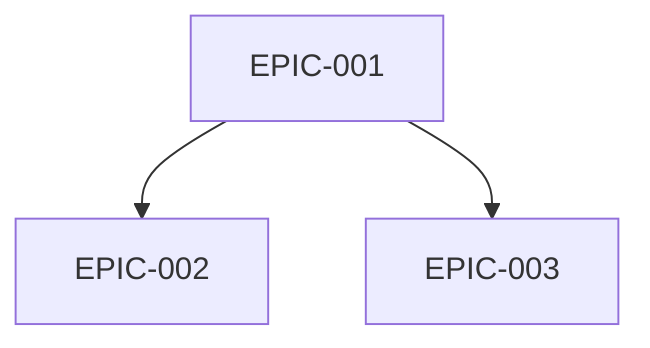
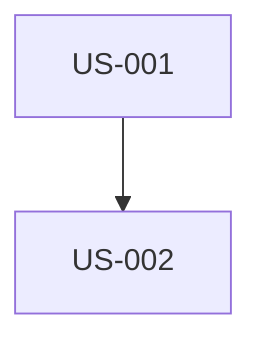

# Generate Complete SCRUM Backlog

You are an experienced Product Owner and Scrum Master. You must analyze project specification documents to create a complete product backlog and plan sprints.

## Arguments
$ARGUMENTS

If no arguments provided, use default stack: symfony,flutter,api-platform,postgresql

## SCRUM FUNDAMENTALS (MANDATORY)

### The 3 Pillars of Scrum
The backlog MUST respect these 3 fundamental pillars:
1. **Transparency**: Everything is visible and understandable by all stakeholders
2. **Inspection**: Work can be evaluated regularly (Sprint Review, Daily)
3. **Adaptation**: Adjustments possible based on inspections (Retrospective)

### The Agile Manifesto - 4 Values
```
✓ Individuals and interactions > processes and tools
✓ Working software > comprehensive documentation
✓ Customer collaboration > contract negotiation
✓ Responding to change > following a plan
```

### The 12 Agile Principles
1. Rapid and regular delivery of customer value
2. Welcome changing requirements positively
3. Deliver frequently (weeks max)
4. Daily collaboration between business and developers
5. Motivated people + trust
6. Face-to-face = best communication
7. Working software = measure of progress
8. Sustainable pace
9. Continuous technical excellence
10. Simplicity (minimize unnecessary work)
11. Self-organizing teams
12. Regular reflection on improvement

## TECH STACK

| Layer | Technology | Details |
|--------|-------------|---------|
| 🌐 Web | Symfony UX + Turbo | Twig, Stimulus, Live Components |
| 📱 Mobile | Flutter | Dart, iOS 15+, Android 10+ |
| ⚙️ API | API Platform | REST/GraphQL, auto-generated OpenAPI |
| 🗄️ DB | PostgreSQL | Doctrine ORM |
| 🐳 Infra | Docker | Complete containerization |

### Mandatory Vertical Slicing
Each User Story must traverse all layers:
```
Symfony UX/Turbo + Flutter → API Platform → PostgreSQL
```
- NO "Backend only" or "Frontend only" US
- NO "Web only" or "Mobile only" US
- API Platform is the central point consumed by Web and Mobile

## DOCUMENTS TO ANALYZE
Search in `./docs/` for specification files:
- ARCHITECTURE_TECHNIQUE*.md
- CAHIER_DES_CHARGES*.md
- Or any other available spec file

## MISSION

### STEP 1: Analyze documents
1. Read and deeply analyze all spec documents
2. Identify: business features, technical requirements, constraints, actors/personas, quality criteria

### STEP 2: Create structure
```
project-management/
├── README.md
├── personas.md
├── definition-of-done.md
├── dependencies-matrix.md
├── backlog/
│   ├── epics/
│   │   └── EPIC-XXX-name.md
│   └── user-stories/
│       └── US-XXX-name.md
└── sprints/
    └── sprint-XXX-sprint_goal/
        ├── sprint-goal.md
        └── sprint-dependencies.md
```

### STEP 3: Create personas.md (MINIMUM 3 PERSONAS)

For each persona, include:
- **Identity**: Name, age, profession, location, technical level
- **Representative quote**: One sentence summarizing motivation
- **Context and background**: 2-3 paragraphs
- **Main objectives**: 3 product-related goals
- **Frustrations and Pain Points**: Minimum 3
- **Motivations**: What drives them to use the product
- **Behaviors**: Devices, OS, favorite apps, typical journey
- **Usage scenarios**: Context → Need → Action → Result
- **Decision criteria**: Adoption, retention, recommendation, abandonment

ID format: P-001, P-002, P-003...

Also include:
- **Personas/Features Matrix**: ⭐⭐⭐ Critical | ⭐⭐ Important | ⭐ Useful
- **Anti-Personas**: Who is NOT the target

### STEP 4: Create definition-of-done.md

Mandatory criteria:
- **Code**: Approved review, conventions respected, SOLID
- **Tests**: 80% unit, integration, E2E, green CI
- **Symfony UX Web**: Controller, Twig, Turbo, Stimulus, responsive, WCAG 2.1 AA
- **Flutter Mobile**: Widgets, Material/Cupertino, iOS 15+/Android 10+, 60 FPS
- **API Platform**: REST endpoints, validation, OpenAPI, ApiTestCase
- **Web/Mobile Parity**: Same business behavior, same API
- **Documentation**: PHPDoc, DartDoc, auto-generated OpenAPI
- **Quality**: PHPStan max, Dart analyzer, API < 200ms
- **Deployment**: Migrations, staging, PO validation Web AND Mobile

### STEP 5: Create Epics (EPIC-XXX-name.md)

For each Epic:
```markdown
# EPIC-XXX: [Name]

## Description
[Business value]

## Associated User Stories
| ID | Title | Points | Priority | Depends on |

## Dependencies with other Epics
### Prerequisites (blocking)
### Dependents (blocked by this one)

## Minimum Marketable Feature (MMF)
**MMF**: [Smallest deliverable version with value]
**Included USs**: US-XXX, US-XXX

## Estimation
- Size: S/M/L/XL
- Estimated sprints: X
```

### STEP 6: Create User Stories (US-XXX-name.md)

**INVEST Model (MANDATORY)**:
- **I**ndependent: Developable alone
- **N**egotiable: Not a fixed contract
- **V**aluable: Brings value
- **E**stimable: Can be estimated
- **S**ized: ≤ 8 points
- **T**estable: Verifiable criteria

**The 3 Cs (MANDATORY)**:
- **Card**: Concise, "As a... I want... So that..." format
- **Conversation**: Notes for team discussion
- **Confirmation**: Acceptance criteria

```markdown
# US-XXX: [Title]

## Parent Epic
EPIC-XXX

## Related Persona
**[P-XXX]**: [Name] - [Role]

## User Story

### Card
**As** [P-XXX: Name, role]
**I want** [action]
**So that** [benefit aligned with persona objectives]

### Conversation
- [Point to clarify 1]
- [Open question 2]

### INVEST Validation
- [ ] Independent / Negotiable / Valuable / Estimable / Sized / Testable

## Acceptance Criteria (Gherkin format + SMART)

**SMART**: Specific, Measurable, Achievable, Realistic, Time-bound

### Nominal scenario
```gherkin
Scenario: [Name]
GIVEN [precise initial state]
WHEN [P-XXX] [specific action]
THEN [observable and measurable result]
```

### Alternative scenarios (minimum 2)
```gherkin
Scenario: [Alternative 1]
...

Scenario: [Alternative 2]
...
```

### Error scenarios (minimum 2)
```gherkin
Scenario: [Error 1]
GIVEN [context]
WHEN [actor] [erroneous action]
THEN the message "[exact message]" is displayed
```

### Web UI/UX Criteria (Symfony UX)
- [ ] Twig template with Symfony UX
- [ ] Turbo Frames/Streams
- [ ] Stimulus if needed
- [ ] Responsive, WCAG 2.1 AA

### Mobile UI/UX Criteria (Flutter)
- [ ] Flutter widget
- [ ] Material/Cupertino
- [ ] iOS 15+, Android 10+
- [ ] 60 FPS

### API Platform Criteria
- [ ] REST endpoint
- [ ] Appropriate HTTP codes
- [ ] Validation, pagination

### Web/Mobile Parity
- [ ] Same functionality on both platforms
- [ ] Same API consumed

## Technical Notes
- Doctrine entity: [Name]
- API Platform resource: [Config]
- Twig template: [Path]
- Flutter widget: [Name]

## Estimation
- **Story Points**: [1/2/3/5/8]
- **MoSCoW**: [Must/Should/Could/Won't]

## Dependencies
### Prerequisite USs (BLOCKING)
| US | Title | Reason |

### Dependent USs (BLOCKED)
| US | Title |

## Assigned Sprint
Sprint [X]
```

### STEP 7: Create dependencies-matrix.md

```markdown
# Dependencies Matrix

## Graph between Epics


## Dependencies table
| Epic | Depends on | Blocks | Criticality |

## Critical path
EPIC-001 → EPIC-002 → EPIC-004

## Inter-US dependencies
| Source US | Target US | Reason |
```

### STEP 8: Create Sprints (sprint-XXX-goal/)

**Naming convention**: sprint-XXX-sprint_goal
Examples: sprint-001-walking_skeleton, sprint-002-jwt_authentication

**sprint-goal.md**:
```markdown
# Sprint XXX: [Goal]

## Sprint Objective (Sprint Goal)
> [One sentence explaining WHY this Sprint and its value]

## Ceremonies
| Ceremony | Duration |
|-----------|-------|
| Sprint Planning Part 1 (WHAT) | 2h |
| Sprint Planning Part 2 (HOW) | 2h |
| Daily Scrum | 15 min/day |
| Backlog Refinement | 5-10% sprint |
| Sprint Review | 2h |
| Retrospective | 1.5h |

## Selected User Stories
| ID | Title | Points | Priority | Depends on | Status |

Total: [X] points

## Execution order
1. 🏁 US-XXX (foundation)
2. US-XXX (depends on US-XXX)
...

## Dependencies graph


## Deliverable increment
At the end, user will be able to (Web AND Mobile): [value]

## Retrospective - Fundamental Directive
> "Regardless of what we discover, we understand and truly believe
> that everyone did the best job they could."

### Format: Starfish
- 🟢 Keep doing
- 🔴 Stop doing
- 🟡 Start doing
- ⬆️ More of
- ⬇️ Less of
```

### STEP 9: Create README.md

Overview with:
- Project description
- Personas (table)
- Tech stack
- Epics with associated personas
- Metrics (USs, points, sprints)
- Sprint roadmap
- Useful links

## SCRUM RULES

1. **Sprint**: 2 weeks fixed
2. **Velocity**: 20-40 points/sprint
3. **Max US**: 8 points (otherwise split)
4. **Fibonacci**: 1, 2, 3, 5, 8, 13, 21
5. **Sprint 1**: Walking Skeleton (infra + 1 complete flow)
6. **Vertical Slicing**: Each US traverses all layers

## FINAL CHECKLIST

### User Stories
- [ ] All respect INVEST and 3Cs
- [ ] Format "As [P-XXX]..."
- [ ] ≤ 8 points
- [ ] SMART Gherkin criteria (1 nominal + 2 alternative + 2 error)

### Personas
- [ ] Minimum 3 (1 primary, 2+ secondary)
- [ ] Objectives, frustrations, scenarios
- [ ] Personas/Features matrix

### Epics
- [ ] MMF identified for each
- [ ] Dependencies with Mermaid

### Sprints
- [ ] Sprint 1 = Walking Skeleton
- [ ] Sprint Goal in one sentence
- [ ] Dependencies graph per sprint

---
Execute this mission now by analyzing documents in ./docs/
