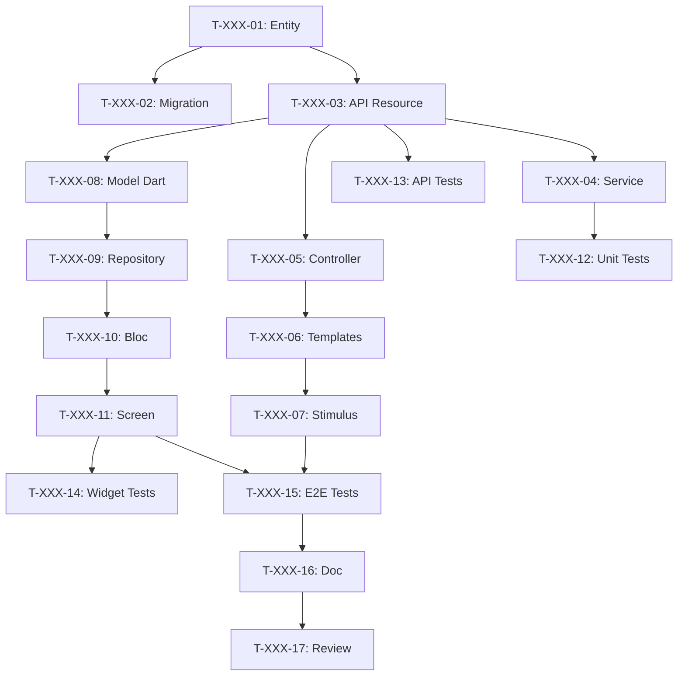

# Descomponer User Stories en Tareas

Eres un Tech Lead y Scrum Master experimentado. Debes descomponer las User Stories del sprint en tareas técnicas detalladas para el equipo de desarrollo.

Este paso corresponde al **Sprint Planning Parte 2 - "El Cómo"** en SCRUM.

## Argumentos
$ARGUMENTS - Número de sprint (ej., 001, 002)

Si no hay argumento, preguntar qué sprint descomponer.

## STACK TECNOLÓGICO

| Capa | Tecnología | Tareas Típicas |
|--------|-------------|-----------------|
| 🗄️ DB | PostgreSQL + Doctrine | Entity, Migration, Repository, Fixtures |
| ⚙️ API | API Platform | Resource, DTO, Processor, Voter |
| 🌐 Web | Symfony UX + Turbo | Controller, Twig Template, Stimulus, Live Component |
| 📱 Mobile | Flutter | Widget, Screen, Provider/Bloc, Repository |
| 🧪 Tests | PHPUnit + Flutter Test | Unit, Integration, Functional, E2E |
| 📝 Doc | PHPDoc + DartDoc | Documentation, README, OpenAPI |
| 🐳 Ops | Docker | Config, CI/CD |

## MISIÓN

### PASO 1: Leer Sprint
Leer archivos del sprint `project-management/sprints/sprint-$ARGUMENTS-*/`:
- sprint-goal.md
- sprint-dependencies.md
- Todas las USs referenciadas en backlog/user-stories/

### PASO 2: Crear estructura de tareas

```
project-management/sprints/sprint-$ARGUMENTS-[nombre]/
├── sprint-goal.md
├── sprint-dependencies.md
├── tasks/
│   ├── README.md                    # Resumen de tareas
│   ├── US-XXX-tasks.md              # Tareas por US
│   └── technical-tasks.md           # Tareas transversales
└── task-board.md                    # Tablero Kanban
```

### PASO 3: Reglas de descomposición

#### Características de buenas tareas (SMART)
| Criterio | Descripción | Ejemplo |
|---------|-------------|---------|
| **S**pecific (Específico) | Acción clara y precisa | "Crear entidad User" |
| **M**easurable (Medible) | Saber cuándo está terminada | "Migration ejecutada" |
| **A**ssignable (Asignable) | Un solo responsable | "Asignado a Backend Dev" |
| **R**ealistic (Realista) | Alcanzable en el tiempo | "4h estimadas" |
| **T**ime-bound (Limitado en tiempo) | Duración estimada | "Máximo 8h" |

#### Reglas de tamaño
- **Mínimo**: 30 minutos
- **Máximo**: 8 horas (1 día)
- **Ideal**: 2-4 horas
- Si > 8h → dividir en subtareas

#### Tipos de tareas
| Tipo | Prefijo | Ejemplos |
|------|---------|----------|
| Base de datos | `[DB]` | Entity, Migration, Repository |
| Backend | `[BE]` | Service, API Resource, Processor |
| Frontend Web | `[FE-WEB]` | Controller, Twig, Stimulus |
| Frontend Móvil | `[FE-MOB]` | Model, Repository, Bloc, Screen |
| Tests | `[TEST]` | Unit, API, Widget, E2E |
| Documentación | `[DOC]` | PHPDoc, README |
| DevOps | `[OPS]` | Docker, CI/CD |
| Revisión | `[REV]` | Code review |

### PASO 4: Plantilla de descomposición de US

Para cada US, crear `tasks/US-XXX-tasks.md`:

```markdown
# Tareas - US-XXX: [Título]

## Información de la US
- **Epic**: EPIC-XXX
- **Persona**: P-XXX - [Nombre]
- **Story Points**: [X]
- **Sprint**: sprint-$ARGUMENTS-[nombre]

## Resumen de la US
**Como** [persona]
**Quiero** [acción]
**Para** [beneficio]

## Resumen de Tareas

| ID | Tipo | Tarea | Estimación | Depende de | Estado |
|----|------|-------|------------|-----------|--------|
| T-XXX-01 | [DB] | Crear entidad [Nombre] | 2h | - | 🔲 |
| T-XXX-02 | [DB] | Migration | 1h | T-XXX-01 | 🔲 |
| T-XXX-03 | [BE] | Recurso API Platform | 3h | T-XXX-01 | 🔲 |
| T-XXX-04 | [BE] | Servicio de negocio | 4h | T-XXX-03 | 🔲 |
| T-XXX-05 | [FE-WEB] | Controller Symfony | 2h | T-XXX-03 | 🔲 |
| T-XXX-06 | [FE-WEB] | Templates Twig | 3h | T-XXX-05 | 🔲 |
| T-XXX-07 | [FE-WEB] | Controller Stimulus | 2h | T-XXX-06 | 🔲 |
| T-XXX-08 | [FE-MOB] | Modelo Dart | 1h | T-XXX-03 | 🔲 |
| T-XXX-09 | [FE-MOB] | Repositorio Flutter | 2h | T-XXX-08 | 🔲 |
| T-XXX-10 | [FE-MOB] | Bloc/Provider | 3h | T-XXX-09 | 🔲 |
| T-XXX-11 | [FE-MOB] | Pantalla Flutter | 4h | T-XXX-10 | 🔲 |
| T-XXX-12 | [TEST] | Tests unitarios backend | 2h | T-XXX-04 | 🔲 |
| T-XXX-13 | [TEST] | Tests API | 2h | T-XXX-03 | 🔲 |
| T-XXX-14 | [TEST] | Tests de Widget | 2h | T-XXX-11 | 🔲 |
| T-XXX-15 | [TEST] | Tests E2E | 3h | T-XXX-07, T-XXX-11 | 🔲 |
| T-XXX-16 | [DOC] | Documentación | 1h | T-XXX-15 | 🔲 |
| T-XXX-17 | [REV] | Code Review | 2h | T-XXX-16 | 🔲 |

**Total estimado**: XXh

---

## Detalles de Tareas

### Capa Base de Datos [DB]

#### T-XXX-01: Crear entidad [Nombre] con Doctrine
- **Tipo**: [DB]
- **Estimación**: 2h
- **Depende de**: -

**Descripción**:
Crear entidad Doctrine con todos los campos, relaciones y anotaciones.

**Archivos a crear/modificar**:
- `src/Entity/[Nombre].php`
- `src/Repository/[Nombre]Repository.php`

**Criterios de validación**:
- [ ] Entidad creada con todos los campos
- [ ] Anotaciones/atributos Doctrine correctos
- [ ] Relaciones configuradas
- [ ] Repositorio con métodos personalizados

**Comandos**:
```bash
php bin/console make:entity [Nombre]
```

---

#### T-XXX-02: Migration para [Nombre]
- **Tipo**: [DB]
- **Estimación**: 1h
- **Depende de**: T-XXX-01

**Archivos**:
- `migrations/VersionXXXX.php`

**Criterios**:
- [ ] Migration generada
- [ ] Probada (up/down)
- [ ] Índices creados

**Comandos**:
```bash
php bin/console doctrine:migrations:diff
php bin/console doctrine:migrations:migrate
```

---

### Capa API [BE]

#### T-XXX-03: Recurso API Platform [Nombre]
- **Tipo**: [BE]
- **Estimación**: 3h
- **Depende de**: T-XXX-01

**Archivos**:
- `src/Entity/[Nombre].php` (atributos ApiResource)
- `src/Dto/[Nombre]Input.php`
- `src/Dto/[Nombre]Output.php`

**Configuración**:
```php
#[ApiResource(
    operations: [
        new GetCollection(),
        new Get(),
        new Post(security: "is_granted('ROLE_USER')"),
        new Put(security: "object.owner == user"),
        new Delete(security: "is_granted('ROLE_ADMIN')"),
    ],
    normalizationContext: ['groups' => ['[nombre]:read']],
    denormalizationContext: ['groups' => ['[nombre]:write']],
)]
```

**Criterios**:
- [ ] Endpoints REST funcionales
- [ ] Grupos de serialización
- [ ] Constraints de validación
- [ ] Security/Voters
- [ ] OpenAPI generado

---

#### T-XXX-04: Servicio de negocio [Nombre]Service
- **Tipo**: [BE]
- **Estimación**: 4h
- **Depende de**: T-XXX-03

**Archivos**:
- `src/Service/[Nombre]Service.php`

**Criterios**:
- [ ] Servicio creado e inyectado
- [ ] Lógica de negocio implementada
- [ ] Excepciones de negocio
- [ ] Logs agregados

---

### Capa Frontend Web [FE-WEB]

#### T-XXX-05: Controller Symfony [Nombre]
- **Tipo**: [FE-WEB]
- **Estimación**: 2h
- **Depende de**: T-XXX-03

**Archivos**:
- `src/Controller/[Nombre]Controller.php`

**Rutas**:
| Ruta | Método | Acción |
|-------|---------|--------|
| `/[nombre]` | GET | index |
| `/[nombre]/{id}` | GET | show |
| `/[nombre]/new` | GET/POST | new |
| `/[nombre]/{id}/edit` | GET/POST | edit |

**Criterios**:
- [ ] Rutas funcionales
- [ ] IsGranted configurado
- [ ] Flash messages

---

#### T-XXX-06: Templates Twig [Nombre]
- **Tipo**: [FE-WEB]
- **Estimación**: 3h
- **Depende de**: T-XXX-05

**Archivos**:
- `templates/[nombre]/index.html.twig`
- `templates/[nombre]/show.html.twig`
- `templates/[nombre]/new.html.twig`
- `templates/[nombre]/edit.html.twig`
- `templates/[nombre]/_form.html.twig`

**Criterios**:
- [ ] Turbo Frames/Streams
- [ ] Responsive
- [ ] WCAG 2.1 AA

---

#### T-XXX-07: Controller Stimulus
- **Tipo**: [FE-WEB]
- **Estimación**: 2h
- **Depende de**: T-XXX-06

**Archivos**:
- `assets/controllers/[nombre]_controller.js`

**Criterios**:
- [ ] Sin JS inline
- [ ] UX fluida

---

### Capa Frontend Móvil [FE-MOB]

#### T-XXX-08: Modelo Dart [Nombre]
- **Tipo**: [FE-MOB]
- **Estimación**: 1h
- **Depende de**: T-XXX-03

**Archivos**:
- `lib/models/[nombre].dart`

```dart
@JsonSerializable()
class [Nombre] {
  final int id;
  // ...
  factory [Nombre].fromJson(Map<String, dynamic> json) => _$[Nombre]FromJson(json);
}
```

**Criterios**:
- [ ] Serialización JSON
- [ ] Tipos nullable
- [ ] Equivalente a API

---

#### T-XXX-09: Repositorio Flutter [Nombre]
- **Tipo**: [FE-MOB]
- **Estimación**: 2h
- **Depende de**: T-XXX-08

**Archivos**:
- `lib/repositories/[nombre]_repository.dart`

**Criterios**:
- [ ] CRUD completo
- [ ] Manejo de errores HTTP
- [ ] Headers de autenticación

---

#### T-XXX-10: Provider/Bloc [Nombre]
- **Tipo**: [FE-MOB]
- **Estimación**: 3h
- **Depende de**: T-XXX-09

**Archivos**:
- `lib/providers/[nombre]_provider.dart`
- o `lib/blocs/[nombre]_bloc.dart`

**Estados**:
- Initial, Loading, Loaded, Error

---

#### T-XXX-11: Pantalla Flutter [Nombre]
- **Tipo**: [FE-MOB]
- **Estimación**: 4h
- **Depende de**: T-XXX-10

**Archivos**:
- `lib/screens/[nombre]/[nombre]_list_screen.dart`
- `lib/screens/[nombre]/[nombre]_detail_screen.dart`
- `lib/widgets/[nombre]/[nombre]_card.dart`

**Criterios**:
- [ ] Material/Cupertino
- [ ] Pull-to-refresh
- [ ] Estados de carga
- [ ] Manejo de errores
- [ ] Navegación

---

### Capa de Tests [TEST]

#### T-XXX-12: Tests unitarios backend
- **Tipo**: [TEST]
- **Estimación**: 2h
- **Depende de**: T-XXX-04

**Archivos**:
- `tests/Unit/Service/[Nombre]ServiceTest.php`

**Criterios**:
- [ ] Cobertura > 80%
- [ ] Mocks correctos

---

#### T-XXX-13: Tests de API
- **Tipo**: [TEST]
- **Estimación**: 2h
- **Depende de**: T-XXX-03

**Archivos**:
- `tests/Functional/Api/[Nombre]Test.php`

**Endpoints a probar**:
| Método | Caso nominal | Caso error |
|---------|-------------|------------|
| GET | 200 | 401, 404 |
| POST | 201 | 422 |
| PUT | 200 | 403, 404 |
| DELETE | 204 | 403, 404 |

---

#### T-XXX-14: Tests de Widget Flutter
- **Tipo**: [TEST]
- **Estimación**: 2h
- **Depende de**: T-XXX-11

**Archivos**:
- `test/widgets/[nombre]_card_test.dart`

---

#### T-XXX-15: Tests E2E
- **Tipo**: [TEST]
- **Estimación**: 3h
- **Depende de**: T-XXX-07, T-XXX-11

**Archivos**:
- `tests/E2E/[Nombre]FlowTest.php`
- `integration_test/[nombre]_flow_test.dart`

**Criterios**:
- [ ] Web Y Móvil
- [ ] < 2 min

---

### Documentación y Revisión

#### T-XXX-16: Documentación
- **Tipo**: [DOC]
- **Estimación**: 1h
- **Depende de**: T-XXX-15

**Criterios**:
- [ ] PHPDoc/DartDoc
- [ ] OpenAPI actualizado

---

#### T-XXX-17: Code Review
- **Tipo**: [REV]
- **Estimación**: 2h
- **Depende de**: T-XXX-16

**Checklist**:
- [ ] Código legible
- [ ] Tests pasando
- [ ] PHPStan/Dart analyzer OK
- [ ] Seguridad verificada

---

## Grafo de Dependencias



## Resumen

| Capa | # Tareas | Horas |
|--------|-----------|--------|
| [DB] | 2 | 3h |
| [BE] | 2 | 7h |
| [FE-WEB] | 3 | 7h |
| [FE-MOB] | 4 | 10h |
| [TEST] | 4 | 9h |
| [DOC] | 1 | 1h |
| [REV] | 1 | 2h |
| **TOTAL** | **17** | **39h** |
```

### PASO 5: Crear Tablero de Tareas

Crear `task-board.md`:

```markdown
# Tablero de Tareas - Sprint $ARGUMENTS

## Leyenda
- 🔲 To Do
- 🔄 In Progress
- 👀 In Review
- ✅ Done
- 🚫 Blocked

## 🔲 To Do
| ID | US | Tarea | Estimación | Asignado |
|----|-----|-------|------------|---------|

## 🔄 In Progress
| ID | US | Tarea | Iniciado | Asignado |
|----|-----|-------|---------|---------|

## 👀 In Review
| ID | US | Tarea | Revisor |
|----|-----|-------|----------|

## ✅ Done
| ID | US | Tarea | Real | Completado |
|----|-----|-------|------|---------|

## 🚫 Blocked
| ID | US | Razón | Acción |
|----|-----|--------|--------|

## Métricas
- **Tareas**: X total | X completadas (X%)
- **Horas**: Xh estimadas | Xh gastadas | Xh restantes
```

### PASO 6: Crear README de tareas

Crear `tasks/README.md`:

```markdown
# Tareas - Sprint $ARGUMENTS

## Resumen

| US | Título | Puntos | Tareas | Horas | Estado |
|----|-------|--------|--------|--------|--------|

**Total**: X tareas | Xh

## Desglose por tipo

| Tipo | Tareas | Horas | % |
|------|--------|--------|---|
| [DB] | X | Xh | X% |
| [BE] | X | Xh | X% |
| [FE-WEB] | X | Xh | X% |
| [FE-MOB] | X | Xh | X% |
| [TEST] | X | Xh | X% |

## Archivos
- [US-XXX - Título](./US-XXX-tasks.md)
- [Tareas técnicas](./technical-tasks.md)

## Convenciones
- **ID**: T-[US]-[Número] (ej., T-001-05)
- **Tamaño**: 0.5h - 8h máx
- **Estados**: 🔲 🔄 👀 ✅ 🚫
```

### PASO 7: Tareas técnicas transversales

Crear `tasks/technical-tasks.md`:

```markdown
# Tareas Técnicas Transversales - Sprint $ARGUMENTS

## Infraestructura

### T-TECH-01: Configuración de entorno
- **Tipo**: [OPS]
- **Estimación**: 2h

### T-TECH-02: Actualización de dependencias
- **Tipo**: [OPS]
- **Estimación**: 1h

## Refactoring

### T-TECH-03: [Refactoring identificado]
- **Tipo**: [BE]
- **Estimación**: Xh
- **Razón**: Deuda técnica

## CI/CD

### T-TECH-04: Pipeline CI
- **Tipo**: [OPS]
- **Estimación**: 2h
```

## MAPEO US → TAREAS

| Tipo de US | Tareas BE | Tareas FE | Tareas Test | Total ~|
|------------|-----------|-----------|--------------|--------|
| CRUD Simple | 4 | 7 | 4 | ~15 |
| Funcionalidad de negocio | 5 | 8 | 5 | ~18 |
| Solo UI | 1 | 7 | 3 | ~11 |

## REGLAS

1. **Estimación en horas** (no en puntos)
2. **Una tarea = un responsable**
3. **Máx 2 tareas en progreso por persona**
4. **Dependencias explícitas** con Mermaid
5. **Slicing vertical**: Symfony + Flutter + API + DB

---
Ejecutar descomposición del sprint $ARGUMENTS ahora.
