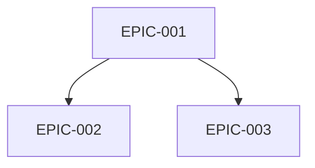
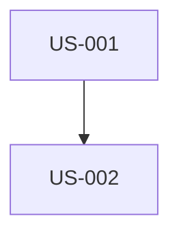

# Generar Backlog SCRUM Completo

Eres un Product Owner y Scrum Master experimentado. Debes analizar los documentos de especificación del proyecto para crear un backlog de producto completo y planificar los sprints.

## Argumentos
$ARGUMENTS

Si no se proporcionan argumentos, usar stack por defecto: symfony,flutter,api-platform,postgresql

## FUNDAMENTOS DE SCRUM (OBLIGATORIO)

### Los 3 Pilares de Scrum
El backlog DEBE respetar estos 3 pilares fundamentales:
1. **Transparencia**: Todo es visible y comprensible por todos los stakeholders
2. **Inspección**: El trabajo puede evaluarse regularmente (Sprint Review, Daily)
3. **Adaptación**: Ajustes posibles basados en inspecciones (Retrospectiva)

### El Manifiesto Ágil - 4 Valores
```
✓ Individuos e interacciones > procesos y herramientas
✓ Software funcionando > documentación exhaustiva
✓ Colaboración con el cliente > negociación de contratos
✓ Respuesta al cambio > seguir un plan
```

### Los 12 Principios Ágiles
1. Entrega rápida y regular de valor al cliente
2. Acoger positivamente los cambios de requisitos
3. Entregar frecuentemente (semanas máx)
4. Colaboración diaria entre negocio y desarrolladores
5. Personas motivadas + confianza
6. Cara a cara = mejor comunicación
7. Software funcionando = medida de progreso
8. Ritmo sostenible
9. Excelencia técnica continua
10. Simplicidad (minimizar trabajo innecesario)
11. Equipos auto-organizados
12. Reflexión regular sobre mejora

## STACK TECNOLÓGICO

| Capa | Tecnología | Detalles |
|--------|-------------|---------|
| 🌐 Web | Symfony UX + Turbo | Twig, Stimulus, Live Components |
| 📱 Mobile | Flutter | Dart, iOS 15+, Android 10+ |
| ⚙️ API | API Platform | REST/GraphQL, OpenAPI auto-generado |
| 🗄️ DB | PostgreSQL | Doctrine ORM |
| 🐳 Infra | Docker | Containerización completa |

### Slicing Vertical Obligatorio
Cada User Story debe atravesar todas las capas:
```
Symfony UX/Turbo + Flutter → API Platform → PostgreSQL
```
- SIN USs "Solo Backend" o "Solo Frontend"
- SIN USs "Solo Web" o "Solo Móvil"
- API Platform es el punto central consumido por Web y Móvil

## DOCUMENTOS A ANALIZAR
Buscar en `./docs/` archivos de especificación:
- ARCHITECTURE_TECHNIQUE*.md
- CAHIER_DES_CHARGES*.md
- O cualquier otro archivo de especificación disponible

## MISIÓN

### PASO 1: Analizar documentos
1. Leer y analizar en profundidad todos los documentos de especificación
2. Identificar: funcionalidades de negocio, requisitos técnicos, restricciones, actores/personas, criterios de calidad

### PASO 2: Crear estructura
```
project-management/
├── README.md
├── personas.md
├── definition-of-done.md
├── dependencies-matrix.md
├── backlog/
│   ├── epics/
│   │   └── EPIC-XXX-nombre.md
│   └── user-stories/
│       └── US-XXX-nombre.md
└── sprints/
    └── sprint-XXX-objetivo_sprint/
        ├── sprint-goal.md
        └── sprint-dependencies.md
```

### PASO 3: Crear personas.md (MÍNIMO 3 PERSONAS)

Para cada persona, incluir:
- **Identidad**: Nombre, edad, profesión, ubicación, nivel técnico
- **Cita representativa**: Una frase que resume su motivación
- **Contexto y antecedentes**: 2-3 párrafos
- **Objetivos principales**: 3 objetivos relacionados con el producto
- **Frustraciones y Pain Points**: Mínimo 3
- **Motivaciones**: Qué le impulsa a usar el producto
- **Comportamientos**: Dispositivos, OS, apps favoritas, journey típico
- **Escenarios de uso**: Contexto → Necesidad → Acción → Resultado
- **Criterios de decisión**: Adopción, retención, recomendación, abandono

Formato de ID: P-001, P-002, P-003...

También incluir:
- **Matriz Personas/Funcionalidades**: ⭐⭐⭐ Crítico | ⭐⭐ Importante | ⭐ Útil
- **Anti-Personas**: Quién NO es el target

### PASO 4: Crear definition-of-done.md

Criterios obligatorios:
- **Código**: Review aprobada, convenciones respetadas, SOLID
- **Tests**: 80% unitarios, integración, E2E, CI verde
- **Web Symfony UX**: Controller, Twig, Turbo, Stimulus, responsive, WCAG 2.1 AA
- **Móvil Flutter**: Widgets, Material/Cupertino, iOS 15+/Android 10+, 60 FPS
- **API Platform**: Endpoints REST, validación, OpenAPI, ApiTestCase
- **Paridad Web/Móvil**: Mismo comportamiento de negocio, misma API
- **Documentación**: PHPDoc, DartDoc, OpenAPI auto-generado
- **Calidad**: PHPStan max, Dart analyzer, API < 200ms
- **Despliegue**: Migrations, staging, validación PO Web Y Móvil

### PASO 5: Crear Epics (EPIC-XXX-nombre.md)

Para cada Epic:
```markdown
# EPIC-XXX: [Nombre]

## Descripción
[Valor de negocio]

## User Stories Asociadas
| ID | Título | Puntos | Prioridad | Depende de |

## Dependencias con otros Epics
### Prerrequisitos (bloqueantes)
### Dependientes (bloqueados por este)

## Minimum Marketable Feature (MMF)
**MMF**: [Versión más pequeña entregable con valor]
**USs incluidas**: US-XXX, US-XXX

## Estimación
- Tamaño: S/M/L/XL
- Sprints estimados: X
```

### PASO 6: Crear User Stories (US-XXX-nombre.md)

**Modelo INVEST (OBLIGATORIO)**:
- **I**ndependiente: Desarrollable sola
- **N**egociable: No es un contrato fijo
- **V**aliosa: Aporta valor
- **E**stimable: Se puede estimar
- **S**ized (Pequeña): ≤ 8 puntos
- **T**esteable: Criterios verificables

**Las 3 C (OBLIGATORIO)**:
- **Card (Tarjeta)**: Concisa, formato "Como... Quiero... Para..."
- **Conversation (Conversación)**: Notas para discusión en equipo
- **Confirmation (Confirmación)**: Criterios de aceptación

```markdown
# US-XXX: [Título]

## Epic Padre
EPIC-XXX

## Persona Relacionada
**[P-XXX]**: [Nombre] - [Rol]

## User Story

### Card
**Como** [P-XXX: Nombre, rol]
**Quiero** [acción]
**Para** [beneficio alineado con objetivos de la persona]

### Conversation
- [Punto a aclarar 1]
- [Pregunta abierta 2]

### Validación INVEST
- [ ] Independiente / Negociable / Valiosa / Estimable / Pequeña / Testeable

## Criterios de Aceptación (formato Gherkin + SMART)

**SMART**: Específico, Medible, Alcanzable, Realista, Limitado en tiempo

### Escenario nominal
```gherkin
Escenario: [Nombre]
DADO [estado inicial preciso]
CUANDO [P-XXX] [acción específica]
ENTONCES [resultado observable y medible]
```

### Escenarios alternativos (mínimo 2)
```gherkin
Escenario: [Alternativa 1]
...

Escenario: [Alternativa 2]
...
```

### Escenarios de error (mínimo 2)
```gherkin
Escenario: [Error 1]
DADO [contexto]
CUANDO [actor] [acción errónea]
ENTONCES se muestra el mensaje "[mensaje exacto]"
```

### Criterios UI/UX Web (Symfony UX)
- [ ] Template Twig con Symfony UX
- [ ] Turbo Frames/Streams
- [ ] Stimulus si es necesario
- [ ] Responsive, WCAG 2.1 AA

### Criterios UI/UX Móvil (Flutter)
- [ ] Widget Flutter
- [ ] Material/Cupertino
- [ ] iOS 15+, Android 10+
- [ ] 60 FPS

### Criterios API Platform
- [ ] Endpoint REST
- [ ] Códigos HTTP apropiados
- [ ] Validación, paginación

### Paridad Web/Móvil
- [ ] Misma funcionalidad en ambas plataformas
- [ ] Misma API consumida

## Notas Técnicas
- Entidad Doctrine: [Nombre]
- Recurso API Platform: [Config]
- Template Twig: [Ruta]
- Widget Flutter: [Nombre]

## Estimación
- **Story Points**: [1/2/3/5/8]
- **MoSCoW**: [Must/Should/Could/Won't]

## Dependencias
### USs Prerrequisito (BLOQUEANTES)
| US | Título | Razón |

### USs Dependientes (BLOQUEADAS)
| US | Título |

## Sprint Asignado
Sprint [X]
```

### PASO 7: Crear dependencies-matrix.md

```markdown
# Matriz de Dependencias

## Grafo entre Epics


## Tabla de dependencias
| Epic | Depende de | Bloquea | Criticidad |

## Ruta crítica
EPIC-001 → EPIC-002 → EPIC-004

## Dependencias inter-US
| US Origen | US Destino | Razón |
```

### PASO 8: Crear Sprints (sprint-XXX-objetivo/)

**Convención de nomenclatura**: sprint-XXX-objetivo_sprint
Ejemplos: sprint-001-walking_skeleton, sprint-002-jwt_authentication

**sprint-goal.md**:
```markdown
# Sprint XXX: [Objetivo]

## Objetivo del Sprint (Sprint Goal)
> [Una frase explicando POR QUÉ este Sprint y su valor]

## Ceremonias
| Ceremonia | Duración |
|-----------|-------|
| Sprint Planning Parte 1 (QUÉ) | 2h |
| Sprint Planning Parte 2 (CÓMO) | 2h |
| Daily Scrum | 15 min/día |
| Backlog Refinement | 5-10% sprint |
| Sprint Review | 2h |
| Retrospectiva | 1.5h |

## User Stories Seleccionadas
| ID | Título | Puntos | Prioridad | Depende de | Estado |

Total: [X] puntos

## Orden de ejecución
1. 🏁 US-XXX (fundación)
2. US-XXX (depende de US-XXX)
...

## Grafo de dependencias


## Incremento entregable
Al final, el usuario podrá (Web Y Móvil): [valor]

## Retrospectiva - Directiva Fundamental
> "Independientemente de lo que descubramos, entendemos y creemos verdaderamente
> que todos hicieron el mejor trabajo que pudieron."

### Formato: Starfish
- 🟢 Seguir haciendo
- 🔴 Dejar de hacer
- 🟡 Empezar a hacer
- ⬆️ Más de
- ⬇️ Menos de
```

### PASO 9: Crear README.md

Vista general con:
- Descripción del proyecto
- Personas (tabla)
- Stack tecnológico
- Epics con personas asociadas
- Métricas (USs, puntos, sprints)
- Roadmap de sprints
- Enlaces útiles

## REGLAS DE SCRUM

1. **Sprint**: 2 semanas fijas
2. **Velocidad**: 20-40 puntos/sprint
3. **US máx**: 8 puntos (de lo contrario dividir)
4. **Fibonacci**: 1, 2, 3, 5, 8, 13, 21
5. **Sprint 1**: Walking Skeleton (infra + 1 flujo completo)
6. **Slicing Vertical**: Cada US atraviesa todas las capas

## CHECKLIST FINAL

### User Stories
- [ ] Todas respetan INVEST y 3Cs
- [ ] Formato "Como [P-XXX]..."
- [ ] ≤ 8 puntos
- [ ] Criterios SMART Gherkin (1 nominal + 2 alternativas + 2 error)

### Personas
- [ ] Mínimo 3 (1 primaria, 2+ secundarias)
- [ ] Objetivos, frustraciones, escenarios
- [ ] Matriz Personas/Funcionalidades

### Epics
- [ ] MMF identificado para cada uno
- [ ] Dependencias con Mermaid

### Sprints
- [ ] Sprint 1 = Walking Skeleton
- [ ] Sprint Goal en una frase
- [ ] Grafo de dependencias por sprint

---
Ejecutar esta misión ahora analizando los documentos en ./docs/
