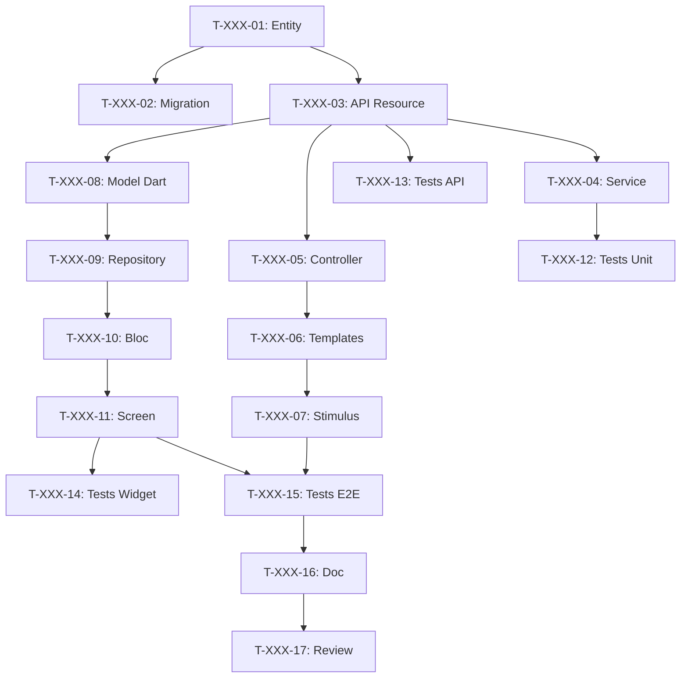

# Décomposition des User Stories en Tâches

Tu es un Tech Lead et Scrum Master expérimenté. Tu dois décomposer les User Stories du sprint en tâches techniques détaillées pour l'équipe de développement.

Cette étape correspond au **Sprint Planning Part 2 - "Le Comment"** de Scrum.

## Arguments
$ARGUMENTS - Numéro du sprint (ex: 001, 002)

Si pas d'argument, demander quel sprint décomposer.

## STACK TECHNIQUE

| Couche | Technologie | Tâches typiques |
|--------|-------------|-----------------|
| 🗄️ DB | PostgreSQL + Doctrine | Entity, Migration, Repository, Fixtures |
| ⚙️ API | API Platform | Resource, DTO, Processor, Voter |
| 🌐 Web | Symfony UX + Turbo | Contrôleur, Template Twig, Stimulus, Live Component |
| 📱 Mobile | Flutter | Widget, Screen, Provider/Bloc, Repository |
| 🧪 Tests | PHPUnit + Flutter Test | Unit, Integration, Functional, E2E |
| 📝 Doc | PHPDoc + DartDoc | Documentation, README, OpenAPI |
| 🐳 Ops | Docker | Config, CI/CD |

## MISSION

### ÉTAPE 1 : Lire le Sprint
Lis les fichiers du sprint `project-management/sprints/sprint-$ARGUMENTS-*/` :
- sprint-goal.md
- sprint-dependencies.md
- Toutes les US référencées dans backlog/user-stories/

### ÉTAPE 2 : Créer la structure des tâches

```
project-management/sprints/sprint-$ARGUMENTS-[nom]/
├── sprint-goal.md
├── sprint-dependencies.md
├── tasks/
│   ├── README.md                    # Vue d'ensemble des tâches
│   ├── US-XXX-tasks.md              # Tâches par US
│   └── technical-tasks.md           # Tâches transverses
└── task-board.md                    # Tableau Kanban
```

### ÉTAPE 3 : Règles de décomposition

#### Caractéristiques d'une bonne tâche (SMART)
| Critère | Description | Exemple |
|---------|-------------|---------|
| **S**pécifique | Action claire et précise | "Créer l'entité User" |
| **M**esurable | On sait quand c'est terminé | "Migration exécutée" |
| **A**ttribuable | Un seul responsable | "Assigné à Dev Backend" |
| **R**éaliste | Faisable dans le temps | "4h estimées" |
| **T**emporelle | Durée estimée en heures | "Max 8h" |

#### Règles de taille
- **Minimum** : 30 minutes
- **Maximum** : 8 heures (1 jour)
- **Idéal** : 2-4 heures
- Si > 8h → découper en sous-tâches

#### Types de tâches
| Type | Préfixe | Exemples |
|------|---------|----------|
| Base de données | `[DB]` | Entity, Migration, Repository |
| Backend | `[BE]` | Service, API Resource, Processor |
| Frontend Web | `[FE-WEB]` | Controller, Twig, Stimulus |
| Frontend Mobile | `[FE-MOB]` | Model, Repository, Bloc, Screen |
| Tests | `[TEST]` | Unit, API, Widget, E2E |
| Documentation | `[DOC]` | PHPDoc, README |
| DevOps | `[OPS]` | Docker, CI/CD |
| Review | `[REV]` | Code review |

### ÉTAPE 4 : Template de décomposition par US

Pour chaque US, crée `tasks/US-XXX-tasks.md` :

```markdown
# Tâches - US-XXX : [Titre]

## Informations US
- **Epic** : EPIC-XXX
- **Persona** : P-XXX - [Prénom]
- **Story Points** : [X]
- **Sprint** : sprint-$ARGUMENTS-[nom]

## Résumé de la US
**En tant que** [persona]
**Je veux** [action]
**Afin de** [bénéfice]

## Vue d'ensemble des tâches

| ID | Type | Tâche | Estimation | Dépend de | Statut |
|----|------|-------|------------|-----------|--------|
| T-XXX-01 | [DB] | Créer entité [Nom] | 2h | - | 🔲 |
| T-XXX-02 | [DB] | Migration | 1h | T-XXX-01 | 🔲 |
| T-XXX-03 | [BE] | Ressource API Platform | 3h | T-XXX-01 | 🔲 |
| T-XXX-04 | [BE] | Service métier | 4h | T-XXX-03 | 🔲 |
| T-XXX-05 | [FE-WEB] | Controller Symfony | 2h | T-XXX-03 | 🔲 |
| T-XXX-06 | [FE-WEB] | Templates Twig | 3h | T-XXX-05 | 🔲 |
| T-XXX-07 | [FE-WEB] | Controller Stimulus | 2h | T-XXX-06 | 🔲 |
| T-XXX-08 | [FE-MOB] | Model Dart | 1h | T-XXX-03 | 🔲 |
| T-XXX-09 | [FE-MOB] | Repository Flutter | 2h | T-XXX-08 | 🔲 |
| T-XXX-10 | [FE-MOB] | Bloc/Provider | 3h | T-XXX-09 | 🔲 |
| T-XXX-11 | [FE-MOB] | Screen Flutter | 4h | T-XXX-10 | 🔲 |
| T-XXX-12 | [TEST] | Tests unitaires BE | 2h | T-XXX-04 | 🔲 |
| T-XXX-13 | [TEST] | Tests API | 2h | T-XXX-03 | 🔲 |
| T-XXX-14 | [TEST] | Tests Widget | 2h | T-XXX-11 | 🔲 |
| T-XXX-15 | [TEST] | Tests E2E | 3h | T-XXX-07, T-XXX-11 | 🔲 |
| T-XXX-16 | [DOC] | Documentation | 1h | T-XXX-15 | 🔲 |
| T-XXX-17 | [REV] | Code Review | 2h | T-XXX-16 | 🔲 |

**Total estimé** : XXh

---

## Détail des tâches

### Couche Base de données [DB]

#### T-XXX-01 : Créer l'entité [Nom] avec Doctrine
- **Type** : [DB]
- **Estimation** : 2h
- **Dépend de** : -

**Description** :
Créer l'entité Doctrine avec tous les champs, relations et annotations.

**Fichiers à créer/modifier** :
- `src/Entity/[Nom].php`
- `src/Repository/[Nom]Repository.php`

**Critères de validation** :
- [ ] Entité créée avec tous les champs
- [ ] Annotations/Attributs Doctrine corrects
- [ ] Relations configurées
- [ ] Repository avec méthodes custom

**Commandes** :
```bash
php bin/console make:entity [Nom]
```

---

#### T-XXX-02 : Migration pour [Nom]
- **Type** : [DB]
- **Estimation** : 1h
- **Dépend de** : T-XXX-01

**Fichiers** :
- `migrations/VersionXXXX.php`

**Critères** :
- [ ] Migration générée
- [ ] Testée (up/down)
- [ ] Index créés

**Commandes** :
```bash
php bin/console doctrine:migrations:diff
php bin/console doctrine:migrations:migrate
```

---

### Couche API [BE]

#### T-XXX-03 : Ressource API Platform [Nom]
- **Type** : [BE]
- **Estimation** : 3h
- **Dépend de** : T-XXX-01

**Fichiers** :
- `src/Entity/[Nom].php` (attributs ApiResource)
- `src/Dto/[Nom]Input.php`
- `src/Dto/[Nom]Output.php`

**Configuration** :
```php
#[ApiResource(
    operations: [
        new GetCollection(),
        new Get(),
        new Post(security: "is_granted('ROLE_USER')"),
        new Put(security: "object.owner == user"),
        new Delete(security: "is_granted('ROLE_ADMIN')"),
    ],
    normalizationContext: ['groups' => ['[nom]:read']],
    denormalizationContext: ['groups' => ['[nom]:write']],
)]
```

**Critères** :
- [ ] Endpoints REST fonctionnels
- [ ] Serialization groups
- [ ] Validation constraints
- [ ] Security/Voters
- [ ] OpenAPI générée

---

#### T-XXX-04 : Service métier [Nom]Service
- **Type** : [BE]
- **Estimation** : 4h
- **Dépend de** : T-XXX-03

**Fichiers** :
- `src/Service/[Nom]Service.php`

**Critères** :
- [ ] Service créé et injecté
- [ ] Logique métier implémentée
- [ ] Exceptions métier
- [ ] Logs ajoutés

---

### Couche Frontend Web [FE-WEB]

#### T-XXX-05 : Controller Symfony [Nom]
- **Type** : [FE-WEB]
- **Estimation** : 2h
- **Dépend de** : T-XXX-03

**Fichiers** :
- `src/Controller/[Nom]Controller.php`

**Routes** :
| Route | Méthode | Action |
|-------|---------|--------|
| `/[nom]` | GET | index |
| `/[nom]/{id}` | GET | show |
| `/[nom]/new` | GET/POST | new |
| `/[nom]/{id}/edit` | GET/POST | edit |

**Critères** :
- [ ] Routes fonctionnelles
- [ ] IsGranted configuré
- [ ] Flash messages

---

#### T-XXX-06 : Templates Twig [Nom]
- **Type** : [FE-WEB]
- **Estimation** : 3h
- **Dépend de** : T-XXX-05

**Fichiers** :
- `templates/[nom]/index.html.twig`
- `templates/[nom]/show.html.twig`
- `templates/[nom]/new.html.twig`
- `templates/[nom]/edit.html.twig`
- `templates/[nom]/_form.html.twig`

**Critères** :
- [ ] Turbo Frames/Streams
- [ ] Responsive
- [ ] WCAG 2.1 AA

---

#### T-XXX-07 : Controller Stimulus
- **Type** : [FE-WEB]
- **Estimation** : 2h
- **Dépend de** : T-XXX-06

**Fichiers** :
- `assets/controllers/[nom]_controller.js`

**Critères** :
- [ ] Pas de JS inline
- [ ] UX fluide

---

### Couche Frontend Mobile [FE-MOB]

#### T-XXX-08 : Model Dart [Nom]
- **Type** : [FE-MOB]
- **Estimation** : 1h
- **Dépend de** : T-XXX-03

**Fichiers** :
- `lib/models/[nom].dart`

```dart
@JsonSerializable()
class [Nom] {
  final int id;
  // ...
  factory [Nom].fromJson(Map<String, dynamic> json) => _$[Nom]FromJson(json);
}
```

**Critères** :
- [ ] Sérialisation JSON
- [ ] Types nullables
- [ ] Équivalent à l'API

---

#### T-XXX-09 : Repository Flutter [Nom]
- **Type** : [FE-MOB]
- **Estimation** : 2h
- **Dépend de** : T-XXX-08

**Fichiers** :
- `lib/repositories/[nom]_repository.dart`

**Critères** :
- [ ] CRUD complet
- [ ] Gestion erreurs HTTP
- [ ] Headers auth

---

#### T-XXX-10 : Provider/Bloc [Nom]
- **Type** : [FE-MOB]
- **Estimation** : 3h
- **Dépend de** : T-XXX-09

**Fichiers** :
- `lib/providers/[nom]_provider.dart`
- ou `lib/blocs/[nom]_bloc.dart`

**États** :
- Initial, Loading, Loaded, Error

---

#### T-XXX-11 : Screen Flutter [Nom]
- **Type** : [FE-MOB]
- **Estimation** : 4h
- **Dépend de** : T-XXX-10

**Fichiers** :
- `lib/screens/[nom]/[nom]_list_screen.dart`
- `lib/screens/[nom]/[nom]_detail_screen.dart`
- `lib/widgets/[nom]/[nom]_card.dart`

**Critères** :
- [ ] Material/Cupertino
- [ ] Pull-to-refresh
- [ ] Loading states
- [ ] Error handling
- [ ] Navigation

---

### Couche Tests [TEST]

#### T-XXX-12 : Tests unitaires Backend
- **Type** : [TEST]
- **Estimation** : 2h
- **Dépend de** : T-XXX-04

**Fichiers** :
- `tests/Unit/Service/[Nom]ServiceTest.php`

**Critères** :
- [ ] Couverture > 80%
- [ ] Mocks corrects

---

#### T-XXX-13 : Tests API
- **Type** : [TEST]
- **Estimation** : 2h
- **Dépend de** : T-XXX-03

**Fichiers** :
- `tests/Functional/Api/[Nom]Test.php`

**Endpoints à tester** :
| Méthode | Cas nominal | Cas erreur |
|---------|-------------|------------|
| GET | 200 | 401, 404 |
| POST | 201 | 422 |
| PUT | 200 | 403, 404 |
| DELETE | 204 | 403, 404 |

---

#### T-XXX-14 : Tests Widget Flutter
- **Type** : [TEST]
- **Estimation** : 2h
- **Dépend de** : T-XXX-11

**Fichiers** :
- `test/widgets/[nom]_card_test.dart`

---

#### T-XXX-15 : Tests E2E
- **Type** : [TEST]
- **Estimation** : 3h
- **Dépend de** : T-XXX-07, T-XXX-11

**Fichiers** :
- `tests/E2E/[Nom]FlowTest.php`
- `integration_test/[nom]_flow_test.dart`

**Critères** :
- [ ] Web ET Mobile
- [ ] < 2 min

---

### Documentation & Review

#### T-XXX-16 : Documentation
- **Type** : [DOC]
- **Estimation** : 1h
- **Dépend de** : T-XXX-15

**Critères** :
- [ ] PHPDoc/DartDoc
- [ ] OpenAPI à jour

---

#### T-XXX-17 : Code Review
- **Type** : [REV]
- **Estimation** : 2h
- **Dépend de** : T-XXX-16

**Checklist** :
- [ ] Code lisible
- [ ] Tests passants
- [ ] PHPStan/Dart analyzer OK
- [ ] Sécurité vérifiée

---

## Graphe de dépendances



## Résumé

| Couche | Nb tâches | Heures |
|--------|-----------|--------|
| [DB] | 2 | 3h |
| [BE] | 2 | 7h |
| [FE-WEB] | 3 | 7h |
| [FE-MOB] | 4 | 10h |
| [TEST] | 4 | 9h |
| [DOC] | 1 | 1h |
| [REV] | 1 | 2h |
| **TOTAL** | **17** | **39h** |
```

### ÉTAPE 5 : Créer le Task Board

Crée `task-board.md` :

```markdown
# Task Board - Sprint $ARGUMENTS

## Légende
- 🔲 À faire
- 🔄 En cours
- 👀 En review
- ✅ Terminé
- 🚫 Bloqué

## 🔲 À Faire
| ID | US | Tâche | Estimation | Assigné |
|----|-----|-------|------------|---------|

## 🔄 En Cours
| ID | US | Tâche | Démarré | Assigné |
|----|-----|-------|---------|---------|

## 👀 En Review
| ID | US | Tâche | Reviewer |
|----|-----|-------|----------|

## ✅ Terminé
| ID | US | Tâche | Réel | Terminé |
|----|-----|-------|------|---------|

## 🚫 Bloqué
| ID | US | Raison | Action |
|----|-----|--------|--------|

## Métriques
- **Tâches** : X total | X terminées (X%)
- **Heures** : Xh estimées | Xh consommées | Xh restantes
```

### ÉTAPE 6 : Créer README des tâches

Crée `tasks/README.md` :

```markdown
# Tâches - Sprint $ARGUMENTS

## Vue d'ensemble

| US | Titre | Points | Tâches | Heures | Statut |
|----|-------|--------|--------|--------|--------|

**Total** : X tâches | Xh

## Répartition par type

| Type | Tâches | Heures | % |
|------|--------|--------|---|
| [DB] | X | Xh | X% |
| [BE] | X | Xh | X% |
| [FE-WEB] | X | Xh | X% |
| [FE-MOB] | X | Xh | X% |
| [TEST] | X | Xh | X% |

## Fichiers
- [US-XXX - Titre](./US-XXX-tasks.md)
- [Tâches techniques](./technical-tasks.md)

## Conventions
- **ID** : T-[US]-[Numéro] (ex: T-001-05)
- **Taille** : 0.5h - 8h max
- **Statuts** : 🔲 🔄 👀 ✅ 🚫
```

### ÉTAPE 7 : Tâches techniques transverses

Crée `tasks/technical-tasks.md` :

```markdown
# Tâches Techniques Transverses - Sprint $ARGUMENTS

## Infrastructure

### T-TECH-01 : Configuration environnement
- **Type** : [OPS]
- **Estimation** : 2h

### T-TECH-02 : Mise à jour dépendances
- **Type** : [OPS]
- **Estimation** : 1h

## Refactoring

### T-TECH-03 : [Refactoring identifié]
- **Type** : [BE]
- **Estimation** : Xh
- **Raison** : Dette technique

## CI/CD

### T-TECH-04 : Pipeline CI
- **Type** : [OPS]
- **Estimation** : 2h
```

## CORRESPONDANCE US → TÂCHES

| Type de US | Tâches BE | Tâches FE | Tâches Tests | Total ~|
|------------|-----------|-----------|--------------|--------|
| CRUD simple | 4 | 7 | 4 | ~15 |
| Feature métier | 5 | 8 | 5 | ~18 |
| UI only | 1 | 7 | 3 | ~11 |

## RÈGLES

1. **Estimation en heures** (pas en points)
2. **Une tâche = un responsable**
3. **Max 2 tâches en cours par personne**
4. **Dépendances explicites** avec Mermaid
5. **Vertical slicing** : Symfony + Flutter + API + DB

---
Exécute maintenant la décomposition du sprint $ARGUMENTS.
