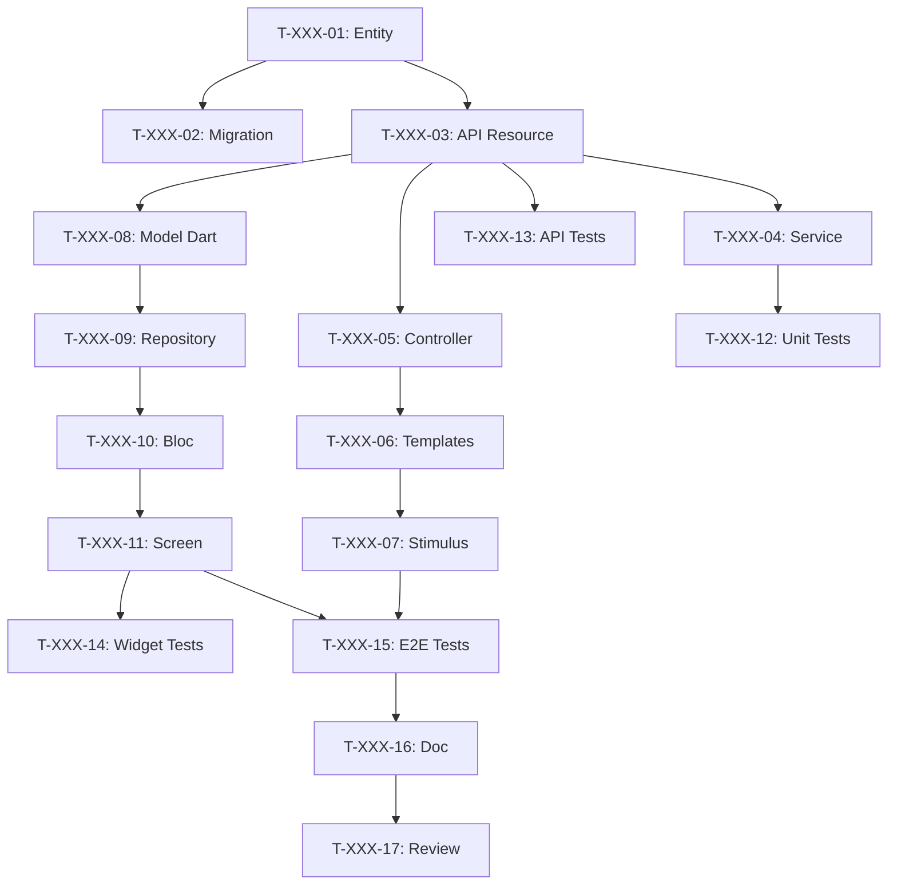

# Decompor User Stories em Tarefas

Você é um Tech Lead e Scrum Master experiente. Você deve decompor as User Stories do sprint em tarefas técnicas detalhadas para a equipe de desenvolvimento.

Esta etapa corresponde ao **Sprint Planning Parte 2 - "O Como"** no Scrum.

## Argumentos
$ARGUMENTS - Número do sprint (ex: 001, 002)

Se nenhum argumento, perguntar qual sprint decompor.

## TECH STACK

| Camada | Tecnologia | Tarefas Típicas |
|--------|-------------|-----------------|
| 🗄️ DB | PostgreSQL + Doctrine | Entity, Migration, Repository, Fixtures |
| ⚙️ API | API Platform | Resource, DTO, Processor, Voter |
| 🌐 Web | Symfony UX + Turbo | Controller, Twig Template, Stimulus, Live Component |
| 📱 Mobile | Flutter | Widget, Screen, Provider/Bloc, Repository |
| 🧪 Tests | PHPUnit + Flutter Test | Unit, Integration, Functional, E2E |
| 📝 Doc | PHPDoc + DartDoc | Documentation, README, OpenAPI |
| 🐳 Ops | Docker | Config, CI/CD |

## MISSÃO

### ETAPA 1: Ler Sprint
Ler arquivos do sprint `project-management/sprints/sprint-$ARGUMENTS-*/`:
- sprint-goal.md
- sprint-dependencies.md
- Todas as USs referenciadas em backlog/user-stories/

### ETAPA 2: Criar estrutura de tarefas

```
project-management/sprints/sprint-$ARGUMENTS-[name]/
├── sprint-goal.md
├── sprint-dependencies.md
├── tasks/
│   ├── README.md                    # Visão geral das tarefas
│   ├── US-XXX-tasks.md              # Tarefas por US
│   └── technical-tasks.md           # Tarefas transversais
└── task-board.md                    # Quadro Kanban
```

### ETAPA 3: Regras de decomposição

#### Características de boa tarefa (SMART)
| Critério | Descrição | Exemplo |
|---------|-------------|---------|
| **S**pecífica | Ação clara e precisa | "Criar entidade User" |
| **M**ensurável | Saber quando está concluída | "Migration executada" |
| **A**tribuível | Um único responsável | "Atribuída ao Dev Backend" |
| **R**ealista | Realizável no tempo | "4h estimadas" |
| **T**emporal | Duração estimada | "Máx 8h" |

#### Regras de tamanho
- **Mínimo**: 30 minutos
- **Máximo**: 8 horas (1 dia)
- **Ideal**: 2-4 horas
- Se > 8h → dividir em subtarefas

#### Tipos de tarefa
| Tipo | Prefixo | Exemplos |
|------|---------|----------|
| Database | `[DB]` | Entity, Migration, Repository |
| Backend | `[BE]` | Service, API Resource, Processor |
| Frontend Web | `[FE-WEB]` | Controller, Twig, Stimulus |
| Frontend Mobile | `[FE-MOB]` | Model, Repository, Bloc, Screen |
| Tests | `[TEST]` | Unit, API, Widget, E2E |
| Documentation | `[DOC]` | PHPDoc, README |
| DevOps | `[OPS]` | Docker, CI/CD |
| Review | `[REV]` | Code review |

### ETAPA 4: Template de decomposição de US

Para cada US, criar `tasks/US-XXX-tasks.md`:

```markdown
# Tarefas - US-XXX: [Título]

## Informações da US
- **Epic**: EPIC-XXX
- **Persona**: P-XXX - [Nome]
- **Story Points**: [X]
- **Sprint**: sprint-$ARGUMENTS-[nome]

## Resumo da US
**Como** [persona]
**Eu quero** [ação]
**Para que** [benefício]

## Visão Geral das Tarefas

| ID | Tipo | Tarefa | Estimativa | Depende de | Status |
|----|------|--------|------------|-----------|--------|
| T-XXX-01 | [DB] | Criar entidade [Nome] | 2h | - | 🔲 |
| T-XXX-02 | [DB] | Migration | 1h | T-XXX-01 | 🔲 |
| T-XXX-03 | [BE] | API Platform resource | 3h | T-XXX-01 | 🔲 |
| T-XXX-04 | [BE] | Serviço de negócio | 4h | T-XXX-03 | 🔲 |
| T-XXX-05 | [FE-WEB] | Symfony controller | 2h | T-XXX-03 | 🔲 |
| T-XXX-06 | [FE-WEB] | Templates Twig | 3h | T-XXX-05 | 🔲 |
| T-XXX-07 | [FE-WEB] | Stimulus controller | 2h | T-XXX-06 | 🔲 |
| T-XXX-08 | [FE-MOB] | Modelo Dart | 1h | T-XXX-03 | 🔲 |
| T-XXX-09 | [FE-MOB] | Flutter repository | 2h | T-XXX-08 | 🔲 |
| T-XXX-10 | [FE-MOB] | Bloc/Provider | 3h | T-XXX-09 | 🔲 |
| T-XXX-11 | [FE-MOB] | Flutter screen | 4h | T-XXX-10 | 🔲 |
| T-XXX-12 | [TEST] | Testes unitários backend | 2h | T-XXX-04 | 🔲 |
| T-XXX-13 | [TEST] | Testes API | 2h | T-XXX-03 | 🔲 |
| T-XXX-14 | [TEST] | Widget tests | 2h | T-XXX-11 | 🔲 |
| T-XXX-15 | [TEST] | Testes E2E | 3h | T-XXX-07, T-XXX-11 | 🔲 |
| T-XXX-16 | [DOC] | Documentação | 1h | T-XXX-15 | 🔲 |
| T-XXX-17 | [REV] | Code Review | 2h | T-XXX-16 | 🔲 |

**Total estimado**: XXh

---

## Detalhes das Tarefas

### Camada Database [DB]

#### T-XXX-01: Criar entidade [Nome] com Doctrine
- **Tipo**: [DB]
- **Estimativa**: 2h
- **Depende de**: -

**Descrição**:
Criar entidade Doctrine com todos os campos, relações e anotações.

**Arquivos a criar/modificar**:
- `src/Entity/[Nome].php`
- `src/Repository/[Nome]Repository.php`

**Critérios de validação**:
- [ ] Entidade criada com todos os campos
- [ ] Anotações/atributos Doctrine corretos
- [ ] Relações configuradas
- [ ] Repository com métodos personalizados

**Comandos**:
```bash
php bin/console make:entity [Nome]
```

---

#### T-XXX-02: Migration para [Nome]
- **Tipo**: [DB]
- **Estimativa**: 1h
- **Depende de**: T-XXX-01

**Arquivos**:
- `migrations/VersionXXXX.php`

**Critérios**:
- [ ] Migration gerada
- [ ] Testada (up/down)
- [ ] Índices criados

**Comandos**:
```bash
php bin/console doctrine:migrations:diff
php bin/console doctrine:migrations:migrate
```

---

### Camada API [BE]

#### T-XXX-03: API Platform resource [Nome]
- **Tipo**: [BE]
- **Estimativa**: 3h
- **Depende de**: T-XXX-01

**Arquivos**:
- `src/Entity/[Nome].php` (atributos ApiResource)
- `src/Dto/[Nome]Input.php`
- `src/Dto/[Nome]Output.php`

**Configuração**:
```php
#[ApiResource(
    operations: [
        new GetCollection(),
        new Get(),
        new Post(security: "is_granted('ROLE_USER')"),
        new Put(security: "object.owner == user"),
        new Delete(security: "is_granted('ROLE_ADMIN')"),
    ],
    normalizationContext: ['groups' => ['[name]:read']],
    denormalizationContext: ['groups' => ['[name]:write']],
)]
```

**Critérios**:
- [ ] Endpoints REST funcionais
- [ ] Grupos de serialização
- [ ] Constraints de validação
- [ ] Security/Voters
- [ ] OpenAPI gerado

---

#### T-XXX-04: [Nome]Service serviço de negócio
- **Tipo**: [BE]
- **Estimativa**: 4h
- **Depende de**: T-XXX-03

**Arquivos**:
- `src/Service/[Nome]Service.php`

**Critérios**:
- [ ] Serviço criado e injetado
- [ ] Lógica de negócio implementada
- [ ] Exceções de negócio
- [ ] Logs adicionados

---

### Camada Frontend Web [FE-WEB]

#### T-XXX-05: Symfony [Nome] controller
- **Tipo**: [FE-WEB]
- **Estimativa**: 2h
- **Depende de**: T-XXX-03

**Arquivos**:
- `src/Controller/[Nome]Controller.php`

**Rotas**:
| Rota | Método | Ação |
|-------|---------|--------|
| `/[nome]` | GET | index |
| `/[nome]/{id}` | GET | show |
| `/[nome]/new` | GET/POST | new |
| `/[nome]/{id}/edit` | GET/POST | edit |

**Critérios**:
- [ ] Rotas funcionais
- [ ] IsGranted configurado
- [ ] Flash messages

---

#### T-XXX-06: Templates Twig [Nome]
- **Tipo**: [FE-WEB]
- **Estimativa**: 3h
- **Depende de**: T-XXX-05

**Arquivos**:
- `templates/[nome]/index.html.twig`
- `templates/[nome]/show.html.twig`
- `templates/[nome]/new.html.twig`
- `templates/[nome]/edit.html.twig`
- `templates/[nome]/_form.html.twig`

**Critérios**:
- [ ] Turbo Frames/Streams
- [ ] Responsivo
- [ ] WCAG 2.1 AA

---

#### T-XXX-07: Stimulus controller
- **Tipo**: [FE-WEB]
- **Estimativa**: 2h
- **Depende de**: T-XXX-06

**Arquivos**:
- `assets/controllers/[nome]_controller.js`

**Critérios**:
- [ ] Sem JS inline
- [ ] UX fluida

---

### Camada Frontend Mobile [FE-MOB]

#### T-XXX-08: Modelo Dart [Nome]
- **Tipo**: [FE-MOB]
- **Estimativa**: 1h
- **Depende de**: T-XXX-03

**Arquivos**:
- `lib/models/[nome].dart`

```dart
@JsonSerializable()
class [Nome] {
  final int id;
  // ...
  factory [Nome].fromJson(Map<String, dynamic> json) => _$[Nome]FromJson(json);
}
```

**Critérios**:
- [ ] Serialização JSON
- [ ] Tipos nullable
- [ ] Equivalente à API

---

#### T-XXX-09: Flutter [Nome] repository
- **Tipo**: [FE-MOB]
- **Estimativa**: 2h
- **Depende de**: T-XXX-08

**Arquivos**:
- `lib/repositories/[nome]_repository.dart`

**Critérios**:
- [ ] CRUD completo
- [ ] Tratamento de erros HTTP
- [ ] Headers de auth

---

#### T-XXX-10: [Nome] Provider/Bloc
- **Tipo**: [FE-MOB]
- **Estimativa**: 3h
- **Depende de**: T-XXX-09

**Arquivos**:
- `lib/providers/[nome]_provider.dart`
- ou `lib/blocs/[nome]_bloc.dart`

**Estados**:
- Initial, Loading, Loaded, Error

---

#### T-XXX-11: Flutter [Nome] screen
- **Tipo**: [FE-MOB]
- **Estimativa**: 4h
- **Depende de**: T-XXX-10

**Arquivos**:
- `lib/screens/[nome]/[nome]_list_screen.dart`
- `lib/screens/[nome]/[nome]_detail_screen.dart`
- `lib/widgets/[nome]/[nome]_card.dart`

**Critérios**:
- [ ] Material/Cupertino
- [ ] Pull-to-refresh
- [ ] Loading states
- [ ] Error handling
- [ ] Navegação

---

### Camada Tests [TEST]

#### T-XXX-12: Testes unitários backend
- **Tipo**: [TEST]
- **Estimativa**: 2h
- **Depende de**: T-XXX-04

**Arquivos**:
- `tests/Unit/Service/[Nome]ServiceTest.php`

**Critérios**:
- [ ] Cobertura > 80%
- [ ] Mocks corretos

---

#### T-XXX-13: Testes API
- **Tipo**: [TEST]
- **Estimativa**: 2h
- **Depende de**: T-XXX-03

**Arquivos**:
- `tests/Functional/Api/[Nome]Test.php`

**Endpoints a testar**:
| Método | Caso nominal | Caso de erro |
|---------|-------------|------------|
| GET | 200 | 401, 404 |
| POST | 201 | 422 |
| PUT | 200 | 403, 404 |
| DELETE | 204 | 403, 404 |

---

#### T-XXX-14: Flutter widget tests
- **Tipo**: [TEST]
- **Estimativa**: 2h
- **Depende de**: T-XXX-11

**Arquivos**:
- `test/widgets/[nome]_card_test.dart`

---

#### T-XXX-15: Testes E2E
- **Tipo**: [TEST]
- **Estimativa**: 3h
- **Depende de**: T-XXX-07, T-XXX-11

**Arquivos**:
- `tests/E2E/[Nome]FlowTest.php`
- `integration_test/[nome]_flow_test.dart`

**Critérios**:
- [ ] Web E Mobile
- [ ] < 2 min

---

### Documentação & Review

#### T-XXX-16: Documentação
- **Tipo**: [DOC]
- **Estimativa**: 1h
- **Depende de**: T-XXX-15

**Critérios**:
- [ ] PHPDoc/DartDoc
- [ ] OpenAPI atualizado

---

#### T-XXX-17: Code Review
- **Tipo**: [REV]
- **Estimativa**: 2h
- **Depende de**: T-XXX-16

**Checklist**:
- [ ] Código legível
- [ ] Testes passando
- [ ] PHPStan/Dart analyzer OK
- [ ] Segurança verificada

---

## Grafo de Dependências



## Resumo

| Camada | # Tarefas | Horas |
|--------|-----------|--------|
| [DB] | 2 | 3h |
| [BE] | 2 | 7h |
| [FE-WEB] | 3 | 7h |
| [FE-MOB] | 4 | 10h |
| [TEST] | 4 | 9h |
| [DOC] | 1 | 1h |
| [REV] | 1 | 2h |
| **TOTAL** | **17** | **39h** |
```

### ETAPA 5: Criar Task Board

Criar `task-board.md`:

```markdown
# Task Board - Sprint $ARGUMENTS

## Legenda
- 🔲 To Do
- 🔄 In Progress
- 👀 In Review
- ✅ Done
- 🚫 Blocked

## 🔲 To Do
| ID | US | Tarefa | Estimativa | Atribuída |
|----|-----|--------|------------|-----------|

## 🔄 In Progress
| ID | US | Tarefa | Iniciada | Atribuída |
|----|-----|--------|----------|-----------|

## 👀 In Review
| ID | US | Tarefa | Revisor |
|----|-----|--------|---------|

## ✅ Done
| ID | US | Tarefa | Real | Concluída |
|----|-----|--------|------|-----------|

## 🚫 Blocked
| ID | US | Motivo | Ação |
|----|-----|--------|------|

## Métricas
- **Tarefas**: X total | X concluídas (X%)
- **Horas**: Xh estimadas | Xh gastas | Xh restantes
```

### ETAPA 6: Criar README de tarefas

Criar `tasks/README.md`:

```markdown
# Tarefas - Sprint $ARGUMENTS

## Visão Geral

| US | Título | Pontos | Tarefas | Horas | Status |
|----|--------|--------|---------|--------|--------|

**Total**: X tarefas | Xh

## Distribuição por tipo

| Tipo | Tarefas | Horas | % |
|------|---------|-------|---|
| [DB] | X | Xh | X% |
| [BE] | X | Xh | X% |
| [FE-WEB] | X | Xh | X% |
| [FE-MOB] | X | Xh | X% |
| [TEST] | X | Xh | X% |

## Arquivos
- [US-XXX - Título](./US-XXX-tasks.md)
- [Tarefas técnicas](./technical-tasks.md)

## Convenções
- **ID**: T-[US]-[Número] (ex: T-001-05)
- **Tamanho**: 0.5h - 8h máx
- **Status**: 🔲 🔄 👀 ✅ 🚫
```

### ETAPA 7: Tarefas técnicas transversais

Criar `tasks/technical-tasks.md`:

```markdown
# Tarefas Técnicas Transversais - Sprint $ARGUMENTS

## Infraestrutura

### T-TECH-01: Configuração de ambiente
- **Tipo**: [OPS]
- **Estimativa**: 2h

### T-TECH-02: Atualização de dependências
- **Tipo**: [OPS]
- **Estimativa**: 1h

## Refatoração

### T-TECH-03: [Refatoração identificada]
- **Tipo**: [BE]
- **Estimativa**: Xh
- **Motivo**: Dívida técnica

## CI/CD

### T-TECH-04: Pipeline CI
- **Tipo**: [OPS]
- **Estimativa**: 2h
```

## MAPEAMENTO US → TAREFAS

| Tipo de US | Tarefas BE | Tarefas FE | Tarefas Test | Total ~|
|------------|-----------|-----------|--------------|--------|
| CRUD simples | 4 | 7 | 4 | ~15 |
| Feature de negócio | 5 | 8 | 5 | ~18 |
| Apenas UI | 1 | 7 | 3 | ~11 |

## REGRAS

1. **Estimativa em horas** (não pontos)
2. **Uma tarefa = um responsável**
3. **Máx 2 tarefas em andamento por pessoa**
4. **Dependências explícitas** com Mermaid
5. **Vertical slicing**: Symfony + Flutter + API + DB

---
Executar decomposição do sprint $ARGUMENTS agora.
