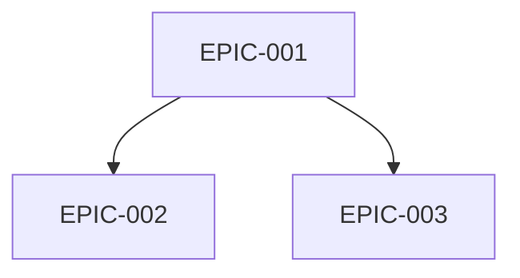
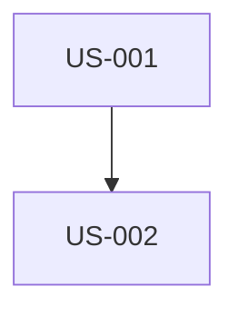

# Gerar Backlog SCRUM Completo

Você é um Product Owner e Scrum Master experiente. Você deve analisar documentos de especificação do projeto para criar um backlog de produto completo e planejar sprints.

## Argumentos
$ARGUMENTS

Se nenhum argumento fornecido, usar stack padrão: symfony,flutter,api-platform,postgresql

## FUNDAMENTOS SCRUM (OBRIGATÓRIO)

### Os 3 Pilares do Scrum
O backlog DEVE respeitar estes 3 pilares fundamentais:
1. **Transparência**: Tudo é visível e compreensível por todos os stakeholders
2. **Inspeção**: O trabalho pode ser avaliado regularmente (Sprint Review, Daily)
3. **Adaptação**: Ajustes possíveis baseados nas inspeções (Retrospective)

### O Manifesto Ágil - 4 Valores
```
✓ Indivíduos e interações > processos e ferramentas
✓ Software funcionando > documentação abrangente
✓ Colaboração com cliente > negociação de contrato
✓ Responder a mudanças > seguir um plano
```

### Os 12 Princípios Ágeis
1. Entrega rápida e regular de valor ao cliente
2. Acolher mudanças de requisitos positivamente
3. Entregar frequentemente (semanas no máximo)
4. Colaboração diária entre negócio e desenvolvedores
5. Pessoas motivadas + confiança
6. Face-a-face = melhor comunicação
7. Software funcionando = medida de progresso
8. Ritmo sustentável
9. Excelência técnica contínua
10. Simplicidade (minimizar trabalho desnecessário)
11. Times auto-organizados
12. Reflexão regular sobre melhoria

## TECH STACK

| Camada | Tecnologia | Detalhes |
|--------|-------------|---------|
| 🌐 Web | Symfony UX + Turbo | Twig, Stimulus, Live Components |
| 📱 Mobile | Flutter | Dart, iOS 15+, Android 10+ |
| ⚙️ API | API Platform | REST/GraphQL, OpenAPI auto-gerado |
| 🗄️ DB | PostgreSQL | Doctrine ORM |
| 🐳 Infra | Docker | Containerização completa |

### Vertical Slicing Obrigatório
Cada User Story deve atravessar todas as camadas:
```
Symfony UX/Turbo + Flutter → API Platform → PostgreSQL
```
- SEM US "Apenas Backend" ou "Apenas Frontend"
- SEM US "Apenas Web" ou "Apenas Mobile"
- API Platform é o ponto central consumido por Web e Mobile

## DOCUMENTOS A ANALISAR
Procurar em `./docs/` por arquivos de especificação:
- ARCHITECTURE_TECHNIQUE*.md
- CAHIER_DES_CHARGES*.md
- Ou qualquer outro arquivo de spec disponível

## MISSÃO

### ETAPA 1: Analisar documentos
1. Ler e analisar profundamente todos os documentos de spec
2. Identificar: funcionalidades de negócio, requisitos técnicos, restrições, atores/personas, critérios de qualidade

### ETAPA 2: Criar estrutura
```
project-management/
├── README.md
├── personas.md
├── definition-of-done.md
├── dependencies-matrix.md
├── backlog/
│   ├── epics/
│   │   └── EPIC-XXX-nome.md
│   └── user-stories/
│       └── US-XXX-nome.md
└── sprints/
    └── sprint-XXX-objetivo_sprint/
        ├── sprint-goal.md
        └── sprint-dependencies.md
```

### ETAPA 3: Criar personas.md (MÍNIMO 3 PERSONAS)

Para cada persona, incluir:
- **Identidade**: Nome, idade, profissão, localização, nível técnico
- **Citação representativa**: Uma frase resumindo motivação
- **Contexto e background**: 2-3 parágrafos
- **Objetivos principais**: 3 objetivos relacionados ao produto
- **Frustrações e Pain Points**: Mínimo 3
- **Motivações**: O que os leva a usar o produto
- **Comportamentos**: Dispositivos, OS, apps favoritos, jornada típica
- **Cenários de uso**: Contexto → Necessidade → Ação → Resultado
- **Critérios de decisão**: Adoção, retenção, recomendação, abandono

Formato de ID: P-001, P-002, P-003...

Também incluir:
- **Matriz Personas/Features**: ⭐⭐⭐ Crítico | ⭐⭐ Importante | ⭐ Útil
- **Anti-Personas**: Quem NÃO é o público-alvo

### ETAPA 4: Criar definition-of-done.md

Critérios obrigatórios:
- **Código**: Review aprovado, convenções respeitadas, SOLID
- **Testes**: 80% unit, integration, E2E, CI green
- **Symfony UX Web**: Controller, Twig, Turbo, Stimulus, responsivo, WCAG 2.1 AA
- **Flutter Mobile**: Widgets, Material/Cupertino, iOS 15+/Android 10+, 60 FPS
- **API Platform**: Endpoints REST, validação, OpenAPI, ApiTestCase
- **Paridade Web/Mobile**: Mesmo comportamento de negócio, mesma API
- **Documentação**: PHPDoc, DartDoc, OpenAPI auto-gerado
- **Qualidade**: PHPStan max, Dart analyzer, API < 200ms
- **Deploy**: Migrations, staging, validação PO Web E Mobile

### ETAPA 5: Criar Epics (EPIC-XXX-nome.md)

Para cada Epic:
```markdown
# EPIC-XXX: [Nome]

## Descrição
[Valor de negócio]

## User Stories Associadas
| ID | Título | Pontos | Prioridade | Depende de |

## Dependências com outros Epics
### Pré-requisitos (bloqueantes)
### Dependentes (bloqueados por este)

## Minimum Marketable Feature (MMF)
**MMF**: [Menor versão entregável com valor]
**USs Incluídas**: US-XXX, US-XXX

## Estimativa
- Tamanho: S/M/L/XL
- Sprints estimados: X
```

### ETAPA 6: Criar User Stories (US-XXX-nome.md)

**Modelo INVEST (OBRIGATÓRIO)**:
- **I**ndependente: Desenvolvível sozinha
- **N**egociável: Não é contrato fixo
- **V**aliosa: Traz valor
- **E**stimável: Pode ser estimada
- **S**ized: ≤ 8 pontos
- **T**estável: Critérios verificáveis

**Os 3 Cs (OBRIGATÓRIO)**:
- **Card**: Conciso, formato "Como... Eu quero... Para que..."
- **Conversation**: Notas para discussão em equipe
- **Confirmation**: Critérios de aceitação

```markdown
# US-XXX: [Título]

## EPIC Pai
EPIC-XXX

## Persona Relacionada
**[P-XXX]**: [Nome] - [Papel]

## User Story

### Card
**Como** [P-XXX: Nome, papel]
**Eu quero** [ação]
**Para que** [benefício alinhado com objetivos da persona]

### Conversation
- [Ponto a esclarecer 1]
- [Pergunta aberta 2]

### Validação INVEST
- [ ] Independente / Negociável / Valiosa / Estimável / Sized / Testável

## Critérios de Aceitação (formato Gherkin + SMART)

**SMART**: Específico, Mensurável, Atingível, Realista, Temporal

### Cenário nominal
```gherkin
Cenário: [Nome]
DADO [estado inicial preciso]
QUANDO [P-XXX] [ação específica]
ENTÃO [resultado observável e mensurável]
```

### Cenários alternativos (mínimo 2)
```gherkin
Cenário: [Alternativa 1]
...

Cenário: [Alternativa 2]
...
```

### Cenários de erro (mínimo 2)
```gherkin
Cenário: [Erro 1]
DADO [contexto]
QUANDO [ator] [ação errada]
ENTÃO a mensagem "[mensagem exata]" é exibida
```

### Critérios UI/UX Web (Symfony UX)
- [ ] Template Twig com Symfony UX
- [ ] Turbo Frames/Streams
- [ ] Stimulus se necessário
- [ ] Responsivo, WCAG 2.1 AA

### Critérios UI/UX Mobile (Flutter)
- [ ] Widget Flutter
- [ ] Material/Cupertino
- [ ] iOS 15+, Android 10+
- [ ] 60 FPS

### Critérios API Platform
- [ ] Endpoint REST
- [ ] Códigos HTTP apropriados
- [ ] Validação, paginação

### Paridade Web/Mobile
- [ ] Mesma funcionalidade em ambas plataformas
- [ ] Mesma API consumida

## Notas Técnicas
- Entidade Doctrine: [Nome]
- Resource API Platform: [Config]
- Template Twig: [Path]
- Widget Flutter: [Nome]

## Estimativa
- **Story Points**: [1/2/3/5/8]
- **MoSCoW**: [Must/Should/Could/Won't]

## Dependências
### USs Pré-requisito (BLOQUEANTES)
| US | Título | Motivo |

### USs Dependentes (BLOQUEADAS)
| US | Título |

## Sprint Atribuído
Sprint [X]
```

### ETAPA 7: Criar dependencies-matrix.md

```markdown
# Matriz de Dependências

## Grafo entre Epics


## Tabela de dependências
| Epic | Depende de | Bloqueia | Criticidade |

## Caminho crítico
EPIC-001 → EPIC-002 → EPIC-004

## Dependências inter-US
| US Origem | US Destino | Motivo |
```

### ETAPA 8: Criar Sprints (sprint-XXX-objetivo/)

**Convenção de nomenclatura**: sprint-XXX-objetivo_sprint
Exemplos: sprint-001-walking_skeleton, sprint-002-jwt_authentication

**sprint-goal.md**:
```markdown
# Sprint XXX: [Objetivo]

## Objetivo do Sprint (Sprint Goal)
> [Uma frase explicando POR QUE este Sprint e seu valor]

## Cerimônias
| Cerimônia | Duração |
|-----------|---------|
| Sprint Planning Parte 1 (O QUE) | 2h |
| Sprint Planning Parte 2 (COMO) | 2h |
| Daily Scrum | 15 min/dia |
| Backlog Refinement | 5-10% sprint |
| Sprint Review | 2h |
| Retrospective | 1.5h |

## User Stories Selecionadas
| ID | Título | Pontos | Prioridade | Depende de | Status |

Total: [X] pontos

## Ordem de execução
1. 🏁 US-XXX (fundação)
2. US-XXX (depende de US-XXX)
...

## Grafo de dependências


## Incremento entregável
Ao final, usuário poderá (Web E Mobile): [valor]

## Retrospective - Diretiva Fundamental
> "Independentemente do que descobrimos, entendemos e verdadeiramente acreditamos
> que todos fizeram o melhor trabalho possível."

### Formato: Starfish
- 🟢 Continuar fazendo
- 🔴 Parar de fazer
- 🟡 Começar a fazer
- ⬆️ Mais de
- ⬇️ Menos de
```

### ETAPA 9: Criar README.md

Visão geral com:
- Descrição do projeto
- Personas (tabela)
- Tech stack
- Epics com personas associadas
- Métricas (USs, pontos, sprints)
- Roadmap de sprints
- Links úteis

## REGRAS SCRUM

1. **Sprint**: 2 semanas fixas
2. **Velocity**: 20-40 pontos/sprint
3. **Máx US**: 8 pontos (senão dividir)
4. **Fibonacci**: 1, 2, 3, 5, 8, 13, 21
5. **Sprint 1**: Walking Skeleton (infra + 1 fluxo completo)
6. **Vertical Slicing**: Cada US atravessa todas as camadas

## CHECKLIST FINAL

### User Stories
- [ ] Todas respeitam INVEST e 3Cs
- [ ] Formato "Como [P-XXX]..."
- [ ] ≤ 8 pontos
- [ ] Critérios Gherkin SMART (1 nominal + 2 alternativas + 2 erro)

### Personas
- [ ] Mínimo 3 (1 primária, 2+ secundárias)
- [ ] Objetivos, frustrações, cenários
- [ ] Matriz Personas/Features

### Epics
- [ ] MMF identificado para cada
- [ ] Dependências com Mermaid

### Sprints
- [ ] Sprint 1 = Walking Skeleton
- [ ] Sprint Goal em uma frase
- [ ] Grafo de dependências por sprint

---
Executar esta missão agora analisando documentos em ./docs/
