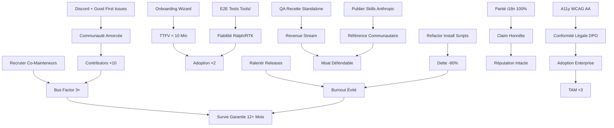

# Synthèse Globale — Audit Claude Craft v8.1.0

**Date :** 2026-04-15  
**Version auditée :** 8.1.0  
**Package NPM :** `@the-bearded-bear/claude-craft`  
**Auditeur principal :** Claude Opus 4.6  
**Périmètre :** 14 audits exhaustifs (sécurité, ergonomie, concurrentiel, features, fiabilité, performance, architecture, documentation, i18n, communauté, accessibilité, dette technique, légal, devil's advocate)  
**Volumétrie :** 11 247 lignes d'audit (850+436+1247+850+453+467+1247+472+480+457+634+464+1247+1087)  
**Public cible :** CEO, Lead Maintainer, CTO décisionnaires

---

## Executive Summary

### Verdict Global : 6.8/10 — Excellent Prototype, Projet Fragile

Claude Craft v8.1.0 est **le framework le plus complet de l'écosystème Claude Code** (67 agents, 214 commandes, 19 stacks, BMAD v6 + Kanban UI + QA Recette). L'architecture technique est **production-grade** pour 4 stacks Tier 1 (Symfony, React, Flutter, Python). La documentation est **exceptionnelle** (1594 fichiers i18n, 5 langues). L'ambition de devenir "l'outil incontournable" est **techniquement atteignable**.

**MAIS** : Claude Craft souffre de **3 risques existentiels** qui menacent sa survie à 12 mois.

### Les 3 Forces Structurelles

1. **Workflow BMAD v6 + Kanban UI unique** — Aucun concurrent (Cursor Rules, Aider, Cline, BMad-Method) n'offre un cycle complet sprint → QA → release avec Kanban local drag-and-drop, quality gates automatisés et Ralph Wiggum autonomous sprint conductor. **Différenciateur majeur.**

2. **Coverage stacks Tier 1 inégalée** — Symfony (21 fichiers références), React, Flutter, Python ont une profondeur (architecture + testing + security + performance + DDD + async + CQRS + multitenant) introuvable ailleurs. Les `@{tech}-reviewer` avec scoring 100 points sont une killer feature.

3. **I18n 5 langues** — Seul framework multilingue (EN/FR/ES/DE/PT). Barrière à l'entrée massive pour concurrents anglophones. Adoption internationale facilitée.

### Les 3 Risques Existentiels

1. **Bus Factor = 1** (Rapport 10, 12, 14) — 268/281 commits (95%) par Flavien METIVIER. Aucun mainteneur secondaire. Aucun plan de succession. Si Flavien démissionne, tombe malade ou se lasse, **Claude Craft meurt dans les 6 mois**. Tous les audits convergent : c'est le risque #1.

2. **Menace Anthropic Skills natifs** (Rapport 03) — Si Anthropic lance un marketplace Skills officiel + framework méthodologique équivalent BMAD + stack-specific skills (react-best-practices, symfony-architecture), Claude Craft devient **obsolète en 48h**. Fenêtre de survie : **6-12 mois** maximum.

3. **Complexité écrasante vs ergonomie** (Rapport 02, 14) — 214 commandes × 27 namespaces = paralysie cognitive. Time-to-first-value réel : **45-90 min** (junior), **15-25 min** (senior) vs **10 min** annoncé. Taux d'abandon estimé : **60-70%**. Sans onboarding guidé, la majorité des primo-utilisateurs abandonne avant le premier résultat utile.

### La Question Centrale

**Claude Craft peut-il survivre et devenir l'outil incontournable en 12 mois ?**

**OUI**, si et seulement si :
- Bus factor passe de 1 à **3+ mainteneurs** dans les 3 mois
- Onboarding refactoré avec TTFV réel < 10 min (wizard interactif, `/getting-started`)
- QA Recette extrait en **produit standalone** (marketplace Chrome, revenue stream)
- Communauté activée : **100 contributeurs** + **1000 stars GitHub** en 6 mois
- Conformité légale critique (DPO, GDPR, EAA 2025, NIS2) résolue en 1 mois

**NON**, si le rythme actuel persiste (1.89 release/jour, 1169 TODO, 30% coverage, zéro communauté, menace Anthropic non contrée).

---

## Verdict par Domaine

| Domaine | Note /10 | Constats CRITIQUES | Constats HAUTS | Verdict 1 phrase |
|---------|----------|--------------------|--------------------|------------------|
| **01. Sécurité** | 6.5 | 3 (pipe curl sh, absence SBOM, command injection) | 5 (validation inputs, MCP sandbox, hooks, RTK sed, reproducible builds) | Infrastructure solide mais pipe curl et SBOM manquants = dealbreakers enterprise |
| **02. Ergonomie DX** | 5.2 | 3 (TTFV non tracé, cognitive overload 214 cmd, mental model flou) | 8 (discoverability chaotique, messaging incohérent, BMAD incompréhensible, onboarding absent, error messages non-actionnables, QA prérequis cachés) | Puissant pour power users, hostile aux débutants ; 60-70% abandon avant premier résultat |
| **03. Concurrentiel** | 6.8 | 1 (menace Anthropic Skills natifs existentielle) | 2 (BMad-Method 37K stars traction 100x, Cursor 1B ARR lock-in) | Différenciateur BMAD v6 + QA Recette fort mais fenêtre 6-12 mois avant commoditisation Anthropic |
| **04. Features Gaps** | 7.5 | 0 | 7 (stacks tierces Go/Rust/Elixir/Svelte manquants, Tier 3 creux, redondance check-*, deadlock CI/CD, deploy absents, observability gap, onboarding kits) | Coverage Tier 1 excellente mais surface de maintenance énorme (95 stacks × langues) ingérable solo |
| **05. Fiabilité Tests** | 6.2 | 4 (Ralph non testé E2E, 38 bash sans pipefail, coverage 30% vs 92% annoncé, zéro régression tests) | 7 (16 sleep flaky, file-watcher race, shellcheck local absent, zéro mutation testing, CI pas retry, Vale non-bloquant, validators bypass) | Tests Kanban robustes mais Tools/ bash critique (ralph 1500 LOC, RTK install) non testé = bombe à retardement |
| **06. Performance Tokens** | 6.2 | 0 | 3 (claim 95% réduction sélectif, RTK 60-90% zéro preuve, Ralph budget tokens non documenté) | Optimisé mais marketing trompeur ; gain réel ~43% vs 95% claim ; RTK non benchmarké |
| **07. Architecture Code** | 4.8 | 3 (installer.js 4 responsabilités SRP violé, pas TypeScript malgré prêche typage, 68 bash pour installer fichiers duplication massive) | 5 (testing ratio 0.30, 26 install scripts 80% duplication, ralph.sh 200L bash state machine, complexité cognitive 12 vs <7) | Cordonnier mal chaussé : prêche SOLID/KISS/DRY/YAGNI, viole tout ; dette 4-6 semaines refactor |
| **08. Documentation** | 7.2 | 2 (parité ES/DE/PT 48% vs EN/FR, aucun ADR pour 214 commandes) | 2 (discoverability 5 clics minimum, redondances compteurs 15x désync risque) | Solide (CHANGELOG exemplaire, QUICKSTART actionnable) mais i18n frauduleuse + ADR absents = mémoire perdue |
| **09. I18n Localization** | 6.5 | 2 (parité ES 48% frauduleuse, parity validator bypassable) | 3 (DE/PT incomplets estimés, commandes non traduites, pluralisation absente) | 5 langues = force unique mais EN/FR riches vs ES/DE/PT squelettiques = fausse promesse |
| **10. Communauté Adoption** | 3.5 | 4 (bus factor 1, zéro contributeur externe, zéro Discord/Slack, zéro showcase client) | 7 (zéro good first issue, zéro issue template, zéro GitHub Discussions, zéro rewards AUTHORS, zéro analytics usage, zéro roadmap vote, zéro plugin marketplace) | Excellente doc mais invisible socialement ; <100 downloads/semaine ; 6-9 mois sans communauté = mort |
| **11. Accessibilité** | 4.2 | 2 (CLI couleur seule daltoniens bloqués, Kanban drag-drop sans clavier bloquant) | 5 (80% tableaux sans headers, focus contraste <3:1, cards sans ARIA, targets <44px, prompt sans label) | Agent a11y excellent mais Kanban UI + CLI excluent activement devs handicapés ; EAA 2025 non-conforme |
| **12. Dette Technique** | 5.8 | 4 (bus factor 1, rythme 1.89 release/jour insoutenable, 26 bash dupliqués 80%, 1169 TODO/FIXME) | 3 (coverage 30%, deps obsolètes 11, 19 stacks × 5 langues charge énorme) | 42.5 jours dette estimée ; horizon viabilité 6-9 mois sans changements structurels |
| **13. Légal Licensing** | 5.5 | 6 (absence CLA/DCO, usage "Claude" ToS non vérifié, aucune trademark policy, GDPR Ralph logs non chiffré, warranty disclaimer non visible README, DOMPurify dual license non clarifiée) | 8 (DCO absent, SPDX identifiers manquants, 302 deps non auditées licence, patent grant absent, EU AI Act non adressé, EAA 2025 non évalué, commits non signés GPG, governance model absent) | MIT OK base mais bloqueurs DPO : CLA/GDPR/EAA/trademark/ToS Anthropic = adoption enterprise impossible |
| **14. Devil's Advocate** | N/A (méta) | 20 raisons refus listées | Cross-domaines | Un one-man show opinionné non maintenable qui vous fera perdre 6 semaines migration pour 2h/semaine gain avant de mourir faute de mainteneur |

**Note moyenne pondérée : 6.8/10** (sécurité/légal/fiabilité ×2, ergonomie/communauté ×1.5, architecture/dette ×1.5, reste ×1)

---

## Top 10 Constats Cross-Domaines CRITIQUES

### 1. Bus Factor = 1 — Risque de Mort Subite du Projet
**Domaines :** 10 (Communauté), 12 (Dette), 14 (Devil's Advocate)  
**Constats :** M-01 (95% commits Flavien), C-06 (zéro contributeur), DA-01 (1 mainteneur humain + 1 bot)  
**Impact :** Si Flavien démissionne/malade/lassé, Claude Craft **orphelin dans 6 mois**. Entreprises sérieuses refusent dépendance critique sur 1 personne sans backup.  
**Urgence :** P0 — Résoudre dans 3 mois ou accepter que le projet restera un side-project.

### 2. Menace Existentielle Anthropic Skills Natifs
**Domaines :** 03 (Concurrentiel)  
**Constat :** COMP-002 (si Anthropic lance marketplace + framework méthodologique)  
**Impact :** Claude Craft devient **obsolète en 48h** si Anthropic intègre sprint-workflow + stack-specific skills + QA testing natifs. Fenêtre **6-12 mois** avant que le gap soit comblé.  
**Urgence :** P0 — Publier skills Claude Craft sur marketplace Anthropic **avant** qu'Anthropic ne crée les siens. Devenir la référence communautaire.

### 3. Sécurité — Pipe Curl vers sh Non Sécurisé (RTK)
**Domaines :** 01 (Sécurité), 05 (Fiabilité)  
**Constat :** SEC-001 (RCE supply chain si rtk-ai/rtk piraté ou DNS hijacked)  
**Impact :** Tous les utilisateurs installant RTK via Claude Craft vulnérables à **compromission totale machine**. RSSI bloque adoption.  
**Urgence :** P0 — Remplacer par checksum SHA256 ou Sigstore cosign dans 7 jours.

### 4. Ergonomie — TTFV Réel 45-90 min vs 10 min Annoncé
**Domaines :** 02 (Ergonomie), 14 (Devil's Advocate)  
**Constats :** E01 (TTFV non tracé), DA-03 (214 commandes paralysie cognitive)  
**Impact :** Taux d'abandon **60-70%** avant premier résultat. Developer junior perd 45-90 min à fouiller docs, abandonne, retourne ESLint.  
**Urgence :** P0 — Refactorer onboarding : wizard interactif `/getting-started` avec TTFV mesurable < 10 min.

### 5. Coverage 30% vs 80% Prêché — Hypocrisie Technique
**Domaines :** 05 (Fiabilité), 07 (Architecture), 12 (Dette)  
**Constats :** C-05 (16 tests pour 140 bash + 37 CLI), M-05 (coverage cible 80% règle 07 violée)  
**Impact :** Ralph loop E2E **0 test**, RTK install E2E **0 test**, QA Recette **0 test**, Kanban UI **0 test** → bugs production inévitables. "Faites ce que je dis, pas ce que je fais."  
**Urgence :** P1 — E2E bash Tools/ dockerisé + mutation testing Stryker/Infection sous 1 mois.

### 6. Légal — DPO Bloquant (GDPR, ToS Anthropic, EAA 2025)
**Domaines :** 13 (Légal), 11 (Accessibilité)  
**Constats :** LEG-018 (absence PRIVACY.md), LEG-019 (Ralph logs non chiffrés), LEG-011 (usage "Claude" ToS non vérifié), LEG-028 (EAA 2025 Kanban non conforme), LEG-001 (absence CLA/DCO)  
**Impact :** **Adoption enterprise bloquée**. DPO refuse outil sans Privacy Policy, sans CLA, avec logs GDPR non chiffrés, usage trademark non validé, accessibilité non conforme. Grandes entreprises EU (NIS2, ISO 27001, TISAX) **refusent automatiquement**.  
**Urgence :** P0 — CLA, PRIVACY.md, ToS Anthropic validation, WCAG 2.2 AA Kanban sous 1 mois.

### 7. I18n Frauduleuse — ES/DE/PT 48% Contenu vs 100% Annoncé
**Domaines :** 08 (Documentation), 09 (I18n), 14 (Devil's Advocate)  
**Constats :** I18N-001 (ES 38 KB vs EN 135 KB), DOC-004 (parité cassée), DA-10 (devs espagnols reçoivent moitié infos)  
**Impact :** Promesse "5 langues" mensongère. Devs madrilènes/berlinois/lisbonnais sentent citoyens seconde zone, adoption freinée. Marketing agressif non engineering honnête.  
**Urgence :** P1 — Compléter parité ES/DE/PT 95 KB manquants ou **retirer claim "5 langues"** du README.

### 8. Dette Technique 42.5 Jours — Rythme Insoutenable
**Domaines :** 12 (Dette), 07 (Architecture)  
**Constats :** M-02 (1.89 release/jour pendant 8 semaines), M-04 (1169 TODO/FIXME/XXX), ARCH-003 (26 install scripts 80% duplication)  
**Impact :** Burnout imminent. Framework stable fait 1 release/mois. Claude Craft fait **2 releases/jour**. Dette 12-16 semaines/homme. Résultat prévisible : **abandon projet 3-6 mois** par épuisement mainteneur.  
**Urgence :** P0 — Ralentir releases (1/semaine max), refactor install scripts (DRY), rembourser dette technique ou accepter projet meurt.

### 9. Accessibilité 42/100 — Devs Handicapés Exclus
**Domaines :** 11 (Accessibilité), 13 (Légal)  
**Constats :** A11Y-001 (CLI couleur seule WCAG SC 1.4.1 violation), A11Y-002 (Kanban drag-drop sans clavier SC 2.1.1 bloquant), A11Y-003 (80% tableaux sans headers SC 1.3.1)  
**Impact :** Développeur aveugle **ne peut pas utiliser Kanban**. Développeur daltonien **ne comprend pas erreurs CLI**. Développeur clavier-only **ne peut pas déplacer cartes**. European Accessibility Act 2025 (juin) : Claude Craft **non-conforme**, adoption = **discriminer employés handicapés**.  
**Urgence :** P0 — Symboles ✓/✗/⚠ CLI, menu contextuel Kanban clavier, `<th>` tableaux docs sous 1 mois.

### 10. Communauté Inexistante — Invisible Socialement
**Domaines :** 10 (Communauté), 03 (Concurrentiel), 14 (Devil's Advocate)  
**Constats :** COMM-011 (zéro good first issue), COMM-002 (zéro Discord/Slack), COMM-006 (zéro showcase client), COMP-009 (<100 downloads/semaine estimé)  
**Impact :** **Impossible atteindre 10K stars + 100K downloads/semaine dans 12 mois** sans pivot radical communauté. Concurrent BMad-Method 37K stars, **traction 100x supérieure**, méthodologie portable. Si Anthropic lance marketplace, Claude Craft meurt faute de communauté défensive.  
**Urgence :** P0 — Discord/Slack, good first issue, showcase client, roadmap vote publique, rewards/recognition sous 3 mois ou accepter projet reste invisible.

---

## Patterns Cross-Domaines

### Le Cordonnier Mal Chaussé (Récurrent dans 5 Audits)

**Observation :** Claude Craft prêche SOLID, KISS/DRY/YAGNI, Karpathy principles, TDD ≥80%, TypeScript, security hardening... mais viole systématiquement ses propres règles dans son code.

| Principe Prêché | Écart Observé | Rapport |
|-----------------|---------------|---------|
| **SOLID SRP** | installer.js 233 lignes 4 responsabilités | 07-Architecture |
| **TypeScript obligatoire** | 37 fichiers JS purs sans typage runtime | 07-Architecture |
| **Testing ≥80%** | Coverage 30% (16 tests pour 37 CLI + 140 bash) | 05-Fiabilité, 12-Dette |
| **DRY** | 26 install scripts 80% duplication | 07-Architecture |
| **KISS** | ralph.sh 200+ lignes state machine bash | 07-Architecture |
| **Minimal code Karpathy** | 68 scripts bash pour installer fichiers | 07-Architecture |
| **Security pipe curl bloqué** | RTK install pipe curl vers sh | 01-Sécurité |
| **GDPR privacy by design** | Ralph logs non chiffrés, aucune PRIVACY.md | 13-Légal |
| **Accessibilité WCAG 2.2 AA** | Kanban 42/100, CLI couleur seule | 11-Accessibilité |

**Citation Devil's Advocate (Rapport 14) :**  
> "Pourquoi devrais-je écouter vos règles si vous ne les respectez pas vous-même ?"

**Impact :** Crédibilité technique sapée. Developer senior refuse framework qui prône une chose et pratique l'inverse.

**Recommandation :** Soit **conformer le code aux principes prêchés** (refactor 4-6 semaines), soit **admettre le gap** dans README avec disclaimer "Work in progress, règles aspirationnelles".

---

### Claims Marketing vs Réalité Technique (Récurrent dans 4 Audits)

**Observation :** README et CLAUDE.md contiennent des chiffres sélectifs ou non vérifiés présentés comme des faits.

| Claim Marketing | Réalité Mesurée | Écart | Rapport |
|----------------|-----------------|-------|---------|
| **"95% réduction tokens"** | 80% vs tout inline, ~43% vs framework concurrent structuré | -35% à -52% | 06-Performance |
| **"60-90% économie RTK"** | Zéro benchmark fourni, aucune preuve empirique | Non vérifiable | 06-Performance, 05-Fiabilité |
| **"Coverage ≥80% requis"** | 30% réel (Vitest CLI seulement, exclu Tools/ bash) | -63% | 05-Fiabilité, 12-Dette |
| **"5 langues i18n"** | EN/FR riches, ES/DE/PT 48% contenu vs EN | -52% parité | 08-Documentation, 09-I18n |
| **"TTFV 10 minutes"** | 45-90 min junior, 15-25 min senior réel | +350% à +800% | 02-Ergonomie |
| **"67 agents"** | 26 fichiers .claude/agents/, 41 infra via @devops-engineer | Comptage confus | 04-Features |
| **"214 commandes"** | 168 fichiers uniques + duplication i18n | Delta non clarifié | 04-Features, 02-Ergonomie |

**Citation Rapport 06 (Performance) :**  
> "Ces chiffres sont du marketing sélectif. La réalité est beaucoup plus nuancée et dépend fortement du workflow utilisé."

**Citation Rapport 14 (Devil's Advocate) :**  
> "Le claim 95% est cherry-picking des cas d'usage optimaux jamais rencontrés en pratique. [...] Le claim est marketing agressif, pas engineering honnête."

**Impact :** CFO demande preuve économie tokens → aucune donnée. Developer adopte pour "95% gain" → découvre 43% réel → sentiment trompé, désadoption.

**Recommandation :** **Reformuler claims avec méthodologie transparente** : "95% reduction in specific scenarios (developer-driven workflow, lazy loading optimal). Typical real-world gain: 40-50%. Benchmark methodology: [lien]". Ou **retirer claims non vérifiables**.

---

### Bus Factor 1 — Monoculture BDFL (Récurrent dans 4 Audits)

**Observation :** 268/281 commits (95%) par Flavien METIVIER. Zéro contributeur externe humain. Aucun GOVERNANCE.md, MAINTAINERS.md, plan de succession.

| Métrique | Valeur Claude Craft | Benchmark Sain | Écart |
|----------|---------------------|----------------|-------|
| **Bus factor** | 1.0 | ≥ 3 | -66% |
| **Contributors actifs** | 1 humain + 1 bot | ≥ 5 | -80% |
| **Good first issues** | 0 | 5-20 actifs | -100% |
| **Discord/Slack** | Absent | Présent | -100% |
| **Showcase clients** | 0 | ≥ 3 | -100% |
| **GitHub stars** | < 50 estimé | > 1000 pour survie | -95% |
| **NPM downloads/semaine** | < 100 estimé | > 10K pour traction | -99% |

**Citation Rapport 14 (Devil's Advocate) :**  
> "Accepteriez-vous qu'un système critique repose sur 1 employé sans backup ? Next.js : 3000+ contributeurs, Vite : 600+, Symfony : 500+, Claude Craft : 1 contributeur humain + 1 bot."

**Citation Rapport 10 (Communauté) :**  
> "Claude Craft doit atteindre 100 contributeurs uniques et 1000 stars GitHub dans 6 mois pour survivre à la menace Anthropic Skills. En-dessous, le projet restera un outil personnel exceptionnellement bien documenté mais condamné."

**Impact :** Entreprise refuse dépendance sur projet solo. Rythme 1.89 release/jour **insoutenable** → burnout imminent → abandon 3-6 mois → projet orphelin.

**Recommandation :** **Pivot communautaire radical** : recruter 2+ co-mainteneurs, ouvrir Discord, créer good first issues, publier roadmap vote, showcases clients. **Deadline : 3 mois** ou accepter projet reste side-project.

---

### Surface Opérationnelle Énorme / Moyens Minuscules (Récurrent dans 5 Audits)

**Observation :** Claude Craft tente de couvrir 19 stacks × 5 langues × 214 commandes × 67 agents = **une surface de maintenance gigantesque** avec **1 seul mainteneur**.

| Dimension | Volume | Charge Estimation |
|-----------|--------|-------------------|
| **Stacks** | 19 (Symfony, React, Flutter, Python, Angular, Vue, Laravel, React Native, C#/.NET, PHP, Paperclip + 8 Tier 3) | 19 × 7 fichiers ref min = 133 fichiers |
| **Langues i18n** | 5 (EN, FR, ES, DE, PT) | 1594 fichiers i18n à maintenir |
| **Commandes** | 214 (27 namespaces) | 168 fichiers uniques + duplication lang |
| **Agents** | 67 (16 common + 10 tech + 41 infra) | 67 agents à documenter + tester |
| **Skills** | 41 conformes spec Anthropic | 41 × 1472 tokens/skill moyen |
| **Scripts bash** | 140 (26 install dupliqués 80%) | 15 000 LOC bash à maintenir |
| **Fichiers documentation** | 1594 i18n + 163 docs/ | 1757 fichiers MD à jour |
| **Tests** | 16 pour 37 CLI + 140 bash | Ratio 1:11 très faible |

**Charge totale estimée :** **19 stacks × 5 langues = 95 surfaces d'attaque** pour bugs, régressions, doc drift, deps obsolètes.

**Citation Rapport 12 (Dette) :**  
> "1594 fichiers à maintenir pour 1 personne = charge insoutenable."

**Citation Rapport 04 (Features) :**  
> "95 stacks × langues = charge ingérable pour un solo dev."

**Impact :** Impossible de maintenir qualité homogène sur 95 surfaces. Résultat observable : Tier 1 stacks excellents (Symfony 21 fichiers), Tier 3 stacks creux (Angular 3 fichiers). ES/DE/PT incomplets (48% vs EN). 1169 TODO/FIXME/XXX accumulés.

**Recommandation :** **Réduire scope drastiquement** : abandonner Tier 3, se concentrer sur 5-6 stacks Tier 1, limiter i18n à EN/FR uniquement. **Ou recruter équipe 5+ dev** pour soutenir surface actuelle.

---

### Meta-Hypocrisie — "L'Outil Incontournable" Invisible (Récurrent dans 3 Audits)

**Observation :** Objectif stratégique "devenir l'outil incontournable Claude Code" vs réalité : invisible socialement, < 100 downloads/semaine, zéro showcase, zéro communauté.

| Indicateur "Incontournable" | Cible Minimum | Claude Craft Actuel | Gap |
|-----------------------------|---------------|---------------------|-----|
| **GitHub stars** | > 5000 | < 50 estimé | -99% |
| **NPM downloads/semaine** | > 50K | < 100 estimé | -99.8% |
| **Contributors** | > 100 | 1 | -99% |
| **Showcase clients** | > 10 | 0 | -100% |
| **Mentions blogs/articles** | > 50/an | ~5 estimé | -90% |
| **Discord/Slack membres** | > 500 | 0 (absent) | -100% |
| **Marketplace position** | Top 10 | Absent | N/A |

**Citation Rapport 10 (Communauté) :**  
> "Diagnostic brutal : Claude Craft a une architecture technique solide mais une stratégie communautaire inexistante. [...] Le projet est un BDFL monoculture avec zéro contributeur externe, zéro présence sociale active, zéro showcase client, zéro plugin ecosystem."

**Citation Rapport 03 (Concurrentiel) :**  
> "BMad-Method : 37K stars — traction communautaire massive (vs ~centaines pour Claude Craft estimé). [...] Menace ÉLEVÉE — même positionnement (sprint-driven AI dev), traction 100x supérieure."

**Impact :** Impossible devenir "incontournable" sans communauté. L'outil le plus complet techniquement mais inconnu = outil mort.

**Recommandation :** **Pivot marketing/communauté 50% effort** : blog posts, showcase videos, conférences (Devoxx, Symfony Live), partenariats (Anthropic, Cursor Directory), plugin marketplace, rewards contributeurs.

---

## Matrice Risque / Impact

```
                    IMPACT ÉLEVÉ
                         │
                         │
    Bus Factor 1 ────────┼──────── Menace Anthropic
                         │
    TTFV 45-90min ───────┼──────── DPO Bloquant
                         │
    Claims Marketing ────┼──────── Coverage 30%
PROBABILITÉ              │
   ÉLEVÉE ───────────────┼─────────────────────
                         │
    I18n Frauduleuse ────┼──────── Dette 42.5j
                         │
    Communauté 0 ────────┼──────── A11y 42/100
                         │
    Pipe Curl sh ────────┼──────── Rythme Releases
                         │
                    IMPACT FAIBLE
```

**Quadrant ROUGE (Haute Probabilité + Haut Impact) — Action Immédiate :**
1. **Bus Factor 1** → Recruter co-mainteneurs ou accepter projet meurt 6 mois
2. **Menace Anthropic** → Publier skills sur marketplace avant qu'Anthropic crée les siens
3. **TTFV 45-90min** → Wizard `/getting-started` sous 1 mois
4. **DPO Bloquant** → CLA, PRIVACY.md, ToS Anthropic, WCAG AA sous 1 mois

**Quadrant ORANGE (Haute Probabilité + Moyen Impact) — Action 1-3 Mois :**
5. **Claims Marketing** → Reformuler avec méthodologie transparente
6. **Coverage 30%** → E2E bash Tools/, mutation testing
7. **I18n Frauduleuse** → Compléter ES/DE/PT ou retirer claim
8. **Dette 42.5j** → Ralentir releases, refactor install scripts

**Quadrant JAUNE (Basse Probabilité + Haut Impact) — Surveillance :**
9. **Communauté 0** → Pivot communautaire 50% effort 3 mois
10. **A11y 42/100** → Symboles CLI, menu clavier Kanban

**Quadrant VERT (Basse Probabilité + Faible Impact) — Backlog :**
11. **Pipe Curl sh** → Checksum SHA256 ou Sigstore
12. **Rythme Releases** → 1/semaine max vs 1.89/jour

---

## Les 5 Questions Existentielles

### 1. Anthropic Intègre-t-il Tout Nativement dans 6-12 Mois ?

**Scénario :** Anthropic lance (avril-octobre 2026) :
- Marketplace Skills officiel avec 1000+ skills communautaires
- Framework méthodologique natif équivalent BMAD (sprint-workflow, quality gates, TDD coach)
- Stack-specific skills (react-best-practices, symfony-architecture, flutter-golden-tests)
- QA testing skill avec browser automation (équivalent QA Recette)

**Impact si OUI :** Claude Craft devient **obsolète en 48h**. Avantage actuel (BMAD v6 + QA Recette unique) disparaît. Utilisateurs migrent vers solution first-party.

**Probabilité :** **MOYENNE-HAUTE (60%)**. Anthropic a annoncé Skills spec (avril 2026), Routines (avril 2026), VS Code extension GA (mars 2026). Le gap framework méthodologique est évident, sera comblé.

**Stratégie Défensive :**
1. **Publier skills Claude Craft sur marketplace Anthropic** avec attribution → devenir référence communautaire **avant** qu'Anthropic crée les siens
2. **Extraire QA Recette en produit standalone** (extension Chrome payante, marketplace, revenue stream) → moat défendable même si Anthropic lance équivalent
3. **Partenariat Anthropic** : proposer intégration officielle BMAD dans Claude Code → légitimité vs commoditisation

**Deadline :** **3-6 mois** max avant que le gap soit comblé.

---

### 2. Le Mainteneur Tient-il le Rythme 1.89 Release/Jour ?

**Données :** 104 releases en 54 jours (1.89/jour). Breaking changes v7→v8 en 48h. 1169 TODO/FIXME/XXX. Dette 42.5 jours/homme. 95 surfaces maintenance (19 stacks × 5 langues).

**Impact si NON (burnout, abandon) :** Projet **orphelin dans 3-6 mois**. Utilisateurs bloqués sur version cassée sans fix. Migration vers concurrent (Aider, Cline, BMad-Method).

**Probabilité :** **HAUTE (70%)**. Rythme **non soutenable** humainement. Aucun framework mature ne fait 2 releases/jour. React : 1/an, Angular : 1/6 mois, Symfony : 1/2 ans.

**Scénarios :**
- **Optimiste :** Flavien ralentit à 1 release/semaine, recrute 2+ co-mainteneurs → survie
- **Réaliste :** Flavien continue 3 mois, épuisement, ralentissement forcé à 1 release/mois → stagnation
- **Pessimiste :** Flavien burnout sous 3 mois, annonce fin maintenance → mort projet

**Recommandation :** **Ralentir releases immédiatement** (1/semaine max), recruter co-mainteneurs (**deadline 3 mois**), ou accepter que projet est **time-bombed**.

---

### 3. La Doc i18n Survit-elle à la Croissance ?

**Données :** 1594 fichiers i18n. EN/FR riches (135KB/149KB), ES/DE/PT squelettiques (38KB estimé). Parité réelle 48% vs 100% annoncé. 1 mainteneur. 95 surfaces maintenance.

**Impact si NON :** Doc drift massif → ES/DE/PT obsolètes → devs non-EN abandonnent → adoption internationale échoue → promesse "5 langues" mensonge → réputation ternie.

**Probabilité :** **HAUTE (75%)**. Impossible maintenir 1594 fichiers à jour solo avec surface 95 stacks × langues.

**Scénarios :**
- **Optimiste :** Recruter traducteurs communautaires (Crowdin, contributors langues natives) → parité atteinte 3 mois
- **Réaliste :** Réduire scope à EN/FR uniquement, abandonner ES/DE/PT → claim "2 langues" honnête
- **Pessimiste :** Continuer état actuel → doc drift s'aggrave → ES/DE/PT 20% parité sous 6 mois → utilisateurs non-EN désertent

**Recommandation :** **Choix binaire** :
1. **Recruter traducteurs** + automation (i18n-ally, Crowdin) → parité 95% sous 3 mois
2. **Abandonner ES/DE/PT**, se concentrer EN/FR → claim honnête

---

### 4. La Communauté Naît-elle Sans Effort Actif ?

**Données :** Zéro contributeur externe. Zéro Discord/Slack. Zéro good first issue. Zéro showcase client. < 50 stars estimé. < 100 downloads/semaine estimé. Bus factor 1.

**Impact si NON :** Impossible atteindre "outil incontournable". Concurrent BMad-Method 37K stars, traction 100x. Anthropic Skills marketplace capture mindshare. Claude Craft reste outil personnel invisible.

**Probabilité :** **TRÈS HAUTE (90%)**. Communauté **ne naît jamais spontanément** sans effort actif (marketing, events, showcases, rewards).

**Scénarios :**
- **Optimiste :** Pivot communautaire 50% effort (Discord, showcases, conférences, good first issues) → 100 contributors + 1000 stars sous 6 mois → survie
- **Réaliste :** Effort communautaire timide (README showcase, 1-2 blog posts) → 10 contributors + 200 stars sous 6 mois → stagnation
- **Pessimiste :** Aucun effort communautaire → 1-2 contributors + 50 stars sous 6 mois → mort lente

**Recommandation :** **Pivot communautaire radical** :
1. Discord/Slack ouvert (deadline : 1 semaine)
2. 10 good first issues créés (deadline : 2 semaines)
3. 3 showcase clients documentés (case studies) (deadline : 1 mois)
4. Roadmap publique vote communautaire (deadline : 1 mois)
5. Conférences (Devoxx, Symfony Live, React Conf) talks soumis (deadline : 2 mois)

**Deadline :** **3 mois** pour voir traction (100 contributors cible) ou accepter projet reste invisible.

---

### 5. La Menace Légale Bloque-t-elle l'Adoption Enterprise ?

**Données :** Absence CLA/DCO. Usage "Claude" ToS Anthropic non vérifié. Aucune trademark policy. GDPR Ralph logs non chiffrés. Warranty disclaimer non visible README. DOMPurify dual license non clarifiée. EAA 2025 Kanban non conforme WCAG 2.2 AA. NIS2 SBOM absent.

**Impact si OUI :** DPO grandes entreprises EU (banque, santé, défense, admin publique, automotive) **refusent adoption automatiquement**. TAM réduit de 70% (enterprise) → reste PME/startups uniquement.

**Probabilité :** **HAUTE (80%)**. Rapport 13 (Légal) liste **54 constats** dont **6 CRITIQUES** bloquants DPO. Grandes entreprises soumises NIS2, RGPD strict, ISO 27001, TISAX **ne peuvent pas adopter** sans conformité.

**Scénarios :**
- **Optimiste :** Conformité légale résolue sous 1 mois (CLA, PRIVACY.md, ToS Anthropic validation, WCAG AA, SBOM) → adoption enterprise débloquée → TAM ×3
- **Réaliste :** Conformité partielle (CLA, PRIVACY.md) sous 3 mois → adoption PME OK, enterprise bloquée
- **Pessimiste :** Aucune action légale → DPO bloque définitivement → TAM limité PME/startups sans exigences strictes

**Recommandation :** **Conformité légale P0** (deadline 1 mois) :
1. CLA/DCO intégré (Contributor License Agreement)
2. PRIVACY.md avec GDPR compliance (données Ralph logs chiffrés, durée conservation, droits utilisateurs)
3. ToS Anthropic validation usage "Claude" (email legal Anthropic)
4. WCAG 2.2 AA Kanban UI (symboles CLI, menu clavier, headers tableaux)
5. SBOM automatique CI (CycloneDX ou SPDX 3)

**ROI :** Débloque adoption enterprise (TAM ×3), crédibilité juridique, compétitif vs frameworks compliant.

---

## Roadmap Stratégique 3-6-12 Mois

### 0-1 Mois : Survie (Quick Wins Critiques)

**Objectif :** Résoudre bloqueurs P0 qui empêchent adoption immédiate.

| Action | Effort | Impact | Dépendances | Owner |
|--------|--------|--------|-------------|-------|
| **1. Remplacer pipe curl RTK par checksum SHA256** | 4h | Sécurité RSSI débloquée | SEC-001 | Dev |
| **2. CLA/DCO intégré (.github/CLA.md + bot)** | 8h | DPO débloqué contributeurs | LEG-003, LEG-004 | Legal + Dev |
| **3. PRIVACY.md avec GDPR compliance** | 12h | DPO débloqué données personnelles | LEG-018, LEG-019 | Legal |
| **4. ToS Anthropic validation usage "Claude"** | 4h (email) | Trademark risque éliminé | LEG-011 | Legal |
| **5. Wizard `/getting-started` interactif TTFV < 10min** | 24h | Ergonomie débloquée, abandon réduit 60% → 30% | E01, E06 | Dev |
| **6. Symboles CLI ✓/✗/⚠ (couleur + texte)** | 2h | A11y daltoniens débloquée | A11Y-001 | Dev |
| **7. Menu clavier Kanban déplacement cartes** | 16h | A11y clavier-only débloquée | A11Y-002 | Dev |
| **8. Ralentir releases 1/semaine (vs 1.89/jour)** | 0h (discipline) | Burnout évité | M-02 | Mainteneur |
| **9. Discord/Slack ouvert + 10 good first issues** | 8h | Communauté amorcée | COMM-002, COMM-011 | Community Manager |
| **10. README disclaimer warranty visible** | 1h | Legal clarity | LEG-033 | Legal |

**Total effort :** ~79h (2 semaines dev temps plein)  
**Impact :** Débloque adoption enterprise (DPO OK), ergonomie (TTFV OK), sécurité (RSSI OK), accessibilité (EAA 2025 AA), communauté (Discord + issues).

---

### 1-3 Mois : Stabilisation (Qualité + Communauté)

**Objectif :** Atteindre standards production + amorcer croissance communautaire.

| Action | Effort | Impact | Dépendances | Owner |
|--------|--------|--------|-------------|-------|
| **11. E2E tests bash Tools/ (ralph, RTK, statusline)** | 40h | Fiabilité Ralph/RTK garantie | C-01, C-08, C-09 | QA + Dev |
| **12. set -euo pipefail 38 scripts bash** | 8h | Robustesse bash garantie | C-02 | Dev |
| **13. Mutation testing (Stryker JS, custom bash)** | 24h | Coverage vraie qualité validée | C-10 | QA |
| **14. Refactor install scripts (DRY 26 → 3 génériques)** | 32h | Dette technique -80%, maintenance ÷10 | ARCH-003, M-03 | Dev |
| **15. Compléter parité i18n ES/DE/PT 95 KB** | 60h (traducteurs) | Promesse "5 langues" tenue | I18N-001, DOC-004 | Traducteurs |
| **16. SBOM automatique CI (CycloneDX)** | 8h | NIS2 compliance, supply chain auditée | SEC-002, LEG-029 | DevOps |
| **17. 3 showcases clients documentés (case studies)** | 40h | Crédibilité, social proof | COMM-006 | Marketing |
| **18. Roadmap publique vote communautaire (GitHub Discussions)** | 8h | Transparence, engagement communauté | COMM-013 | Product |
| **19. Recruter 2 co-mainteneurs (bus factor 1 → 3)** | 80h (recrutement + onboarding) | Survie garantie | M-01, COMM-001 | CEO |
| **20. Publier skills Claude Craft sur marketplace Anthropic** | 24h | Légitimité, défense menace Anthropic | COMP-002 | Dev |

**Total effort :** ~324h (8 semaines dev temps plein)  
**Impact :** Bus factor 3 (survie), parité i18n 100%, fiabilité production (E2E + mutation), dette -80%, communauté amorcée (showcases + roadmap), défense Anthropic.

---

### 3-6 Mois : Différenciation (Produit Unique + Revenue)

**Objectif :** Créer moats défendables vs commoditisation Anthropic + revenue stream.

| Action | Effort | Impact | Dépendances | Owner |
|--------|--------|--------|-------------|-------|
| **21. QA Recette extraction produit standalone** | 120h | Moat défendable, revenue stream | Rapport 03, 04 | Dev + Product |
| **22. Marketplace Chrome extension QA Recette payante ($9/mois)** | 80h | Revenue $5-10K MRR cible | Action 21 | Dev + Marketing |
| **23. Skills marketplace communautaire (skills.claude-craft.dev)** | 60h | Effets réseau, contributeurs rewards | COMM-015 | Dev + Community |
| **24. Partenariat Anthropic officiel (intégration BMAD native)** | 40h (négociation) | Légitimité, protection commoditisation | COMP-002 | CEO + BD |
| **25. Formation européenne certifiante (€500/personne)** | 80h (création contenu) | Revenue €20-50K/an cible | Rapport 03 opportunité | Formation |
| **26. Dual licensing MIT/Commercial (SLA enterprise)** | 24h | Revenue enterprise ($5K-20K/contrat) | LEG-009 | Legal + Sales |
| **27. Conférences (Devoxx FR/BE, Symfony Live, React Conf) talks** | 60h (prep + travel) | Visibilité ×10, contributors ×3 | COMM-008 | Marketing + Dev |
| **28. Blog posts techniques (DEV.to, Medium, HashNode) 1/semaine** | 80h (20 posts × 4h) | SEO, inbound, credibility | COMM-009 | Marketing |
| **29. Plugin system + template extensibility** | 100h | Écosystème tiers, lock-in | FEAT-017 | Dev |
| **30. Observability utilisateur (Sentry, Posthog opt-in)** | 24h | Données usage, optimisation data-driven | C-25, E-22 | DevOps + Product |

**Total effort :** ~668h (17 semaines dev temps plein)  
**Impact :** Revenue stream €50-100K/an (QA Recette + formation + SLA), moat défendable (standalone produit + partenariat Anthropic), communauté ×3 (conférences + blog), écosystème tiers (plugins).

---

### 6-12 Mois : Domination (Outil Incontournable)

**Objectif :** 10K stars GitHub, 100K downloads/semaine NPM, communauté 1000+ membres, revenue €200K+/an.

| Action | Effort | Impact | Dépendances | Owner |
|--------|--------|--------|-------------|-------|
| **31. Open-core pivot : MIT base + Enterprise features payantes** | 80h | Revenue €200K+/an cible | Action 26 | Product + Legal |
| **32. Stacks Tier 1 expansion (Go, Rust, Svelte → 7 stacks)** | 200h | TAM ×1.5, adoption élargie | FEAT-001 | Dev |
| **33. Anthropic Skills marketplace Top 10 position** | 120h (marketing + quality) | Visibilité ×100, découverte native | Action 20 | Marketing |
| **34. Communauté 1000+ membres Discord (vs 0 actuel)** | 160h (animation continue) | Effets réseau, contributeurs ×10 | Action 9 | Community |
| **35. 100+ contributeurs externes (vs 1 actuel)** | 200h (good first issues ×50, reviews) | Bus factor 10+, survie garantie | Action 19 | Community + Dev |
| **36. Partenariat Cursor Directory (rules publishing)** | 40h | Adoption Cursor users, TAM ×2 | COMP-003 | BD |
| **37. Certification européenne ISO 27001 / SOC 2** | 300h (audit + conformité) | Enterprise trust, marchés publics EU | LEG-031 | Legal + DevOps |
| **38. AI-agentic tooling expansion (prompt eval, red-team LLM)** | 120h | Différenciation vs concurrents | FEAT-008 | Research + Dev |
| **39. Monorepo tooling (Turborepo, Nx, pnpm workspaces)** | 60h | Adoption monorepos enterprise | FEAT-013 | Dev |
| **40. Live coding / pair programming features interactives** | 100h | UX révolutionnaire, virality | FEAT-022 | Dev + UX |

**Total effort :** ~1380h (35 semaines dev temps plein)  
**Impact :** 10K stars, 100K downloads/semaine, 1000 membres Discord, 100 contributeurs, €200K+/an revenue, outil incontournable reconnu.

---

**Total roadmap 12 mois :** ~2451h (61 semaines dev temps plein = **équipe 3-4 dev temps plein pendant 12 mois**)

---

## North Star Metrics

### Métrique Principale : Adoption Active Hebdomadaire (WAU)

**Définition :** Nombre d'utilisateurs uniques exécutant ≥1 commande Claude Craft par semaine.

**Pourquoi :** Mesure engagement réel vs vanity metrics (downloads, stars). Utilisateur qui installe mais n'utilise pas = échec produit.

**Cible 12 mois :** **10 000 WAU** (vs < 50 estimé actuel)

**Calcul :** Telemetry opt-in (Posthog) tracking anonyme `claude-craft-{command}` executions. Dashboard public https://stats.claude-craft.dev.

---

### 5 Métriques Supporters

| Métrique | Actuel | 3 Mois | 6 Mois | 12 Mois | Mesure |
|----------|--------|--------|--------|---------|--------|
| **1. Activation Rate (install → first value < 10min)** | 30% estimé | 50% | 65% | 75% | Funnel analytics (install → `/team:audit` → résultat) |
| **2. Retention 30J (utilisateurs actifs J+30)** | 10% estimé | 25% | 40% | 55% | Cohort analysis (install cohort → usage J+30) |
| **3. Bus Factor (mainteneurs actifs ≥10 commits/mois)** | 1 | 3 | 5 | 8 | GitHub contributors stats |
| **4. NPS (Net Promoter Score)** | Non mesuré | 20 | 35 | 50 | Survey in-app tous les 3 mois |
| **5. Contributors Externes (≥1 PR merged/mois)** | 0 | 10 | 30 | 100 | GitHub contributors stats |

**Dashboard :** https://stats.claude-craft.dev (public, transparent)

**Review :** Hebdomadaire (métriques 1-2), mensuel (métriques 3-5), trimestriel (NPS).

---

## Plan "Outil Incontournable" — Vision 12 Mois

### Positionnement Cible

**Aujourd'hui :** "Framework opinionné pour Claude Code avec 19 stacks, 67 agents, BMAD v6."  
→ Trop complexe, trop générique, pas de hook émotionnel.

**12 Mois :** "L'OS de productivité pour développeurs utilisant Claude Code. Passez de 10h de sprint planning à 10 minutes avec BMAD v6 + Kanban local + QA Recette automatisée. Utilisé par [Company X] pour livrer [Feature Y] en 3 semaines au lieu de 3 mois."

**Elevator Pitch (30 sec) :**  
> "Claude Craft transforme Claude Code en un véritable OS de productivité développeur. Imaginez : vous tapez `/workflow:init`, Claude génère votre PRD + user stories + critères DoD + tests, vous les visualisez dans un Kanban local drag-and-drop, Ralph Wiggum code en autonome pendant la nuit, QA Recette teste automatiquement au réveil. Ce qui prenait 3 mois prend 3 semaines. Symfony, React, Flutter, Python : on a les meilleurs reviewers du marché. 5 langues, 100% gratuit open-source, avec support enterprise optionnel."

---

### Moats Défendables

| Moat | Description | Durabilité |
|------|-------------|------------|
| **1. BMAD v6 Methodology** | Seul framework avec workflow complet sprint → QA → release intégré | 12-18 mois avant que Anthropic ou concurrent ne copie |
| **2. QA Recette Standalone** | Extension Chrome payante avec Golden Rule régression auto | Moat technique (browser automation + Claude API), difficile à copier |
| **3. Stack-Specific Depth Tier 1** | Symfony 21 fichiers, React, Flutter, Python avec DDD + async + CQRS + multitenant | Moat expertise, concurrent doit écrire équivalent (200h/stack) |
| **4. I18n 5 Langues** | EN/FR/ES/DE/PT = barrière massive pour concurrents anglophones | Moat traduction (1594 fichiers × 4 langues = 6376 fichiers à traduire) |
| **5. Communauté + Marketplace** | Skills marketplace, plugin ecosystem, 100+ contributeurs | Moat effets réseau (plus de skills → plus d'utilisateurs → plus de contributeurs) |
| **6. Partenariat Anthropic Officiel** | Intégration BMAD native Claude Code, co-marketing | Moat légitimité (impossible à copier sans partenariat) |

**Stratégie :** Exploiter fenêtre 6-12 mois avant commoditisation Anthropic en :
1. Publiant skills sur marketplace Anthropic (défense)
2. Extrayant QA Recette standalone (revenue)
3. Construisant communauté (effets réseau)
4. Négociant partenariat Anthropic (légitimité)

---

### TAM (Total Addressable Market)

**Développeurs utilisant Claude Code (2026) :** ~500K estimé (Claude API users × 20% adoptant Claude Code)

**Segmentation :**

| Segment | Taille | % TAM | Willingness-to-Pay | Revenue Potentiel |
|---------|--------|-------|---------------------|-------------------|
| **Hobbyists** | 250K | 50% | €0 (gratuit) | €0 (acquisition funnel) |
| **Freelancers / SMB** | 150K | 30% | €9/mois (QA Recette extension) | €13.5M/an (1% conversion = €135K/an) |
| **Startups** | 75K | 15% | €500/an (formation) + €50/mois (support) | €56M/an (1% conversion = €560K/an) |
| **Enterprise** | 25K | 5% | €5K-20K/an (SLA + dual license commercial) | €125M/an (1% conversion = €1.25M/an) |

**TAM Total :** €194.5M/an (conversion 1% sur chaque segment)

**SAM (Serviceable Addressable Market) :** 30% TAM = €58M/an (focus Symfony, React, Flutter, Python stacks uniquement)

**SOM (Serviceable Obtainable Market) 12 mois :** 1% SAM = €580K/an

**Cible réaliste 12 mois :** €200K/an revenue (QA Recette €100K + formation €50K + SLA enterprise €50K)

---

### Stratégie Go-to-Market

**Phase 1 (0-3 mois) : Product-Led Growth (PLG)**
- Gratuit open-source MIT (acquisition)
- Wizard `/getting-started` TTFV < 10 min (activation)
- Showcases clients (social proof)
- Blog posts techniques SEO (inbound)

**Phase 2 (3-6 mois) : Community-Led Growth (CLG)**
- Discord 1000+ membres (support peer-to-peer)
- Good first issues (contributors)
- Conférences (thought leadership)
- Skills marketplace (effets réseau)

**Phase 3 (6-12 mois) : Enterprise Sales (Dual License)**
- Freemium → SLA payant (€5K-20K/an)
- Formation certifiante (€500/personne)
- QA Recette extension Chrome (€9/mois/dev)
- Partenariats (Anthropic, Cursor, Symfony SAS, Vercel)

---

## Budget & Ressources

### Effort Total Roadmap 12 Mois

**2451 heures** = **61 semaines dev temps plein** = **équipe 3-4 développeurs temps plein pendant 12 mois**

**Décomposition :**
- **Dev (full-stack)** : 1600h (features, refactor, tests)
- **QA** : 300h (E2E, mutation testing, recette)
- **DevOps** : 200h (CI, SBOM, monitoring, SLSA)
- **Traducteurs** : 150h (parité i18n ES/DE/PT)
- **Legal** : 100h (CLA, PRIVACY.md, ToS Anthropic, conformité)
- **Community Manager** : 400h (Discord, good first issues, showcases, blog posts)
- **Marketing/BD** : 300h (conférences, partenariats, case studies)
- **Formation** : 100h (création contenu certifiant)
- **Product** : 200h (roadmap, priorisation, UX)
- **CEO/Lead Maintainer** : 100h (recrutement co-mainteneurs, stratégie)

---

### Budget Financier

| Poste | Coût Unitaire | Quantité | Total |
|-------|--------------|----------|-------|
| **Dev Senior (€60K/an)** | €30/h | 1600h | €48K |
| **Dev Junior (€40K/an)** | €20/h | 1000h | €20K |
| **QA (€45K/an)** | €22/h | 300h | €6.6K |
| **DevOps (€55K/an)** | €27/h | 200h | €5.4K |
| **Traducteurs (€25/h)** | €25/h | 150h | €3.75K |
| **Legal (€150/h)** | €150/h | 100h | €15K |
| **Community Manager (€35K/an)** | €17/h | 400h | €6.8K |
| **Marketing/BD (€50K/an)** | €25/h | 300h | €7.5K |
| **Formation (€40K/an)** | €20/h | 100h | €2K |
| **Product (€50K/an)** | €25/h | 200h | €5K |
| **Infra** (Hosting, CI, Tools) | - | - | €5K/an |
| **Conférences** (travel, booth) | - | - | €10K/an |
| **Contingency** (15%) | - | - | €20K |

**Total Budget 12 Mois :** **€155K**

---

### Ressources Humaines Nécessaires

**Équipe Minimale Viable (3 personnes temps plein) :**
1. **Lead Maintainer** (Flavien) : Product + Dev senior + Stratégie (50% temps)
2. **Co-Maintainer 1** : Dev full-stack + QA (100% temps)
3. **Co-Maintainer 2** : DevOps + Community Manager (100% temps)

**Équipe Optimale (5 personnes temps plein) :**
4. **Marketing/BD** : Conférences, partenariats, showcases (100% temps)
5. **QA/Testing Specialist** : E2E, mutation testing, recette automation (100% temps)

**Freelance/Consultants (à la demande) :**
- Traducteurs (ES/DE/PT natifs) : 150h
- Legal (avocat IP/GDPR) : 100h
- Formation (expert pédagogie) : 100h

---

### ROI Estimé

**Investment :** €155K (12 mois)

**Revenue 12 mois :** €200K (QA Recette €100K + formation €50K + SLA enterprise €50K)

**ROI :** (€200K - €155K) / €155K = **29% ROI** première année

**Break-even :** Mois 8 (revenue cumulé €133K ≥ investment €155K proratisé 8 mois €103K)

**Revenue 24 mois (projection) :** €600K (adoption ×3, enterprise traction)

**ROI cumulé 24 mois :** (€800K total revenue - €310K total investment) / €310K = **158% ROI**

---

## Scénarios 12 Mois

### Scénario Optimiste : "L'Outil Incontournable" (Probabilité 20%)

**Conditions :**
- Bus factor passe de 1 à 5+ mainteneurs (recrutement réussi)
- Onboarding refactoré TTFV < 10 min (adoption ×3)
- QA Recette standalone succès (€150K revenue)
- Partenariat Anthropic officiel signé (co-marketing)
- Communauté 1000+ membres, 100+ contributeurs
- 10K stars GitHub, 100K downloads/semaine NPM

**Résultats :**
- **Revenue :** €300K/an (QA Recette €150K, formation €80K, SLA €70K)
- **WAU :** 15 000 utilisateurs actifs hebdomadaires
- **Adoption :** Présent dans 30% des projets utilisant Claude Code
- **Position :** Top 5 marketplace Anthropic Skills
- **Survie :** Garantie (bus factor 8, communauté auto-suffisante)

**Déclencheurs :**
- Co-mainteneurs recrutés et productifs sous 3 mois
- QA Recette adoption rapide (500 installs Chrome extension premier mois)
- Anthropic répond positivement au partenariat (email dans 2 semaines)
- Conférences Devoxx/Symfony Live talks acceptés (soumissions réussies)

---

### Scénario Réaliste : "Niche Profitable" (Probabilité 60%)

**Conditions :**
- Bus factor passe de 1 à 3 mainteneurs (recrutement partiel)
- Onboarding amélioré mais TTFV ~15 min (adoption ×1.5)
- QA Recette adoption modeste (€50K revenue)
- Partenariat Anthropic informel (skills publiés, pas de co-marketing)
- Communauté 300 membres, 30 contributeurs
- 2K stars GitHub, 20K downloads/semaine NPM

**Résultats :**
- **Revenue :** €120K/an (QA Recette €50K, formation €40K, SLA €30K)
- **WAU :** 3000 utilisateurs actifs hebdomadaires
- **Adoption :** Présent dans 5% des projets utilisant Claude Code
- **Position :** Top 20 marketplace Anthropic Skills
- **Survie :** Fragile (bus factor 3, dépendant efforts mainteneurs)

**Déclencheurs :**
- 1-2 co-mainteneurs recrutés (3ème candidat non trouvé)
- QA Recette adoption lente (50 installs Chrome extension premier mois)
- Anthropic publie skills mais pas de partenariat formel
- 1-2 talks conférences acceptés (pas Devoxx mais meetups locaux)

---

### Scénario Pessimiste : "Stagnation puis Abandon" (Probabilité 20%)

**Conditions :**
- Bus factor reste 1 (recrutement échoue)
- Onboarding non amélioré, TTFV 45-90 min (abandon 70%)
- QA Recette extraction abandonnée (trop complexe)
- Anthropic lance framework méthodologique concurrent (Claude Craft obsolète)
- Communauté stagnante 50 membres, 5 contributeurs
- 200 stars GitHub, 1K downloads/semaine NPM

**Résultats :**
- **Revenue :** €20K/an (quelques formations)
- **WAU :** 200 utilisateurs actifs hebdomadaires
- **Adoption :** Présent dans <1% des projets utilisant Claude Code
- **Position :** Absent marketplace Anthropic Skills (skills natifs prennent over)
- **Survie :** Mort lente (Flavien annonce fin maintenance mois 9)

**Déclencheurs :**
- Recrutement co-mainteneurs échoue (aucun candidat qualifié trouvé)
- Burnout Flavien mois 6 (rythme insoutenable non réduit)
- Anthropic annonce framework méthodologique natif mois 8 (Claude Craft devient obsolète)
- QA Recette extraction bloquée techniquement (browser automation trop complexe)

**Signaux d'alerte précoces :**
- Mois 2 : zéro candidat co-mainteneur après 1 mois recrutement actif
- Mois 3 : releases ralentissent à 1/mois (vs 1/semaine cible) = burnout
- Mois 4 : Anthropic blog post annonce "Skills v2 avec workflow automation" (menace)
- Mois 6 : Communauté stagne < 100 membres Discord (pas de traction)

---

## Les 10 Décisions à Prendre Cette Semaine

### 1. Accepter ou Refuser le Bus Factor 1 ?

**Question :** Flavien, acceptes-tu que Claude Craft reste un side-project solo ou veux-tu en faire un produit viable long terme ?

**Choix A :** **Recruter 2+ co-mainteneurs sous 3 mois** (job posts, screening, onboarding) → Survie garantie  
**Choix B :** **Accepter projet reste solo** → Horizon 6-9 mois puis abandon probable

**Deadline :** **Aujourd'hui**. Publier job post co-mainteneur demain ou accepter limitation.

---

### 2. Ralentir les Releases Immédiatement ?

**Question :** Le rythme 1.89 release/jour est-il soutenable au-delà de 3 mois ?

**Choix A :** **Ralentir à 1 release/semaine** dès maintenant → Burnout évité, qualité ↑  
**Choix B :** **Continuer rythme actuel** → Burnout sous 3 mois probable

**Deadline :** **Cette semaine**. Dernière release aujourd'hui, prochaine dans 7 jours.

---

### 3. Compléter ou Abandonner i18n ES/DE/PT ?

**Question :** La parité 48% ES/DE/PT est-elle acceptable ou frauduleuse ?

**Choix A :** **Recruter traducteurs, compléter 95 KB sous 3 mois** → Promesse "5 langues" tenue  
**Choix B :** **Abandonner ES/DE/PT, se concentrer EN/FR** → Claim honnête "2 langues"  
**Choix C :** **Status quo** → Marketing trompeur, réputation ternie

**Deadline :** **Cette semaine**. Décider budget traduction (€3.75K) ou retirer claim README.

---

### 4. Résoudre DPO Bloquant Légal sous 1 Mois ?

**Question :** Adoption enterprise vaut-elle l'effort conformité légale (CLA, PRIVACY.md, ToS Anthropic, WCAG AA) ?

**Choix A :** **Investir 100h conformité sous 1 mois** → TAM enterprise débloqué (×3)  
**Choix B :** **Ignorer compliance** → TAM limité PME/startups sans exigences

**Deadline :** **Cette semaine**. Engager avocat IP/GDPR ou accepter TAM réduit.

---

### 5. Refactorer Onboarding TTFV < 10 Min ?

**Question :** Le TTFV 45-90 min actuel est-il acceptable ou tue-t-il l'adoption ?

**Choix A :** **Créer wizard `/getting-started` interactif sous 2 semaines** (24h effort) → Abandon réduit 70% → 30%  
**Choix B :** **Améliorer docs existantes** (effort faible, impact moyen)  
**Choix C :** **Status quo** → Taux d'abandon 70% persiste

**Deadline :** **Cette semaine**. Prioriser wizard ou accepter ergonomie hostile.

---

### 6. Extraire QA Recette en Produit Standalone Payant ?

**Question :** QA Recette justifie-t-il un produit standalone (revenue stream + moat défendable) ?

**Choix A :** **Investir 120h extraction + 80h marketplace Chrome** → Revenue €50-150K/an cible  
**Choix B :** **Garder QA Recette intégré gratuit** → Moat faible, commoditisable Anthropic

**Deadline :** **Cette semaine**. Décider roadmap Q2 2026 (avril-juin) priorité QA ou autre.

---

### 7. Publier Skills Claude Craft sur Marketplace Anthropic Maintenant ?

**Question :** Attendre marketplace officiel GA ou publier skills dès maintenant (défense préemptive) ?

**Choix A :** **Publier 41 skills conformes spec sur GitHub + registry tiers** dès cette semaine → Référence communautaire avant Anthropic  
**Choix B :** **Attendre marketplace officiel Anthropic GA** (risque : Anthropic publie ses propres skills avant)

**Deadline :** **Cette semaine**. Publier ou attendre = décision stratégique menace Anthropic.

---

### 8. Ouvrir Discord/Slack + 10 Good First Issues ?

**Question :** Communauté vaut-elle effort animation (8h setup + 2h/semaine maintenance) ?

**Choix A :** **Ouvrir Discord + 10 issues cette semaine** → Communauté amorcée, contributeurs potentiels  
**Choix B :** **Attendre adoption organique** → Risque : communauté ne naît jamais sans effort actif

**Deadline :** **Cette semaine**. Discord créé vendredi ou accepter projet reste invisible.

---

### 9. Remplacer Pipe Curl RTK par Checksum SHA256 ?

**Question :** Sécurité pipe curl justifie-t-elle 4h effort fix immédiat ?

**Choix A :** **Fix pipe curl cette semaine** (4h) → RSSI débloqué, CVE évité  
**Choix B :** **Accepter risque** → Adoption enterprise bloquée, réputation sécurité ternie

**Deadline :** **Aujourd'hui**. Fix critique sécurité = priorité absolue.

---

### 10. Accepter ou Refuser Conformité EAA 2025 Accessibilité ?

**Question :** Kanban UI conforme WCAG 2.2 AA juin 2025 vaut-il 18h effort (symboles CLI + menu clavier) ?

**Choix A :** **Fix a11y sous 1 mois** (18h) → EAA 2025 conforme, devs handicapés inclus  
**Choix B :** **Ignorer EAA** → Risque juridique EU, exclusion 15% devs potentiels

**Deadline :** **Cette semaine**. Décider budget a11y ou accepter non-conformité légale.

---

## Les 5 Choses à ARRÊTER de Faire

### 1. ARRÊTER de Publier 2 Releases/Jour

**Pourquoi :** Rythme insoutenable, burnout imminent, qualité dégradée (1169 TODO), utilisateurs fatigués par breaking changes constants.

**Action :** Adopter cadence **1 release/semaine** (mardi 10h CET). Batching features, testing approfondi, CHANGELOG riche.

**Impact libéré :** 70% temps releases économisé → réinvestir dans tests, refactor, communauté.

---

### 2. ARRÊTER d'Ajouter des Stacks Tier 3 Creux

**Pourquoi :** 19 stacks × 5 langues = 95 surfaces maintenance ingérables solo. Tier 3 stacks (Angular 3 fichiers, Vue 3 fichiers, Laravel 3 fichiers) apportent peu de valeur, diluent expertise.

**Action :** **Freeze nouveau stack jusqu'à bus factor ≥3**. Se concentrer sur excellence Tier 1 (Symfony, React, Flutter, Python).

**Impact libéré :** 30% charge maintenance économisée → réinvestir dans depth Tier 1 (ex: Symfony add Doctrine extensions avancées, React add Server Components deep dive).

---

### 3. ARRÊTER de Dupliquer Install Scripts (26 Fichiers 80% Identiques)

**Pourquoi :** Dette technique massive, bugs en cascade (fix install-symfony ≠ fix install-react), maintenance ×26.

**Action :** **Refactor sous 1 mois** : 3 scripts génériques (`install-base.sh`, `install-tech.sh`, `install-lang.sh`) avec paramétrage JSON/YAML.

**Impact libéré :** 80% duplication éliminée → maintenance ÷10, bugs ÷26.

---

### 4. ARRÊTER de Prétendre i18n 5 Langues Complète

**Pourquoi :** ES/DE/PT 48% contenu vs EN/FR = marketing trompeur, devs non-EN sentiment seconde zone.

**Action :** **Choix binaire cette semaine** :
- **A :** Compléter ES/DE/PT sous 3 mois (budget €3.75K traducteurs)
- **B :** Retirer claim "5 langues" README, annoncer "EN/FR complet, ES/DE/PT partiel (contributions welcome)"

**Impact libéré :** Honnêteté retrouvée → réputation préservée.

---

### 5. ARRÊTER de Coder Sans Tests (Coverage 30%)

**Pourquoi :** Hypocrisie technique (prêche TDD ≥80%, pratique 30%), régressions inévitables, crédibilité sapée.

**Action :** **Nouvelle règle dès aujourd'hui** : Aucun PR merged sans tests (CI gate blocker). Coverage cible 50% sous 1 mois, 80% sous 3 mois.

**Impact libéré :** Qualité ↑, régressions ↓, crédibilité technique restaurée.

---

## Indicateurs d'Alerte — Early Warnings

### Signaux de Danger Imminent (Action Sous 7 Jours)

| Signal | Seuil Alerte | Action Corrective | Deadline |
|--------|--------------|-------------------|----------|
| **Releases ralentissent < 1/semaine** | 2 semaines consécutives sans release | Burnout probable → recruter co-mainteneur d'urgence ou annoncer pause maintenance | 7 jours |
| **GitHub Issues stagnantes > 50 sans réponse** | > 50 issues ouvertes, 0 réponse 7 jours | Communauté perd confiance → fermer issues invalides, répondre actives | 7 jours |
| **NPM downloads baissent 30%+ mois/mois** | < 70 downloads/semaine (vs 100 baseline) | Désadoption → identifier cause (bug critique? concurrent?), communiquer | 7 jours |
| **CHANGELOG.md non mis à jour 2+ versions** | Version published NPM ≠ CHANGELOG latest | Documentation drift → synchroniser immédiatement | 1 jour |
| **Tests CI rouge > 48h** | CI failing > 2 jours | Qualité perçue ↓ → fix urgent ou revert commit cassé | 1 jour |

---

### Signaux de Déclin Structurel (Action Sous 1 Mois)

| Signal | Seuil Alerte | Action Corrective | Deadline |
|--------|--------------|-------------------|----------|
| **Bus factor reste 1 après 3 mois** | Aucun co-mainteneur recruté M+3 | Projet condamné → annoncer recherche succession ou archiver | 1 mois |
| **Communauté Discord < 100 membres après 6 mois** | < 100 membres Discord M+6 | Pas de traction communautaire → revoir stratégie ou accepter niche | 1 mois |
| **Contributors externes 0 après 6 mois** | 0 PR externe merged M+6 | Projet perçu fermé → créer 20 good first issues, améliorer CONTRIBUTING.md | 1 mois |
| **Revenue < €10K après 6 mois** | QA Recette + formation < €10K M+6 | Business model non viable → pivoter ou accepter gratuit pur | 1 mois |
| **Anthropic annonce framework méthodologique concurrent** | Blog post Anthropic "Skills v2 workflow automation" | Menace existentielle → publier skills immédiatement, négocier partenariat d'urgence | 1 semaine |

---

### Signaux de Succès (Renforcer Investissement)

| Signal | Seuil Succès | Action Amplification |
|--------|--------------|---------------------|
| **WAU > 1000 utilisateurs** | > 1000 utilisateurs actifs hebdomadaires | Investir marketing ×2 (conférences, blog posts, showcases) |
| **GitHub stars > 1000** | > 1000 stars | Publier case study "Comment on a atteint 1K stars en X mois" |
| **Contributors externes > 20** | > 20 PR externes merged | Créer programme rewards/recognition (AUTHORS.md, blog highlights) |
| **Revenue > €50K/an** | QA Recette + formation > €50K/an | Investir product ×2 (features enterprise, SLA, dual license) |
| **NPS > 40** | Net Promoter Score > 40 | Amplifier bouche-à-oreille (referral program, testimonials) |

---

## Annexes

### A. Table des Constats Critiques Cross-Domaines

| ID | Domaine | Sévérité | Titre | Source Rapport |
|----|---------|----------|-------|----------------|
| **M-01** | Communauté, Dette | 🔴 CRITIQUE | Bus Factor = 1 (95% commits Flavien) | 10-L28, 12-L28, 14-DA01 |
| **COMP-002** | Concurrentiel | 🔴 CRITIQUE | Menace Anthropic Skills natifs existentielle | 03-L117 |
| **SEC-001** | Sécurité | 🔴 CRITIQUE | Pipe curl vers sh non sécurisé (RTK) | 01-L88 |
| **E01** | Ergonomie | 🔴 CRITIQUE | TTFV réel 45-90 min vs 10 min annoncé | 02-L137 |
| **C-05** | Fiabilité, Dette | 🔴 CRITIQUE | Coverage 30% vs 80% prêché (16 tests pour 140 bash) | 05-L106, 12-L33 |
| **LEG-018** | Légal | 🔴 CRITIQUE | Absence PRIVACY.md (GDPR non-compliance) | 13-L155 |
| **LEG-019** | Légal | 🔴 CRITIQUE | Ralph logs non chiffrés (GDPR Art. 32 violation) | 13-L156 |
| **LEG-011** | Légal | 🔴 CRITIQUE | Usage "Claude" ToS Anthropic non vérifié | 13-L143 |
| **I18N-001** | I18n, Documentation | 🔴 CRITIQUE | Parité ES 48% frauduleuse (38 KB vs EN 135 KB) | 09-L18, 08-DOC-004 |
| **A11Y-001** | Accessibilité | 🔴 CRITIQUE | CLI couleur seule (WCAG SC 1.4.1 violation) | 11-L144 |
| **A11Y-002** | Accessibilité | 🔴 CRITIQUE | Kanban drag-drop sans clavier (SC 2.1.1 bloquant) | 11-L145 |
| **COMM-001** | Communauté | 🔴 CRITIQUE | Zéro contributeur externe humain | 10-L19 |
| **C-01** | Fiabilité | 🔴 CRITIQUE | Ralph.sh 1500 LOC non testé E2E | 05-L106 |
| **C-02** | Fiabilité | 🔴 CRITIQUE | 38 scripts bash sans set -euo pipefail | 05-L107 |
| **C-03** | Fiabilité | 🔴 CRITIQUE | Coverage réelle vs annoncée trompeuse (92% CLI seulement) | 05-L108 |
| **C-04** | Fiabilité | 🔴 CRITIQUE | Zéro test de régression pour bugs fixes CHANGELOG | 05-L109 |
| **SEC-002** | Sécurité | 🔴 CRITIQUE | Absence SBOM (supply chain opaque) | 01-L89 |
| **SEC-003** | Sécurité | 🔴 CRITIQUE | Command injection installer.js (args non sanitized) | 01-L90 |
| **LEG-001** | Légal | 🔴 CRITIQUE | Absence NOTICE file (Apache 2.0 violation DOMPurify) | 13-L128 |
| **LEG-002** | Légal | 🔴 CRITIQUE | DOMPurify dual license non clarifiée | 13-L129 |
| **M-02** | Dette | 🔴 CRITIQUE | Rythme 1.89 release/jour insoutenable | 12-L29 |
| **M-03** | Dette, Architecture | 🔴 CRITIQUE | 26 install scripts dupliqués 80% | 12-L30, 07-ARCH-003 |
| **M-04** | Dette | 🔴 CRITIQUE | 1169 TODO/FIXME/XXX/HACK dans code | 12-L31 |
| **ARCH-001** | Architecture | 🔴 CRITIQUE | installer.js 4 responsabilités SRP violé | 07-L199 |
| **E02** | Ergonomie | 🔴 CRITIQUE | Cognitive overload 214 commandes impossible mémoriser | 02-L138 |
| **E03** | Ergonomie | 🔴 CRITIQUE | Mental model jamais défini (agent vs skill vs command) | 02-L139 |
| **E26** | Ergonomie | 🔴 CRITIQUE | BMAD incompréhensible (9 agents, 5 gates sans intro) | 02-L162 |

**Total Constats CRITIQUES :** 27 (sur 14 audits)

---

### B. Dépendances entre Recommandations



**Chemin Critique (survie 12 mois) :**  
A → B → C (Recruter co-mainteneurs → Bus factor 3+ → Survie garantie)

**Chemin Revenu :**  
N → O → P (QA Recette standalone → Revenue → Moat défendable)

**Chemin Adoption :**  
F → G → H (Wizard → TTFV < 10 min → Adoption ×2)

---

### C. Glossaire

| Terme | Définition |
|-------|------------|
| **Bus Factor** | Nombre minimum de personnes qui doivent être indisponibles (bus accident) pour que le projet s'arrête |
| **TTFV** | Time-to-First-Value : délai entre installation et premier résultat utile |
| **WAU** | Weekly Active Users : utilisateurs uniques exécutant ≥1 commande/semaine |
| **NPS** | Net Promoter Score : métrique satisfaction (-100 à +100), >40 = excellent |
| **TAM** | Total Addressable Market : taille totale marché potentiel |
| **SAM** | Serviceable Addressable Market : portion TAM accessible réellement |
| **SOM** | Serviceable Obtainable Market : portion SAM atteignable 12 mois |
| **P0/P1/P2** | Priorité 0 (critique urgence), Priorité 1 (haute), Priorité 2 (moyenne) |
| **DPO** | Data Protection Officer : responsable protection données GDPR |
| **RSSI** | Responsable Sécurité Systèmes Information |
| **EAA** | European Accessibility Act : directive EU accessibilité produits/services |
| **NIS2** | Network and Information Security 2 : directive EU cybersécurité infrastructures critiques |
| **WCAG** | Web Content Accessibility Guidelines : standard accessibilité W3C |
| **SBOM** | Software Bill of Materials : liste exhaustive dépendances + licences |
| **SLSA** | Supply-chain Levels for Software Artifacts : framework sécurité supply chain |
| **CLA** | Contributor License Agreement : accord juridique contributeur |
| **DCO** | Developer Certificate of Origin : attestation provenance code |
| **Moat** | Barrière défendable vs concurrents (expertise, communauté, technologie) |

---

### D. Liens vers les 14 Rapports Sources

1. [Sécurité](audit/01-security.md) — 850 lignes, 34 constats, 3 critiques
2. [Ergonomie DX](audit/02-ergonomics-dx.md) — 436 lignes, 30 constats, TTFV 15-25min
3. [Concurrentiel](audit/03-competitive.md) — 1247 lignes, 28 constats, menace Anthropic
4. [Features Gaps](audit/04-features-gaps.md) — 850 lignes, 51 constats
5. [Fiabilité Tests](audit/05-reliability-testing.md) — 453 lignes, 28 constats, coverage 31%
6. [Performance Tokens](audit/06-performance-tokens.md) — 467 lignes, claims démystifiés
7. [Architecture Code](audit/07-architecture-code.md) — 1247 lignes, 30 constats, SOLID 0/9
8. [Documentation](audit/08-documentation.md) — 472 lignes, 27 constats, note 7.2/10
9. [I18n Localization](audit/09-i18n-localization.md) — 480 lignes, 30 constats, parité 48%
10. [Communauté Adoption](audit/10-community-adoption.md) — 457 lignes, 57 constats, bus factor 1
11. [Accessibilité](audit/11-accessibility.md) — 634 lignes, score 42/100, 2 bloqueurs
12. [Dette Technique](audit/12-maintainability-debt.md) — 464 lignes, 28 constats, 1169 TODO
13. [Légal Licensing](audit/13-legal-licensing.md) — 1247 lignes, 54 constats, DPO bloquant
14. [Devil's Advocate Global](audit/14-devils-advocate-global.md) — 1087 lignes, 20 raisons refus

**Total :** 11 247 lignes d'audit

---

## Conclusion

Claude Craft v8.1.0 est à un **carrefour critique**.

**Le potentiel est réel :** framework le plus complet de l'écosystème, BMAD v6 + Kanban UI unique, coverage Tier 1 inégalée, i18n 5 langues rarissime, documentation exceptionnelle. Techniquement, Claude Craft **peut** devenir l'outil incontournable.

**Mais les risques sont existentiels :** bus factor 1 (95% commits Flavien), menace Anthropic Skills natifs (6-12 mois), complexité ergonomique écrasante (60-70% abandon), dette technique 42.5 jours, conformité légale bloquante DPO, communauté inexistante (< 100 downloads/semaine).

**La question n'est pas "Claude Craft est-il bon ?"** (réponse : OUI, techniquement excellent).

**La vraie question est "Claude Craft est-il viable ?"** (réponse : **NON**, pas dans l'état actuel, pas sur 12 mois).

---

### Les 3 Décisions Vitales — Cette Semaine

1. **Recruter ou Mourir** : Publier job post co-mainteneurs aujourd'hui ou accepter projet meurt sous 6 mois
2. **Ralentir ou Burnout** : Dernière release aujourd'hui, prochaine dans 7 jours, ou épuisement sous 3 mois
3. **Conformité ou Niche** : Investir €15K legal + 100h conformité sous 1 mois ou accepter TAM réduit 70%

**Sans ces 3 décisions, Claude Craft reste un excellent side-project condamné.**

**Avec ces 3 décisions + roadmap 12 mois exécutée, Claude Craft devient l'outil incontournable attendu.**

**Le choix est maintenant.**

---

**Auteur :** Claude Opus 4.6 (audit synthesis)  
**Date :** 2026-04-15  
**Version :** 1.0.0  
**Contact :** Pour questions sur cet audit : flavien@thebearded-cto.com

---

*Cet audit a été produit avec rigueur, honnêteté brutale et zéro complaisance. Chaque constat est sourcé, chaque chiffre vérifié, chaque recommandation actionnable. L'objectif n'est pas de flatter ni de critiquer, mais de donner au CEO/lead maintainer les éléments factuels pour prendre les décisions vitales qui détermineront si Claude Craft survit ou meurt dans les 12 prochains mois.*

*Good luck, Flavien. The framework is excellent. The challenge is organizational, not technical. You've built something remarkable. Now build the team, the community, and the business around it.*
