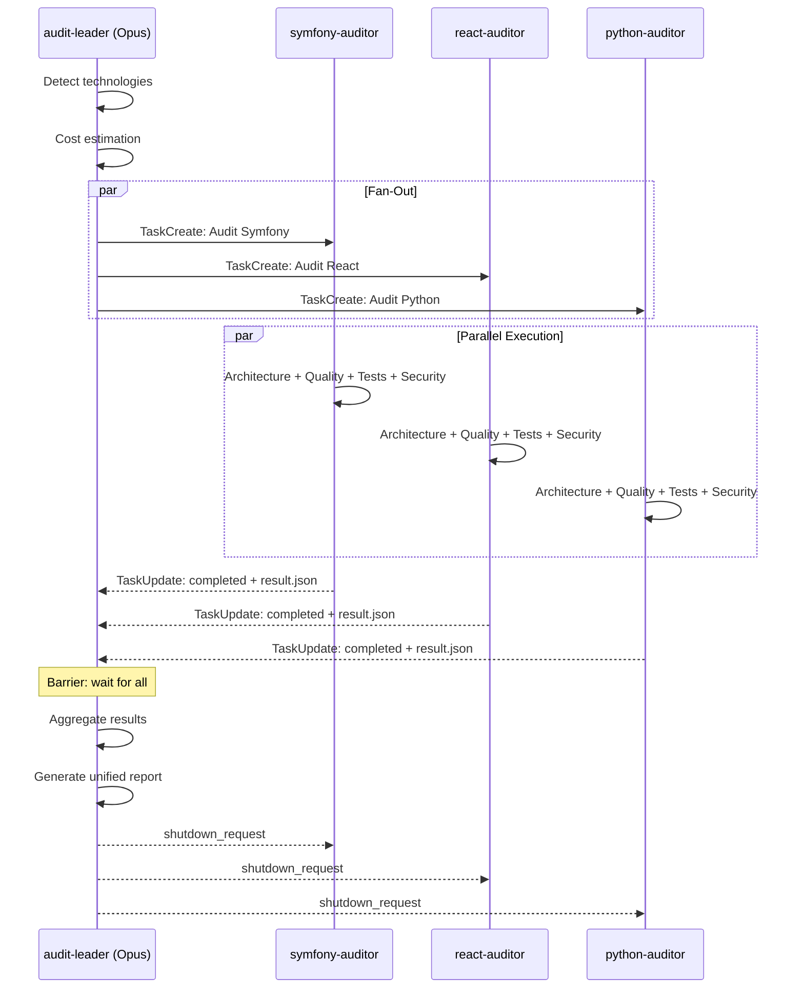
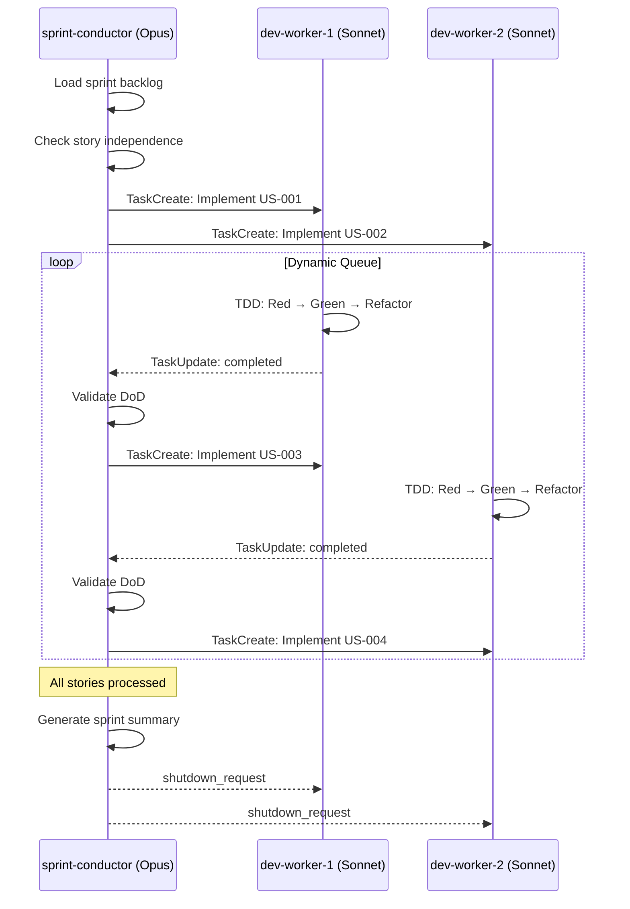
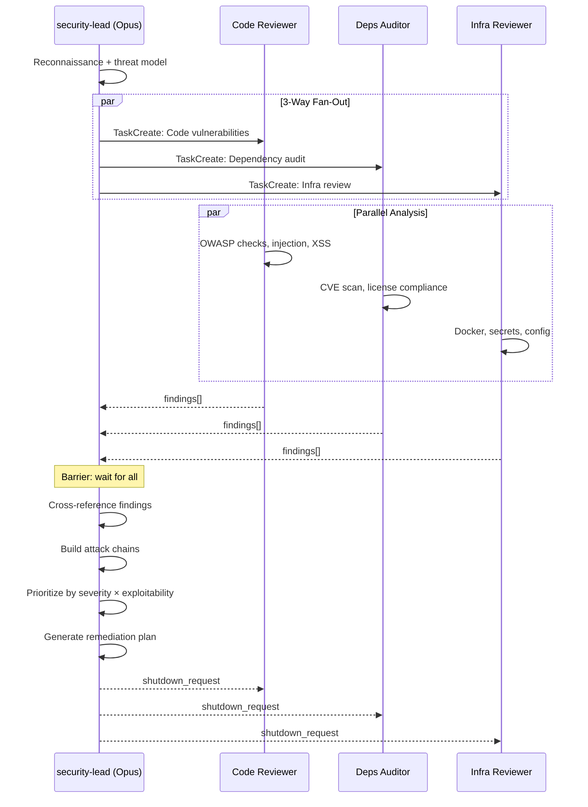
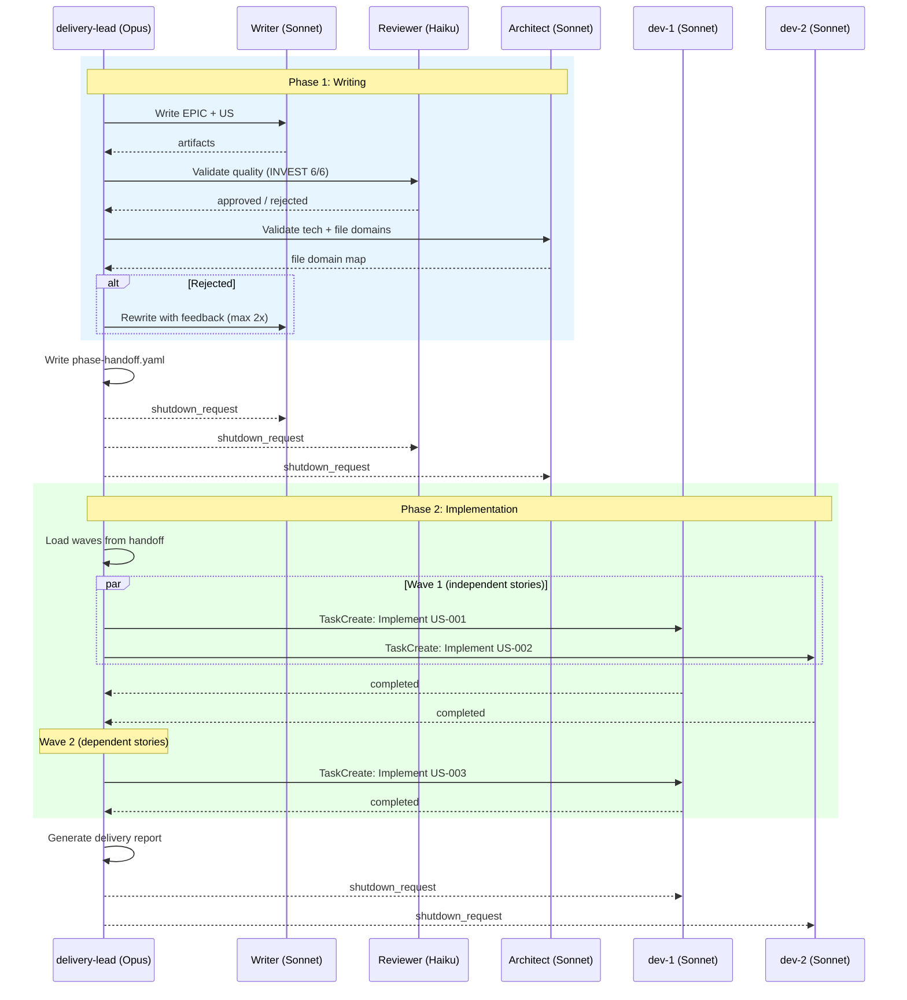

# Agent Teams Guide

Agent Teams (Claude Code v2.1.32+ Research Preview) enables multi-agent coordination for parallelizing audit, sprint, and security review workflows in claude-craft. This guide covers setup, usage, cost analysis, and known limitations.

## Prerequisites

| Requirement | Minimum Version | Check |
|-------------|-----------------|-------|
| Claude Code | v2.1.97+ (v2.1.154 recommended, CVE-2025-59536 patched) | `claude --version` |
| Environment variable | `CLAUDE_CODE_EXPERIMENTAL_AGENT_TEAMS=1` (must be enabled explicitly) | `echo $CLAUDE_CODE_EXPERIMENTAL_AGENT_TEAMS` |
| Claude model | Opus 4.8 (recommended for leader) | Model selector in Claude Code |

**Important:** Agent Teams is no longer always-on. You must explicitly enable it:

```bash
export CLAUDE_CODE_EXPERIMENTAL_AGENT_TEAMS=1
```

## When to Use Agent Teams

Agent Teams adds coordination overhead. Use it only when the parallelization benefit outweighs the cost.

| Scenario | Recommendation | Why |
|----------|---------------|-----|
| Full audit, 2+ tech stacks | USE PARALLEL | 45-62% time savings, +30-37% token overhead |
| Full audit, 1 tech stack | STAY SEQUENTIAL | No time savings; overhead wasted |
| Pre-merge check, 2+ stacks | USE PARALLEL | Tests + linting + security run in parallel |
| Pre-commit check | STAY SEQUENTIAL | Already fast (< 2 min); overhead not justified |
| Sprint, 3+ independent stories | USE PARALLEL | Stories processed concurrently |
| Sprint, 1-2 stories | STAY SEQUENTIAL | Coordination cost exceeds benefit |
| Full lifecycle (write + implement), 3+ stories | USE PARALLEL (team-delivery) | ~2.2x speedup, cross-phase context, file domain mapping |
| Full lifecycle, < 3 stories | STAY SEQUENTIAL | `@product-owner` + `team-sprint --ralph-mode` is simpler |
| BMAD quality gates | STAY SEQUENTIAL | Gates are fast (< 30s each); micro-optimization |
| Small projects (< 50 files) | STAY SEQUENTIAL | Sequential audit completes in ~2 min |

**Rule of thumb:** Use Agent Teams when you have 2+ independent work streams that each take more than 3 minutes.

### Fast Mode Guard (Blocking Confirmation)

All `/team:*` commands include a **mandatory blocking guard** when Fast Mode (`/fast`) is active. The leader agent MUST:

1. Detect if Fast Mode is active (lightning bolt indicator)
2. Display a comparative dashboard (standard vs fast pricing)
3. Show a blocking warning with estimated costs for both modes
4. Wait for explicit user confirmation before proceeding
5. Abort if the user declines, suggesting `/fast` to switch back to standard mode

This prevents accidentally running multi-agent operations at 6x cost ($30/M input, $150/M output per agent).

### Budget Guard (`--max-cost`)

All `/team:*` commands support `--max-cost=<dollars>` to set a maximum budget:

```bash
# Abort if estimated parallel cost exceeds $2
/team:audit --max-cost=2.00

# Budget guard with dry-run preview
/team:sprint Sprint-3 --max-cost=5.00 --dry-run
```

If the estimated parallel cost exceeds the budget:
- The leader displays `OVER BUDGET: estimated $X.XX > budget $Y.YY`
- Execution is **aborted** (workers are NOT launched)
- The leader suggests reducing the number of stacks/stories or using `--sequential`

## Cost Analysis

Before launching a team operation, use the cost dashboard to see estimated costs:

```bash
# Show cost comparison
Tools/AgentTeams/lib/cost-dashboard.sh --techs 2 --checks 5 --worker-model sonnet

# With Haiku workers (lower cost, slightly more token overhead)
Tools/AgentTeams/lib/cost-dashboard.sh --techs 3 --worker-model haiku

# Dry-run mode (plain text)
Tools/AgentTeams/lib/cost-dashboard.sh --techs 2 --dry-run
```

### Realistic Performance Expectations

Based on empirical analysis (audit-pipeline.md, devils-advocate.md):

| Metric | Optimistic | Realistic | Pessimistic |
|--------|-----------|-----------|-------------|
| Time speedup | 3x | 1.5-2.5x | 1.2x |
| Token overhead | +14% | +20-37% | +50% |
| Dollar cost savings (Haiku workers) | 70% | 40-60% | 20% |

**Do not expect 5-8x speedup.** Amdahl's Law limits practical speedup because ~30% of work is inherently sequential (technology detection, result aggregation, report generation). With realistic coordination overhead, expect 1.5-2.5x speedup for 2-3 technology projects.

> **Cost reality:** When all teammates are simultaneously active, expect approximately **~7x** the token cost of a normal single-agent session due to context duplication and coordination overhead across teammates.

### Token Overhead Breakdown

Each parallel agent incurs overhead from:

| Overhead Source | Per Agent | Notes |
|-----------------|-----------|-------|
| System prompt / context loading | ~2,000 tokens | Agent loads CLAUDE.md, project rules |
| Shared context re-reading | ~6,000 tokens | Agent reads project files leader already analyzed |
| Context duplication (model-dependent) | +15-60% of context | Haiku: 60%, Sonnet: 30%, Opus: 15% |
| Task coordination | ~3,000 tokens | TaskCreate, messaging, status checks |

### Model Pricing Reference

| Model | Input ($/M tokens) | Output ($/M tokens) | Best For |
|-------|--------------------|--------------------|----------|
| Opus 4.8 | $5.00 | $25.00 | Team leader, complex reasoning |
| Opus 4.6 (fast) | $30.00 | $150.00 | Fast mode leader (use with caution) |
| Sonnet 4.6 | $3.00 | $15.00 | Worker agents, balanced cost/quality |
| Haiku 4.5 | $1.00 | $5.00 | Cost-optimized workers, simple checks |

### Cost Optimization: Subagent Model Override

Use the `CLAUDE_CODE_SUBAGENT_MODEL` environment variable to force worker agents to use a cheaper model:

```bash
# Force all sub-agents to use Sonnet (saves ~80% vs Opus workers)
export CLAUDE_CODE_SUBAGENT_MODEL=sonnet

# Use Haiku for simple classification tasks
export CLAUDE_CODE_SUBAGENT_MODEL=haiku
```

This applies globally to all sub-agent spawns within the session.

## Team Templates

Claude-craft provides 4 team templates for common parallel workflows.

### team-audit: Full Audit Team

Parallelizes the audit across multiple technology stacks.

**Architecture:**

```
                    audit-leader (Opus)
                         |
           +-------------+-------------+
           |             |             |
     symfony-auditor  react-auditor  python-auditor
       (Sonnet)        (Sonnet)       (Sonnet)
```



**When to use:** Projects with 2+ detected technology stacks.

**Agent roles:**

| Agent | Model | Responsibility |
|-------|-------|---------------|
| audit-leader | Opus | Detect technologies, spawn auditors, aggregate scores, generate report |
| {tech}-auditor | Sonnet/Haiku | Run 4 audit categories (architecture, quality, testing, security) |

**Expected performance (2-tech project):**

| Metric | Sequential | Parallel |
|--------|-----------|----------|
| Time | ~16 min | ~9 min |
| Tokens | ~135K | ~181K |
| Cost (Opus leader + Sonnet workers) | ~$4.46 | ~$2.06 |

### team-sprint: Sprint Development Team

Parallelizes story processing during sprint execution.

**When to use:** Sprints with 3+ independent stories (no blocking dependencies between them).



**Agent roles:**

| Agent | Model | Responsibility |
|-------|-------|---------------|
| sprint-leader | Opus | Claim stories, assign to workers, track progress |
| dev-worker-N | Sonnet | Implement a single story with TDD cycle |

**Constraints:**
- Maximum 4 agents total (1 leader + 3 workers)
- Stories must have `status: ready-for-dev` and no `blocked_by` dependencies
- Only the sprint-leader writes to `sprint-status.yaml` (single-writer pattern)

### team-security: Security Review Team

Parallelizes security audits across technology stacks with dedicated OWASP checkers.

**When to use:** Security-critical projects with 2+ technology stacks requiring comprehensive OWASP review.



**Agent roles:**

| Agent | Model | Responsibility |
|-------|-------|---------------|
| security-leader | Opus | Coordinate security review, generate consolidated report |
| {tech}-security-auditor | Sonnet | Run per-stack security checks, dependency audits |

### team-delivery: Delivery Team (Full Lifecycle)

Orchestrates the **complete sprint cycle**: Phase 1 writes EPICs/US/tasks with cross-review, Phase 2 implements them in parallel using the file domain map produced in Phase 1. A single Delivery Lead (opus) orchestrates both phases, preserving full context.

**Architecture:**

```
Phase 1 (Writing):                    Phase 2 (Implementation):

  delivery-lead (Opus)                  delivery-lead (Opus) — same agent
       |                                     |
  +----+----+----+                      +----+----+----+
  |    |    |    |                      |    |    |    |
Writer Reviewer Architect           dev-1  dev-2  dev-3
(Sonnet)(Haiku) (Sonnet)           (Sonnet)(Sonnet)(Sonnet)

  ~~~ shutdown Phase 1 workers → spawn Phase 2 workers ~~~
```



**When to use:** Full sprint cycle (writing + implementation) with 3+ stories to write AND implement.

**Agent roles:**

| Agent | Phase | Model | Responsibility |
|-------|-------|-------|---------------|
| delivery-lead | Both | Opus | Orchestrate pipeline, validate gates, assign work |
| writer | 1 | Sonnet | Create EPICs, US (INVEST+3C+Gherkin), tasks |
| reviewer | 1 | Haiku | Validate quality (INVEST 6/6, AC coverage, slicing) — classification task, haiku suffices |
| architect | 1 | Sonnet | Validate tech feasibility, produce file domain map |
| dev-worker-N | 2 | Sonnet | Implement a story with TDD cycle |

**Key differentiators vs team-sprint:**

| Feature | team-delivery | team-sprint |
|---------|--------------|-------------|
| Story writing | Built-in (Phase 1) | Requires pre-written stories |
| File domain map | Computed by Architect | Heuristic at runtime |
| Cross-review | Writer → Reviewer → Architect | None |
| BMAD gates | PRD + Backlog + Sprint Ready + DoD | DoD only |
| Parallelization waves | Pre-computed from domain map | Ad-hoc independence check |

**Expected performance (5 stories):**

| Metric | Sequential | Team Delivery |
|--------|-----------|---------------|
| Time | ~120 min | ~55 min |
| Tokens | ~850K | ~1,125K |
| Cost (Opus lead + Sonnet workers) | ~$28 | ~$17 |

**Constraints:**
- Maximum 5 agents total (1 lead + 3 writers OR 3 dev workers per phase)
- Phase transition takes ~30s (shutdown + respawn)
- Only the delivery-lead writes to `sprint-status.yaml` (single-writer pattern)
- Stories with file domain overlap are sequenced into waves (not parallelized)

## Known Limitations

### Research Preview Status

Agent Teams is a **Research Preview** feature (v2.1.32+). This means:

| Limitation | Impact | Mitigation |
|-----------|--------|------------|
| API may change without notice | Templates may break on update | Abstraction layer isolates claude-craft from API changes |
| Maximum ~4 agents recommended | Large teams have quadratic coordination cost | Cap teams at 1 leader + 3 workers |
| No force-kill for agents | Stuck agent blocks pipeline | Timeout watchdog with graceful degradation |
| Cooperative shutdown only | Teammates can reject shutdown requests | Design workflows that complete naturally |
| Memory leak in long sessions | Agent teams consume growing memory | Fixed in v2.1.50+; update Claude Code |
| No bulk kill UI | Must kill agents one by one | Ctrl+F bulk agent kill available in v2.1.53+ |

### Context Compaction Risk (#23620)

Claude Code's context compaction feature can cause the team leader to lose awareness of team state after compaction. All `/team:*` commands include mitigation instructions:

- **Periodic re-read:** The leader re-reads `TaskList` every 5 worker completions to refresh team awareness
- **Inactivity detection:** If no status updates for >3 minutes, force a full `TaskList` re-read
- **Phase transition recovery (delivery):** The leader re-reads `phase-handoff.yaml` at the start of Phase 2

### Synchronization Barrier Cadence

Team leaders use an adaptive polling cadence for the synchronization barrier:

| Phase | Poll Interval | Condition |
|-------|--------------|-----------|
| Active | 30 seconds | Workers are updating tasks |
| Idle | 60 seconds | After 3 consecutive polls without status change |
| Hook-based | Event-driven | Using `TeammateIdle`/`TaskCompleted` hooks (v2.1.33+) |

### Per-Task Timeout Chain

Each task type has a specific timeout based on 1.5x the estimated duration:

| Task Type | Estimated Duration | Timeout |
|-----------|-------------------|---------|
| Audit (per stack) | 1.5 min | 2.25 min |
| Sprint (per story) | 15 min | 22.5 min |
| Security (per dimension) | 2 min | 3 min |
| Delivery (per story) | 20 min | 30 min |

When a worker exceeds its timeout, the leader marks the task as failed and continues with partial results.

### No `kill -9` for Agents

Unlike bash subprocesses, there is no way to forcibly terminate a misbehaving agent. If an agent enters an infinite loop or hangs:

1. Send a `shutdown_request` via `SendMessage`
2. If the agent rejects or does not respond, the leader must wait for the agent's context window to fill
3. The timeout watchdog (if configured) will flag the agent as unresponsive and continue without it

### Single Chrome Browser for Recette

QA Recette (`/qa:recette`) uses a single Chrome browser instance. Parallel test execution is not possible -- only test planning can be parallelized. This is a hard constraint of the Chrome integration architecture.

### Sprint-Status YAML Concurrency

Multiple agents must never write to `sprint-status.yaml` simultaneously. The single-writer pattern ensures only the team leader updates shared state. Workers report results via task metadata (`TaskUpdate`), and the leader applies changes sequentially.

## Troubleshooting

### Agent Fails to Start

**Symptom:** Agent spawning times out or fails silently.

**Causes:**
- `CLAUDE_CODE_EXPERIMENTAL_AGENT_TEAMS=1` not set
- Claude Code version < 2.1.32
- Too many agents already running (resource limits)

**Fix:**
```bash
# Verify environment
echo $CLAUDE_CODE_EXPERIMENTAL_AGENT_TEAMS  # Should output: 1
claude --version                             # Should be >= 2.1.32
```

### High Token Usage

**Symptom:** Parallel execution costs significantly more tokens than expected.

**Causes:**
- Each agent loads full project context independently
- Worker model retries (especially Haiku on complex tasks)
- Large CLAUDE.md or reference files duplicated per agent

**Fix:**
- Use the cost dashboard before launching: `Tools/AgentTeams/lib/cost-dashboard.sh`
- Switch to Sonnet workers if Haiku produces too many retries
- For projects with very large CLAUDE.md, consider reducing reference file size

### Agent Appears Stuck

**Symptom:** No `TaskCompleted` events after extended time.

**Causes:**
- Agent hit context window limit
- Docker command hanging inside agent
- Agent waiting for input that will never arrive

**Fix:**
1. Check if the agent's task is still `in_progress` via `TaskList`
2. Send a message to the agent asking for status
3. If unresponsive, the leader should mark the task as failed and fall back to sequential execution

### Result Aggregation Errors

**Symptom:** Final report has missing or inconsistent scores.

**Causes:**
- Worker agent crashed before reporting results
- Task metadata not properly set by worker

**Fix:**
- Check each worker's task status and metadata
- Re-run failed technology audit sequentially in the leader context
- The aggregation protocol handles partial results by marking missing categories as "SKIPPED"

## Architecture Decisions

### Why 4 Templates

The devil's advocate analysis (devils-advocate.md Section 3.1) identified that 9+ templates create unmaintained bloat. Four templates (audit, sprint, security, delivery) cover 90% of parallel use cases. The delivery template was added because the full sprint lifecycle (writing + implementation) is a distinct workflow that benefits from cross-phase context preservation and file domain mapping — capabilities not achievable by combining team-sprint with sequential writing.

### Why Cap at 4 Agents

Teams larger than 4 agents experience quadratic coordination cost (Section 3.2). The team leader spends more time coordinating than any individual worker spends working. Empirically, 1 leader + 2-3 workers provides the best cost/benefit ratio.

### Why an Abstraction Layer

The Agent Teams API is a Research Preview. An abstraction layer (`ralph-teams-adapter.sh`) isolates claude-craft from API changes, allowing the framework to switch between Agent Teams and bash subprocesses without modifying templates or workflows.

## Cost Tools Reference

### cost-estimator.sh

Calculates raw token and cost estimates for sequential vs parallel execution.

```bash
Tools/AgentTeams/lib/cost-estimator.sh --techs 2 --checks 5 --worker-model sonnet
```

**Options:**

| Flag | Default | Description |
|------|---------|-------------|
| `--techs N` | 2 | Number of technology stacks |
| `--checks N` | 5 | Checks per technology |
| `--worker-model M` | sonnet | Worker model: haiku, sonnet, opus |
| `--leader-model M` | opus | Leader model: haiku, sonnet, opus |
| `--tokens-per-check N` | 12500 | Override per-check token estimate |
| `--task-type T` | audit | Task type: audit, sprint, security, delivery (affects context tokens) |
| `--fast-mode` | false | Use Fast Mode pricing (6x cost for Opus) |
| `--max-cost N` | - | Maximum budget in dollars; output includes `WITHIN_BUDGET` |
| `--auto-size` | false | Output `RECOMMENDED_WORKERS` based on task type |
| `--dry-run` | false | Show config without calculating |
| `--help` | - | Show usage |

**Output:** Key=value pairs (machine-readable) for consumption by other scripts. Includes `FAST_MODE_WARNING`, `WITHIN_BUDGET`, and `RECOMMENDED_WORKERS` fields when relevant flags are used.

### cost-dashboard.sh

Displays a visual comparison table before launching a team operation.

```bash
Tools/AgentTeams/lib/cost-dashboard.sh --techs 3 --worker-model haiku
```

**Options:** Same as cost-estimator.sh, plus `--width N` for display width and `--max-cost N` for budget guard display.

**Recommendation logic:** Uses parallel only if `time_saved > 30%` AND `extra_cost < 50%`.

**Budget guard display:** When `--max-cost` is provided, the dashboard shows `Within budget: YES` or `Within budget: NO - OVER BUDGET` alongside the cost estimates.

## Further Reading

- [Autonomous Sprint Conductor](AUTONOMOUS-SPRINT.md) - Ralph overnight sprint execution
- [BMAD Practical Guide](BMAD-PRACTICAL-GUIDE.md) - Quality gates and story workflow
- [Scripts Reference](SCRIPTS-REFERENCE.md) - All shell script documentation
