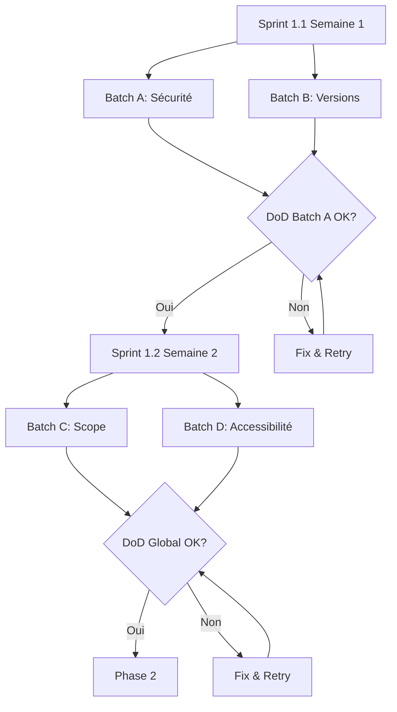

# Phase 1 — Stabilisation & Fondations (0-1 mois, ~85h)

## Objectif

Résoudre les bloqueurs P0 critiques : sécurité supply chain, tests cassés, versions obsolètes, compliance de base. Score cible : 6.9 → 7.3.

## Statut actuel

- Phase 1 survie (`audit/phases/phase-1-survie.md`) : automatable scope livré
- Reste 3 actions humaines (`audit/phases/phase-1-human-actions.md`) : Discord, email Anthropic, cadence releases
- Items P0 des rapports 01/02/09 non couverts par les phases existantes à intégrer

## Actions restantes

### Sprint 1.1 — Quick Wins Sécurité & Conformité (semaine 1)

#### Batch parallèle A — Sécurité (3 agents indépendants)

**Agent 1 : `@security-auditor`**

| ID | Action | Effort | Rapport source | Statut |
|----|--------|--------|---------------|--------|
| SEC-01 | Élargir regex blocage commandes dangereuses | 2h | 02-security | À faire |
| SEC-02 | Documenter limites hooks + anti-encodage regex | 4-8h | 02-security | À faire |
| SEC-04 | Créer settings.local.json.example avec permissions minimales | 1h | 02-security | À faire |
| SEC-10 | Remplacer curl\|sh par apt/snap dans check-prerequisites | 2h | 02-security | À faire |

**Détails :**
- **SEC-01** : Ajouter variantes rm -rf sans espace, patterns destructifs dans `.claude/settings.json`
- **SEC-02** : Documenter Base64, variables, eval contournables dans `docs/SECURITY.md`
- **SEC-04** : Créer `.claude/settings.local.json.example` avec commentaires sur permissions
- **SEC-10** : Modifier `Tools/install-rtk.sh`, `scripts/check-prerequisites.sh`

**Fichiers :**
- `.claude/settings.json`
- `Tools/install-rtk.sh`
- `scripts/check-prerequisites.sh`
- `docs/SECURITY.md`

**DoD :**
```bash
grep -r "curl.*|.*sh" Tools/ docs/ # 0 résultats
test -f .claude/settings.local.json.example && echo "OK"
```

---

**Agent 2 : `@devops-engineer`**

| ID | Action | Effort | Rapport source | Statut |
|----|--------|--------|---------------|--------|
| SEC-13 | Épingler dépendances critiques dans package.json | 1h | 02-security | À faire |
| SEC-14 | Épingler actions GitHub par hash SHA256 | 2h | 02-security | À faire |

**Détails :**
- **SEC-13** : Remplacer `^` par versions exactes pour vitest, typescript, eslint, prettier
- **SEC-14** : Remplacer `actions/checkout@v4` par `actions/checkout@<SHA256>`

**Fichiers :**
- `package.json`
- `.github/workflows/*.yml`

**DoD :**
```bash
grep -r "@v" .github/workflows/ # 0 résultats (sauf actions internes)
grep "\"\\^" package.json # 0 résultats pour deps critiques
```

---

**Agent 3 : `@tdd-coach`**

| ID | Action | Effort | Rapport source | Statut |
|----|--------|--------|---------------|--------|
| REL-01 / STD-02 / SCAL-16 | Corriger 8 tests en échec + configurer vitest --coverage | 4h | 01-architecture, 09-dx-quality | À faire |

**Détails :**
- Corriger les 8 tests CLI en échec (voir `npm test`)
- Configurer `vitest.config.*` avec threshold 80%
- Ajouter script `npm run test:coverage` dans `package.json`

**Fichiers :**
- `tests/`
- `vitest.config.*`
- `package.json`

**DoD :**
```bash
npm test # 773/773 passent
npm run test:coverage # Génère rapport avec threshold 80%
```

---

#### Batch parallèle B — Conformité versions (1 agent, parallèle avec A)

**Agent 4 : `@research-assistant`**

| ID | Action | Effort | Rapport source | Statut |
|----|--------|--------|---------------|--------|
| STD-12 | Mettre à jour 4 versions critiques dans la documentation | 2h | 01-architecture | À faire |

**Détails :**
- Angular 19 → 20 LTS / 21
- React Native 0.76 → 0.85
- Reanimated 3 → 4
- Pest 3 → 4

**Recherches web pré-rédigées :**
```
WebSearch "Angular 21 release date 2026"
WebSearch "React Native 0.85 new architecture 2026"
WebSearch "Reanimated 4 breaking changes 2026"
WebSearch "Pest PHP 4 migration guide 2026"
```

**Recherches Context7 :**
```
context7 resolve-library-id angular
context7 query-docs --library-id=<id> "version 21"

context7 resolve-library-id react-native
context7 query-docs --library-id=<id> "0.85"

context7 resolve-library-id react-native-reanimated
context7 query-docs --library-id=<id> "version 4"

context7 resolve-library-id pest-php
context7 query-docs --library-id=<id> "version 4"
```

**Fichiers :**
- `.claude/CLAUDE.md`
- `.claude/references/angular/`
- `.claude/references/react-native/`

**DoD :**
```bash
grep -r "Angular 19\|0\.76\|Reanimated 3\|Pest 3" .claude/ # 0 résultats
```

---

### Sprint 1.2 — Scope & Documentation (semaine 2)

#### Batch parallèle C — Réduction scope (2 agents)

**Agent 5 : `@research-assistant`**

| ID | Action | Effort | Rapport source | Statut |
|----|--------|--------|---------------|--------|
| SCAL-03 | Geler 3 langues i18n (garder EN + FR uniquement) | 1h | 01-architecture | À faire |
| SCAL-05 | Déprécier stacks Tier 3 (Go, Rust, Svelte) → status "Experimental" | 1h | 01-architecture | À faire |
| SCAL-07 | Documenter cadence release 1/semaine max dans CONTRIBUTING.md | 1h | 01-architecture | À faire |
| SCAL-19 | Créer docs/RUNBOOK.md — Opérations critiques | 8h | 01-architecture | À faire |

**Détails :**
- **SCAL-03** : Documenter dans CHANGELOG et CONTRIBUTING.md que ES/DE/PT sont "community-maintained"
- **SCAL-05** : Ajouter badge "Experimental" dans docs des stacks Go/Rust/Svelte
- **SCAL-07** : Section "Release Cadence" dans CONTRIBUTING.md
- **SCAL-19** : RUNBOOK.md avec : release process, rollback procedure, hotfix workflow, incident response

**Fichiers :**
- `CONTRIBUTING.md`
- `CHANGELOG.md`
- `docs/RUNBOOK.md`
- `.claude/references/go/`, `.claude/references/rust/`, `.claude/references/svelte/`

**DoD :**
```bash
test -f docs/RUNBOOK.md && echo "OK RUNBOOK"
grep -i "experimental" .claude/references/go/CLAUDE.md # Mention présente
grep -i "community-maintained" CONTRIBUTING.md # ES/DE/PT mentionnés
```

---

**Agent 6 : `@research-assistant`**

| ID | Action | Effort | Rapport source | Statut |
|----|--------|--------|---------------|--------|
| FUNC-23 | Documentation complète QA Recette — guide unifié | 8h | 01-architecture | À faire |

**Détails :**
- Consolider `docs/qa-recette/*.md` en guide unique
- Sections : Setup, Usage, Scenarios (story/sprint/resume), Troubleshooting
- Maximum 500 lignes
- 3 scénarios complets avec screenshots/exemples

**Fichiers :**
- `docs/qa-recette/`

**DoD :**
```bash
wc -l docs/qa-recette/README.md # < 500 lignes
grep -c "## Scénario" docs/qa-recette/README.md # >= 3
```

---

#### Batch séquentiel D — Accessibilité (1 agent, après A si modifs CLI)

**Agent 7 : `@accessibility-expert`**

| ID | Action | Effort | Rapport source | Statut |
|----|--------|--------|---------------|--------|
| DX-06 | Symboles CLI ✓/✗/⚠ en plus des couleurs | 2h | 09-dx-quality | À faire |

**Détails :**
- Support variable `NO_COLOR` standard
- Remplacer couleurs seules par symboles + couleurs
- Ajouter fallback texte pour terminaux sans couleur

**Recherche web :**
```
WebSearch "NO_COLOR standard CLI accessibility 2026"
```

**Fichiers :**
- `cli/*.js`
- `Tools/*.sh`

**DoD :**
```bash
NO_COLOR=1 npm run doctor | grep -E "✓|✗|⚠" # Symboles présents
```

---

## Actions humaines (non automatisables)

| ID | Action | Effort | Rapport source | Statut |
|----|--------|--------|---------------|--------|
| P1-04 | Envoyer email Anthropic trademark | 1h | 02-security | À faire |
| P1-08 | Respecter cadence 1 release/semaine | 0h (discipline) | 01-architecture | À faire |
| P1-09 | Créer serveur Discord + 10 good first issues | 4h | 09-dx-quality | À faire |

**Détails :**
- **P1-04** : Draft email prêt dans `docs/audit/legal/anthropic-trademark-email-draft.md`
- **P1-08** : Discipline d'équipe, suivi via calendar reminder
- **P1-09** : Drafts issues prêts dans `docs/audit/community/good-first-issues.md`

---

## DoD & Validation globale

```bash
# Tests
npm test  # 773/773 passent
npm run test:coverage  # Rapport généré avec threshold 80%

# Sécurité
grep -r "curl.*|.*sh" Tools/ docs/  # 0 résultats
grep -r "@v" .github/workflows/  # 0 résultats (hors actions internes)

# Conformité versions
grep -rn "Angular 19\|0\.76\|Reanimated 3\|Pest 3" .claude/  # 0 résultats

# Documentation
test -f docs/RUNBOOK.md && echo "OK RUNBOOK"
test -f .claude/settings.local.json.example && echo "OK settings example"
wc -l docs/qa-recette/README.md  # < 500 lignes

# Accessibilité
NO_COLOR=1 npx claude-craft doctor 2>&1 | grep -E "✓|✗|⚠"  # Symboles présents

# Scope
grep -i "experimental" .claude/references/go/CLAUDE.md  # Présent
grep -i "community-maintained" CONTRIBUTING.md  # ES/DE/PT mentionnés
```

---

## Risques & Rollback

| Risque | Probabilité | Impact | Mitigation |
|--------|-------------|--------|------------|
| Épingler deps casse le build | Faible | Élevé | Tester en CI avant merge, rollback via `git revert` |
| Gel i18n déçoit communauté ES/DE/PT | Moyenne | Moyen | Communiquer "community-maintained" (pas "removed"), inviter contributions |
| STD-12 versions pas encore stables | Faible | Moyen | Vérifier via Context7 + WebSearch avant update, documenter breaking changes |
| Tests coverage threshold bloque CI | Moyenne | Élevé | Commencer avec threshold 60%, augmenter progressivement |

**Rollback plan :**
- Chaque batch A/B/C/D dans une branche dédiée
- Merge dans `main` uniquement si DoD 100% validé
- En cas d'échec : `git revert` du merge commit

---

## Condition de passage à Phase 2

- [ ] 773/773 tests passent
- [ ] Coverage tool configuré et fonctionnel (threshold ≥ 60%)
- [ ] 0 curl|sh dans la codebase
- [ ] Actions GitHub épinglées par hash SHA256
- [ ] 4 versions mises à jour (Angular 21, RN 0.85, Reanimated 4, Pest 4)
- [ ] RUNBOOK.md créé et validé
- [ ] Discord ouvert avec ≥ 10 membres actifs
- [ ] Email Anthropic envoyé (confirmation reçue ou délai 14 jours écoulé)

→ [phase-2-qualite-performance.md](phase-2-qualite-performance.md)

---

## Ordre d'exécution recommandé



**Parallélisation :**
- Semaine 1 : Agents 1, 2, 3, 4 en parallèle (4 agents simultanés)
- Semaine 2 : Agents 5, 6 en parallèle, puis Agent 7 séquentiel

**Effort total :** ~35h agents + ~5h humain = **~40h semaine 1** + **~20h semaine 2** + **~5h humain** = **~65h total**

---

**Date de dernière mise à jour :** 2026-04-17  
**Version :** 1.0.0  
**Auteur :** Claude Code (audit 2026-04-16)
